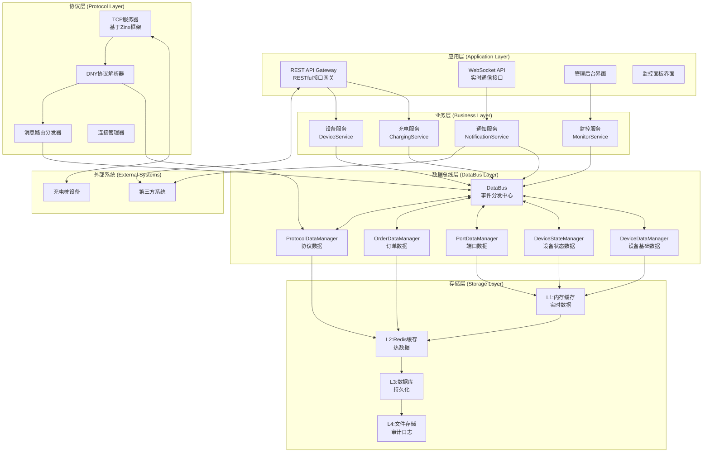

# IoT 充电桩系统数据总线架构设计文档

## 概述

本设计文档基于数据总线架构模式，提出了一套完整的 IoT 充电桩系统重构方案。核心目标是通过建立统一的数据总线、明确数据所有权、标准化数据模型、规范数据流转等手段，彻底解决当前系统存在的数据管理混乱、模块耦合严重、数据不一致等根本性问题。

### 设计目标

- **消除数据重复存储**：建立单一数据源，消除 6 种设备数据重复存储问题
- **统一数据管理**：明确数据所有权，建立 5 个数据域的统一管理
- **标准化数据模型**：使用统一的数据结构，避免数据转换复杂性
- **规范数据流转**：建立清晰的数据流转路径，支持追踪和监控
- **保持模块独立**：各模块保持独立但数据流一致，支持独立开发部署

## 数据总线架构设计

### 整体架构

系统采用数据总线架构模式，建立统一的数据管理和流转机制，确保各模块独立但数据流一致。



### 架构层次说明

**应用层 (Application Layer)**

- REST API Gateway：提供标准化的 RESTful API 接口，支持设备管理、充电控制、数据查询等功能
- WebSocket API：提供实时数据推送和双向通信能力
- 管理后台界面：运营管理和系统配置界面
- 监控面板界面：系统监控和告警展示界面

**业务层 (Business Layer)**

- 充电服务：充电业务逻辑处理，包括订单管理、计费结算、业务流程控制
- 设备服务：设备管理服务，负责设备注册、状态管理、配置更新
- 通知服务：通知服务，处理事件通知和第三方系统回调
- 监控服务：系统监控和性能指标收集服务

**数据总线层 (DataBus Layer)**

- DataBus：数据总线核心，负责数据路由、事件分发、一致性保证
- DeviceDataManager：设备基础数据的唯一所有者和管理器
- DeviceStateManager：设备状态数据的唯一所有者和管理器
- PortDataManager：端口数据的唯一所有者和管理器
- OrderDataManager：订单数据的唯一所有者和管理器
- ProtocolDataManager：协议数据的唯一所有者和管理器

**协议层 (Protocol Layer)**

- TCP 服务器：基于 Zinx 框架的 TCP 连接管理
- DNY 协议解析器：DNY 协议的解析和编码
- 消息路由分发器：协议消息的路由和分发
- 连接管理器：TCP 连接的生命周期管理

**存储层 (Storage Layer)**

- L1 内存缓存：存储实时数据，提供最快的访问速度
- L2 Redis 缓存：存储热数据，TTL 设置为 24 小时
- L3 数据库：持久化存储历史数据和配置信息
- L4 文件存储：存储审计日志和归档数据

## 数据分类和所有权设计

### 数据域划分

#### 1. 设备基础数据域 - DeviceDataManager

```go
type DeviceData struct {
    DeviceID     string            `json:"device_id"`
    PhysicalID   uint32            `json:"physical_id"`
    ICCID        string            `json:"iccid"`
    DeviceType   uint16            `json:"device_type"`
    Version      string            `json:"version"`
    ConnID       uint64            `json:"conn_id"`
    RemoteAddr   string            `json:"remote_addr"`
    ConnectedAt  time.Time         `json:"connected_at"`
    Properties   map[string]interface{} `json:"properties"`
}
```

**职责范围**：

- 设备标识管理：deviceID、physicalID、ICCID
- 设备属性管理：deviceType、version、model
- 连接信息管理：connID、remoteAddr、connectedAt
- 设备配置管理：portCount、capabilities

#### 2. 设备状态数据域 - DeviceStateManager

```go
type DeviceState struct {
    DeviceID        string    `json:"device_id"`
    ConnectionState string    `json:"connection_state"`
    BusinessState   string    `json:"business_state"`
    HealthState     string    `json:"health_state"`
    LastUpdate      time.Time `json:"last_update"`
    StateHistory    []StateChange `json:"state_history"`
}
```

**职责范围**：

- 连接状态管理：connected、disconnected、timeout
- 业务状态管理：online、offline、charging、idle
- 健康状态管理：normal、warning、error
- 状态历史管理：stateChanges、lastUpdate

#### 3. 端口数据域 - PortDataManager

```go
type PortData struct {
    DeviceID      string    `json:"device_id"`
    PortNumber    int       `json:"port_number"`    // 统一使用API端口号(1-based)
    Status        string    `json:"status"`
    IsCharging    bool      `json:"is_charging"`
    CurrentPower  float64   `json:"current_power"`
    TotalEnergy   float64   `json:"total_energy"`
    ChargeDuration int64    `json:"charge_duration"`
    OrderID       string    `json:"order_id"`
    LastUpdate    time.Time `json:"last_update"`
}
```

**职责范围**：

- 端口状态管理：idle、charging、fault、occupied
- 端口配置管理：maxPower、supportedModes
- 实时数据管理：currentPower、voltage、current
- 充电数据管理：chargeDuration、totalEnergy
- 端口映射管理：API 端口 ↔ 协议端口

#### 4. 订单数据域 - OrderDataManager

```go
type OrderData struct {
    OrderID       string    `json:"order_id"`
    DeviceID      string    `json:"device_id"`
    PortNumber    int       `json:"port_number"`
    UserID        string    `json:"user_id"`
    Status        string    `json:"status"`
    StartTime     *time.Time `json:"start_time"`
    EndTime       *time.Time `json:"end_time"`
    TotalEnergy   float64   `json:"total_energy"`
    TotalFee      int64     `json:"total_fee"`
    CreatedAt     time.Time `json:"created_at"`
    UpdatedAt     time.Time `json:"updated_at"`
}
```

**职责范围**：

- 订单基础管理：orderID、deviceID、portNumber、userID
- 订单状态管理：created、active、completed、failed
- 时间信息管理：startTime、endTime、duration
- 计费数据管理：totalEnergy、totalFee、chargeFee
- 业务数据管理：cardNumber、stopReason

#### 5. 协议数据域 - ProtocolDataManager

```go
type ProtocolData struct {
    ConnID      uint64    `json:"conn_id"`
    Command     uint8     `json:"command"`
    MessageID   string    `json:"message_id"`
    RawData     []byte    `json:"raw_data"`
    ParsedData  interface{} `json:"parsed_data"`
    Direction   string    `json:"direction"`
    Timestamp   time.Time `json:"timestamp"`
}
```

**职责范围**：

- 原始数据管理：rawBytes、timestamp、direction
- 解析数据管理：command、messageID、payload
- 转换规则管理：协议格式 ↔ 业务格式
- 消息跟踪管理：requestID、responseID、status

## DataBus 核心接口设计

### 主接口定义

```go
type DataBus interface {
    // === 数据发布接口 ===
    PublishDeviceData(deviceID string, data *DeviceData) error
    PublishStateChange(deviceID string, oldState, newState DeviceState) error
    PublishPortData(deviceID string, portNum int, data *PortData) error
    PublishOrderData(orderID string, data *OrderData) error
    PublishProtocolData(connID uint64, data *ProtocolData) error

    // === 数据查询接口 ===
    GetDeviceData(deviceID string) (*DeviceData, error)
    GetDeviceState(deviceID string) (DeviceState, error)
    GetPortData(deviceID string, portNum int) (*PortData, error)
    GetOrderData(orderID string) (*OrderData, error)
    GetActiveOrders(deviceID string) ([]*OrderData, error)

    // === 数据订阅接口 ===
    SubscribeDeviceEvents(callback DeviceEventCallback) error
    SubscribeStateChanges(callback StateChangeCallback) error
    SubscribePortEvents(callback PortEventCallback) error
    SubscribeOrderEvents(callback OrderEventCallback) error

    // === 批量操作接口 ===
    BatchUpdate(updates []DataUpdate) error
    Transaction(operations []DataOperation) error
}
```

### 事件回调定义

```go
type DeviceEventCallback func(event DeviceEvent) error
type StateChangeCallback func(event StateChangeEvent) error
type PortEventCallback func(event PortEvent) error
type OrderEventCallback func(event OrderEvent) error

type DeviceEvent struct {
    Type      string      `json:"type"`
    DeviceID  string      `json:"device_id"`
    Data      *DeviceData `json:"data"`
    Timestamp time.Time   `json:"timestamp"`
}

type StateChangeEvent struct {
    Type      string      `json:"type"`
    DeviceID  string      `json:"device_id"`
    OldState  DeviceState `json:"old_state"`
    NewState  DeviceState `json:"new_state"`
    Timestamp time.Time   `json:"timestamp"`
}
```
