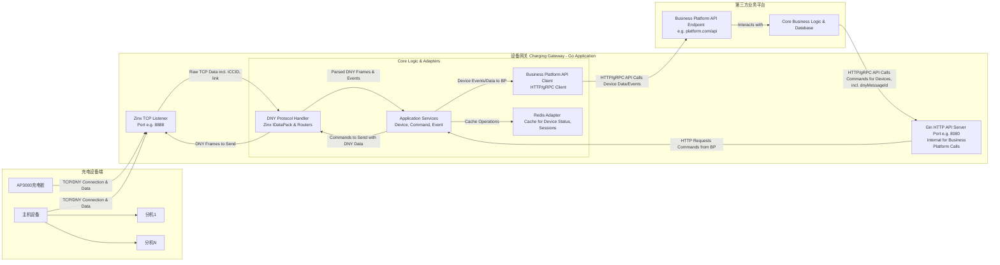

**充电设备网关 (Charging Gateway) 设计方案**

**版本：1.2**
**日期：2024年3月11日**

**修订历史：**
*   V1.0 (2024-03-10): 初稿。
*   V1.1 (2024-03-11): 修正系统架构图；细化消息ID处理、主机-分机通信、"link"心跳处理；全面复核与协议文档的符合性。
*   V1.2 (2024-03-11): 整合所有章节内容，移除“维持不变”引用，全面充实细节，形成独立完整文档。

**目录**

1.  [引言](#1-引言)
    1.1. [项目背景与目标](#11-项目背景与目标)
    1.2. [文档目的](#12-文档目的)
    1.3. [范围](#13-范围)
    1.4. [术语定义](#14-术语定义)
2.  [系统概述](#2-系统概述)
    2.1. [系统架构](#21-系统架构)
    2.2. [核心职责](#22-核心职责)
3.  [技术选型](#3-技术选型)
4.  [目录结构](#4-目录结构)
5.  [核心设计与实现](#5-核心设计与实现)
    5.1. [TCP 通信 (Zinx)](#51-tcp-通信-zinx)
        5.1.1. [连接管理与生命周期](#511-连接管理与生命周期)
        5.1.2. [DNY 协议解析与封装](#512-dny-协议解析与封装)
        5.1.3. [指令路由与处理](#513-指令路由与处理)
        5.1.4. ["link" 心跳及 ICCID 处理](#514-link-心跳及-iccid-处理)
    5.2. [与第三方业务平台的交互](#52-与第三方业务平台的交互)
        5.2.1. [设备网关调用业务平台 API](#521-设备网关调用业务平台-api)
        5.2.2. [业务平台调用设备网关 API](#522-业务平台调用设备网关-api)
        5.2.3. [消息ID (dnyMessageId) 追踪机制](#523-消息id-dnymessageid-追踪机制)
    5.3. [设备状态管理 (Gateway层面)](#53-设备状态管理-gateway层面)
    5.4. [主机与分机模式处理](#54-主机与分机模式处理)
    5.5. [配置管理](#55-配置管理)
    5.6. [日志系统](#56-日志系统)
    5.7. [错误处理与重试机制](#57-错误处理与重试机制)
    5.8. [安全性考虑](#58-安全性考虑)
6.  [关键业务流程示例](#6-关键业务流程示例)
    6.1. [设备上线与注册](#61-设备上线与注册)
    6.2. [用户发起充电（业务平台驱动）](#62-用户发起充电业务平台驱动)
    6.3. [充电监控与结算](#63-充电监控与结算)
    6.4. [设备参数配置（业务平台驱动）](#64-设备参数配置业务平台驱动)
    6.5. [固件升级流程（业务平台驱动）](#65-固件升级流程业务平台驱动)
7.  [部署方案](#7-部署方案)
    7.1. [环境划分](#71-环境划分)
    7.2. [容器化部署 (Docker)](#72-容器化部署-docker)
    7.3. [集群与编排 (Kubernetes)](#73-集群与编排-kubernetes)
    7.4. [配置与密钥管理](#74-配置与密钥管理)
8.  [监控与告警](#8-监控与告警)
    8.1. [监控指标 (Metrics)](#81-监控指标-metrics)
    8.2. [日志监控](#82-日志监控)
    8.3. [告警机制](#83-告警机制)
    8.4. [仪表盘 (Dashboard)](#84-仪表盘-dashboard)
9.  [测试策略](#9-测试策略)
    9.1. [单元测试](#91-单元测试)
    9.2. [集成测试](#92-集成测试)
    9.3. [端到端测试 (设备模拟)](#93-端到端测试-设备模拟)
10. [未来展望与可扩展性](#10-未来展望与可扩展性)
    10.1. [多协议支持](#101-多协议支持)
    10.2. [性能优化](#102-性能优化)
    10.3. [智能化运维](#103-智能化运维)
    10.4. [与业务平台更深集成模式探索](#104-与业务平台更深集成模式探索)

---

## 1. 引言

### 1.1. 项目背景与目标

本项目旨在构建一个稳定、高效、可扩展的充电设备网关（Charging Gateway）。该网关作为充电硬件设备（AP3000系列充电桩、主机及分机，遵循指定的DNY通信协议）与后台第三方业务平台的桥梁，负责处理设备端的 TCP 长连接、DNY 通信协议的解析与封装、设备连接状态管理，并与业务平台进行指令和数据的双向交互。

**目标：**

*   可靠接入和管理大量充电设备。
*   准确解析和处理设备上报的各类指令和数据，符合DNY协议规范。
*   高效地将设备事件转发给业务平台，并将业务平台的控制指令下发给设备。
*   提供清晰、标准的API接口供业务平台集成。
*   保证系统的高可用性、可维护性和可伸缩性。

### 1.2. 文档目的

本文档详细描述充电设备网关的设计方案，包括系统架构、技术选型、模块划分、核心流程、与外部系统的交互方式以及对协议文档各项要求的符合性分析，为后续的开发、测试和部署工作提供明确指导。本文档力求内容的独立性和完整性。

### 1.3. 范围

本方案聚焦于设备网关自身的设计与实现，包括：

*   基于Zinx的TCP服务器搭建与设备连接管理。
*   DNY通信协议的完整实现（解析、封装、校验、字节序）。
*   设备连接状态的初步管理与缓存。
*   与第三方业务平台的API接口设计与交互逻辑。
*   对主机-分机模式的通信支持。
*   相关的部署、监控、测试策略建议。

不包含：

*   第三方业务平台的详细设计。
*   充电桩硬件或固件的具体实现细节（严格依据提供的通信协议文档）。
*   用户界面 (UI/APP) 的设计。

### 1.4. 术语定义

*   **Gateway / 设备网关：** 本项目构建的 TCP 服务器模块。
*   **Device / 设备：** 指充电桩（如 AP3000）或充电桩主机（网关模式），均遵循DNY协议。
*   **DNY 协议：** 设备与服务器之间通信采用的自定义二进制协议，具体见《充电业务流程与状态机.md》等协议文档。
*   **业务平台 (BP)：** 后台第三方核心业务处理服务。
*   **Zinx：** 用于构建 TCP 服务器的 Go 语言框架。
*   **Gin：** 用于构建 Gateway 对业务平台 HTTP API 的 Go 语言框架。
*   **物理ID (deviceId)：** 设备的唯一硬件标识符，按DNY协议规则编码。
*   **消息ID (dnyMessageId)：** DNY 协议中用于匹配请求和响应的消息标识，由业务平台生成并透传。
*   **命令ID (commandId)：** DNY 协议中区分不同操作的指令代码。
*   **ICCID：** SIM卡集成电路卡识别码，由通信模块上报。
*   **"link" 心跳：** 通信模块发送的TCP层保活字符串。

## 2. 系统概述

### 2.1. 系统架构



### 2.2. 核心职责

*   **设备连接管理：** 监听指定TCP端口，接受并高效维护来自充电设备的大量TCP长连接。
*   **协议处理：**
    *   精确解析设备上报的DNY协议帧，包括对包头、长度、物理ID、消息ID、命令、数据、校验的正确处理，以及小端字节序转换。
    *   处理通信模块上报的ICCID和"link"保活心跳。
    *   将服务器指令（由业务平台发起）封装成符合规范的DNY协议帧下发给设备。
*   **设备认证与注册：** 处理设备的注册请求（0x20），记录设备基础信息，并通知业务平台。
*   **心跳维持：** 处理DNY协议的设备心跳（0x21/0x01，主机0x11），维护设备在线状态。
*   **数据转发与指令中继：**
    *   将设备上报的业务相关数据（如刷卡0x02、结算0x03、功率0x06、报警0x42等）通过API调用实时、可靠地转发给业务平台。
    *   接收业务平台通过API下发的控制指令（如充电控制0x82、参数设置0x83等），确保指令能准确送达目标设备。
*   **本地状态缓存：** 使用Redis缓存设备连接信息、ICCID、基本在线状态、设备类型等，以提高响应速度和减轻业务平台压力。
*   **日志记录：** 全面、详细地记录通信报文（包括原始HEX）、系统事件、错误信息及处理流程，便于监控、调试和审计。
*   **主机-分机模式支持：** 正确处理主机代理的分机数据上报和指令下发。

## 3. 技术选型

*   **编程语言：** **Go (Golang)** - 高并发、网络编程优势、部署简单。
*   **TCP 服务器框架：** **Zinx** - 轻量级、专注于 TCP 应用，处理长连接、消息路由、并发模型。
*   **HTTP 服务端 (Gateway 对外 API)：** **Gin Gonic** - 轻量级、高性能的 HTTP Web 框架，用于构建 Gateway 接收业务平台指令的 API。
*   **HTTP 客户端 (Gateway 调用业务平台)：** Go 标准库 `net/http` (可结合 `resty` 等辅助库增强易用性)。
*   **缓存/内存数据库：** **Redis** - 存储设备连接信息、会话状态、热点数据、分布式锁。
*   **配置管理：** **Viper** - 支持多种格式（YAML, JSON, TOML等），环境变量，远程配置。
*   **日志库：** **Logrus** (或 Zap) - 功能丰富，支持结构化日志、日志级别、输出到文件/控制台。
*   **容器化：** **Docker** - 标准化部署环境。
*   **部署编排 (可选)：** **Docker Compose** (本地/测试环境), **Kubernetes** (生产环境)。

## 4. 目录结构

采用结构清晰、关注点分离的Go项目布局（详细说明见前述V1.1版本方案，此处仅列出结构）：

```
charging_gateway/
├── api/
│   └── openapi/
│       └── gateway_api.yaml
├── cmd/
│   └── gateway/
│       └── main.go
├── configs/
│   └── gateway.yaml
├── deployments/
│   ├── Dockerfile
│   └── docker-compose.yml
├── internal/
│   ├── adapter/
│   ├── app/
│   ├── domain/
│   ├── infrastructure/
│   └── port/
├── pkg/
│   ├── errors/
│   ├── utils/
│   └── validation/
├── test/
│   ├── mock/
│   ├── integration/
│   └── unit/
├── go.mod
├── go.sum
└── README.md
```

## 5. 核心设计与实现

### 5.1. TCP 通信 (Zinx)

#### 5.1.1. 连接管理与生命周期

*   **Zinx `IServer`**: 在 `internal/infrastructure/zinx_server/server.go` 中配置（如Worker池大小、最大连接数、包大小限制等）并初始化，由 `main.go` 通过 `internal/port/zinx_entry.go` 启动。
*   **`OnConnStart` Hook (`internal/infrastructure/zinx_server/connection_hooks.go`)**:
    *   新TCP连接建立时触发。记录连接的远程IP和端口。
    *   为该连接启动一个独立的goroutine，专门用于在该连接的生命周期早期处理非DNY协议的元数据，如ICCID和"link"心跳（详见5.1.4）。
    *   设置一个“初始化超时”（例如15-30秒）。如果在此时间内，连接未能成功上报ICCID并通过0x20注册，则Gateway主动断开此连接，防止无效连接占用资源。
*   **`OnConnStop` Hook**:
    *   TCP连接断开时（无论哪一方发起）触发。
    *   从 `IConnection` 的属性中获取已绑定的 `deviceId` 和 `iccid`。
    *   清理与此连接相关的内存资源（如从本地连接映射中移除）。
    *   更新该 `deviceId` 在Redis中的在线状态为 `false`，记录离线时间。
    *   调用 `BusinessPlatformClient.ReportDeviceOffline(deviceId, iccid, disconnectReason)` 通知业务平台设备离线事件，并可能传递断开原因（如超时、对端关闭等）。
*   **连接与设备ID映射 (强绑定)**:
    *   当设备通过0x20注册包成功上报其物理ID后，Gateway将此物理ID与当前的Zinx `IConnection`对象进行强绑定。
    *   **内存映射：** 使用一个并发安全的 `sync.Map` (`map[deviceId]ziface.IConnection`) 存储物理ID到活动连接的映射，用于快速查找连接以下发指令。同时，也可能需要 `map[zinxConnId]deviceId` 用于反向查找。
    *   **Redis映射：** `device:conn:{deviceId}` (HASH) -> `gatewayNodeId: "<GW实例ID>"`, `zinxConnId: "<Zinx内部连接ID>"`, `iccid: "..."`, `ipAddress: "..."`, `connectedAt: <timestamp>`. `gatewayNodeId` 在集群部署时有用。
    *   Zinx的 `IConnManager.GetConnections()` 可获取所有连接，但基于物理ID的快速查找更常用。

#### 5.1.2. DNY 协议解析与封装

*   **自定义 `IDataPack` (`internal/infrastructure/zinx_server/datapacker.go`)**:
    *   **`GetHeadLen() uint32`**: 返回DNY协议帧头固定长度 (3字节包头 "DNY" + 2字节长度字段 = 5字节)。
    *   **`Pack(msg ziface.IMessage) ([]byte, error)`**:
        1.  从自定义的 `IMessage` 实现中获取物理ID, `dnyMessageId`, `commandId`, 以及预序列化好的DNY数据部分 (byte slice)。
        2.  计算数据部分的长度 `n`。
        3.  计算DNY“长度”字段值: `L = 4 (物理ID) + 2 (消息ID) + 1 (命令) + n (数据) + 2 (校验)`。
        4.  创建一个 `bytes.Buffer`。
        5.  写入DNY包头 (3字节)。
        6.  以小端序写入 `L` (2字节)。
        7.  以小端序写入物理ID (4字节)。
        8.  以小端序写入 `dnyMessageId` (2字节)。
        9.  写入 `commandId` (1字节)。
        10. 写入数据部分 (n字节)。
        11. 计算从包头到数据部分的累加和校验，取低2字节，以小端序写入校验和 (2字节)。
        12. 返回 `buffer.Bytes()`。
    *   **`Unpack(binaryData []byte) (ziface.IMessage, error)`**:
        *(注意：Zinx的默认工作方式是先读取固定长度的头部（包含完整包长信息），然后再读取剩余包体。此处的`binaryData`通常是完整的包，由Zinx的连接负责读取和组装好一个完整的应用层包再传递给Unpack)*
        1.  检查 `binaryData` 长度是否至少为 DNY 最小包长 (3包头+2长度+4物理ID+2消息ID+1命令+0数据+2校验 = 14字节)。
        2.  从 `binaryData[3:5]` 读取2字节DNY“长度”字段 (L)，小端转整型。
        3.  校验 `len(binaryData)` 是否等于 `3 + 2 + L`。不等于则为包错误。
        4.  提取待校验数据部分 `dataToVerify = binaryData[:3+2+L-2]` (从包头到数据，不含末尾2字节校验)。
        5.  提取接收到的校验和 `receivedChecksum = binaryData[3+2+L-2:]`。
        6.  计算 `dataToVerify` 的校验和，与 `receivedChecksum` 比较（注意字节序）。不一致则返回校验错误。
        7.  解析：从 `binaryData[5:]` 开始，按小端序依次解析物理ID (4B), 消息ID (2B), 命令ID (1B)。
        8.  数据部分为 `binaryData[5+4+2+1 : 3+2+L-2]`。
        9.  创建自定义的 `IMessage` 实现 (如 `internal/domain/dny_protocol/frame.DnyMessage`)，填充 `MsgId` (DNY命令ID), `DataLen`, `Data` (原始数据部分字节流)，并额外存储解析出的物理ID和消息ID。
*   **DNY 指令数据结构体 (`internal/domain/dny_protocol/message_types.go`)**:
    *   为每个DNY指令（如0x02, 0x03, 0x20, 0x82等）的数据部分定义精确的Go结构体。
    *   提供 `MarshalBinary() ([]byte, error)` 和 `UnmarshalBinary(data []byte) error` 方法，使用 `encoding/binary` 和 `bytes.Buffer` 实现小端序的序列化和反序列化。这些方法将被Zinx Handler调用。
*   **物理ID编解码 (`pkg/utils/physical_id.go`)**: 包含 `DecodePhysicalID(raw []byte) (typeCode byte, number uint32, err error)` 和 `EncodePhysicalID(typeCode byte, number uint32) ([]byte, error)`。

#### 5.1.3. 指令路由与处理

*   **Zinx `IRouter` (`internal/infrastructure/zinx_server/handlers/`)**:
    *   为每个**设备上报**的DNY命令ID创建一个具体的Handler Go文件 (e.g., `device_register_handler.go` for 0x20)。
    *   每个Handler嵌入`zinx.BaseRouter`并重写`Handle(request ziface.IRequest)`方法。
    *   **`router.go`**: 在此文件中定义一个函数，该函数接收`ziface.IServer`作为参数，并调用`server.AddRouter(dnyCommandId, & конкретныйHandler{})`来注册所有上行指令的处理器。此函数将在`zinx_entry.go`中被调用。
    *   **Handler `Handle` 方法逻辑**:
        1.  `msg := request.GetMessage()`: 获取已由`IDataPack.Unpack`解析出的自定义`IMessage`对象。
        2.  `dnyCommandId := msg.GetMsgId()`
        3.  `rawDataBytes := msg.GetData()`
        4.  `physicalId := msg.GetPhysicalId()` (自定义IMessage中存储的)
        5.  `dnyMessageId := msg.GetDnyMessageId()` (自定义IMessage中存储的)
        6.  根据`dnyCommandId`，选择对应的`message_types.go`中的结构体，调用其`UnmarshalBinary(rawDataBytes)`方法，将原始数据解析为具体的指令对象。
        7.  调用`internal/app/`层的相应服务方法，例如 `eventService.HandleDeviceRegistration(physicalId, dnyMessageId, parsedRegisterData, request.GetConnection())`。
        8.  如果该指令需要设备网关回复（如0x20注册包），`app`层服务会返回一个包含回复数据（已序列化为DNY数据部分的字节流）和回复命令ID的对象。Handler据此构建回复的`IMessage`（物理ID、消息ID通常与请求一致或按协议规定），并通过`request.GetConnection().SendMsg(replyMsg)`发送。

#### 5.1.4. "link" 心跳及 ICCID 处理

*   **处理时机与方式：** 这些非DNY协议数据在TCP连接建立早期或空闲时出现。
*   **`internal/infrastructure/zinx_server/connection_hooks.go`中的`OnConnStart`**:
    1.  当新连接建立，`OnConnStart`被调用。
    2.  在该Hook函数中，为此`IConnection`启动一个**专用的goroutine**进行“预处理”或“握手”阶段。
    3.  此goroutine从连接中读取数据：
        *   **尝试读取ICCID：** 读取固定长度（如20字节）或直到特定分隔符（如果协议有规定）。验证格式（如纯数字）。成功后，通过`connection.SetProperty("iccid", iccidValue)`绑定到连接，并更新Redis中该连接的ICCID。
        *   **处理"link"心跳：** 如果读取到的数据是"link"字符串 (4字节)，则更新连接的`lastLinkHeartbeatAt`属性及Redis中的时间戳。然后继续读取。
        *   **超时控制：** 此goroutine应有一个初始化超时。如果在规定时间内未收到有效的ICCID或首个DNY包，则主动关闭连接 `connection.Stop()`。
    4.  **数据传递给DNY解析器：** 一旦预处理完成（例如，ICCID已收到），或者goroutine判断后续数据可能是DNY帧，它应将数据流的控制权交还给Zinx的正常消息处理循环，后续数据将由`IDataPack.Unpack`处理。这可能通过一个channel或状态标记实现，或者Zinx本身有机制在Hook后继续正常的消息读取。
        *   **简易实现：** `OnConnStart` 可以阻塞式地读取并处理ICCID。一旦ICCID处理完毕，`OnConnStart`返回，Zinx的正常消息循环开始工作，此时`IDataPack.Unpack`需要能处理紧随其后的"link"（如果混在DNY流中）或DNY帧。
        *   **`IDataPack.Unpack`对"link"的兼容：** 如果"link"可能混杂在DNY数据流中（即在ICCID之后，DNY帧之间），`Unpack`在尝试解析DNY包头失败时，应检查当前读取的少量字节是否匹配"link"。若是，则消耗掉"link"的字节，更新心跳，并尝试重新从下一个字节开始解析DNY包。
*   **状态更新：** `lastLinkHeartbeatAt`存储在`IConnection`属性和Redis中，用于判断连接是否因链路层超时而“死亡”。

### 5.2. 与第三方业务平台的交互

#### 5.2.1. 设备网关调用业务平台 API

*   **客户端实现 (`internal/adapter/thirdparty/business_platform_client.go`)**:
    *   定义接口（如 `BusinessPlatformClient`）和其实现。
    *   方法如 `ReportDeviceRegistration(ctx context.Context, deviceId string, data RegistrationData) (*RegistrationResponse, error)`。
    *   内部使用Go标准库 `net/http` Client，可配置连接池、超时（`http.Client{Timeout: ...}`）。
    *   使用`context.Context`传递超时和取消信号。
    *   统一处理认证（如在请求头中添加API Key/Token，从配置读取）。
    *   对业务平台返回的HTTP状态码和业务错误码进行处理和转换。
    *   JSON序列化/反序列化使用`encoding/json`。
*   **接口列表 (Gateway调用BP，示例，具体由BP定义)：**
    *   `POST {BP_BASE_URL}/api/v1/gateway-events/device/registered` (上报0x20注册信息)
    *   `POST {BP_BASE_URL}/api/v1/gateway-events/device/heartbeat` (上报0x01/0x21/0x11心跳)
    *   `POST {BP_BASE_URL}/api/v1/gateway-events/charge/swipe-request` (上报0x02刷卡请求) -> BP响应中包含回复给设备的0x02应答数据。
    *   `POST {BP_BASE_URL}/api/v1/gateway-events/charge/settlement` (上报0x03结算数据) -> BP响应中包含回复给设备的0x03应答数据。
    *   `POST {BP_BASE_URL}/api/v1/gateway-events/charge/power-update` (上报0x06功率心跳)
    *   `POST {BP_BASE_URL}/api/v1/gateway-events/device/alarm` (上报0x42报警)
    *   `POST {BP_BASE_URL}/api/v1/gateway-events/device/offline` (通知设备离线)
    *   `POST {BP_BASE_URL}/api/v1/gateway-events/command/response` (上报设备对下发指令的业务响应，如0x82应答码)

#### 5.2.2. 业务平台调用设备网关 API

*   **HTTP API 服务端 (`internal/infrastructure/http_server/`)**: 使用Gin框架。
    *   `server.go`: 初始化Gin引擎，配置中间件（如`gin.Recovery()`、自定义日志中间件、认证中间件）。
    *   `router.go`: 定义路由，例如 `POST /gateway/api/v1/devices/:deviceId/commands`。
    *   `handlers/command_handler.go`: 实现具体的HTTP Handler。
*   **API接口定义 (BP调用Gateway)：**
    *   `POST /gateway/api/v1/devices/:deviceId/commands`
        *   路径参数: `deviceId` (目标设备的物理ID)。
        *   请求体 (JSON):
            ```json
            {
              "commandId": 82, // DNY Command ID (integer)
              "dnyMessageId": "platform_msg_abc123", // 由业务平台生成的唯一消息ID，用于DNY协议帧
              "payload": { /* JSON object representing DNY data part for commandId */
                "rateMode": 0, 
                "balance": 10000,
                "portIndex": 0,
                "command": 1, // 1=启动
                "chargingDuration": 3600,
                "orderNumber": "ORDER123456789012",
                // ... 其他0x82指令参数，字段名与message_types.go中对应结构体匹配
              }
            }
            ```
        *   **Handler逻辑：**
            1.  **认证与授权：** 通过中间件验证请求来源（如基于共享密钥的HMAC签名、IP白名单、OAuth2 Bearer Token等）。
            2.  **参数校验：** 校验`deviceId`、`commandId`、`dnyMessageId`、`payload`的有效性。
            3.  调用`app.CommandService.SendDownstreamCommand(ctx, deviceId, commandId, dnyMessageId, payloadMap)`。
            4.  `CommandService`会：
                a.  根据`deviceId`从内存/Redis查找设备是否在线及其Zinx `IConnection`。
                b.  若不在线或找不到连接，返回错误给HTTP Handler，Handler再响应给BP（如404或503）。
                c.  根据`commandId`，将`payloadMap`（map[string]interface{}）转换为`message_types.go`中对应的Go结构体实例。
                d.  调用该结构体的`MarshalBinary()`方法得到DNY数据部分的字节流。
                e.  构建包含物理ID、`dnyMessageId`、`commandId`和数据的`IMessage`。
                f.  通过`IConnection.SendMsg()`发送。
                g.  若发送成功（消息已进入Zinx发送队列），返回成功。
            5.  HTTP Handler响应`202 Accepted`给业务平台，表示指令已接收并尝试发送。
            6.  **设备对该指令的业务执行结果将通过上行路径反馈。**

#### 5.2.3. 消息ID (dnyMessageId) 追踪机制

此机制确保业务平台能够将其下发的指令与设备最终的执行反馈关联起来，已在5.2.2中详细描述。关键是`dnyMessageId`由业务平台生成，并在整个“BP -> Gateway -> Device -> Gateway -> BP”的反馈回路中保持不变。

### 5.3. 设备状态管理 (Gateway层面)

*   **Redis (`internal/adapter/cache/redis_adapter.go`)**:
    *   **设备连接信息 (HASH):** `device:conn:{deviceId}` -> `gatewayNodeId` (Gateway实例标识, K8s Pod名), `zinxConnId` (Zinx连接ID), `iccid`, `ipAddress`, `connectedAt` (Unix timestamp), `protocolVersion` (DNY协议版本, 若有)。
    *   **设备在线状态 (HASH):** `device:status:{deviceId}` -> `online` ("1"/"0"), `lastDnyHeartbeatAt` (Unix ts), `lastLinkHeartbeatAt` (Unix ts), `firmwareVersion`, `deviceTypeHex` (e.g., "0x04"), `numPorts`.
    *   **端口简要状态 (STRING or HASH):** `device:port_raw_status:{deviceId}:{portIndex}` -> 存储设备上报的原始端口状态码 (e.g., "1" for 0x01)。或者使用HASH `device:port:{deviceId}:{portIndex}` -> `rawStatusCode: "1"`, `lastReportedAt: <timestamp>`.
    *   **主机-分机映射 (若Gateway管理)：** `master_slaves:{masterDeviceId}` (SET of `slaveDeviceId`), `slave_master:{slaveDeviceId}` (STRING `masterDeviceId`).
*   **`internal/app/device_service.go`**: 封装对Redis的操作，提供如`UpdateDeviceOnlineStatus`, `GetDeviceConnectionInfo`, `CachePortRawStatus`等方法。
*   **数据一致性：** Gateway的Redis缓存是设备连接和通信状态的“快照”。业务平台是权威数据源。当Gateway重启或设备重连到不同实例时，会通过设备注册流程重新建立和更新缓存。业务平台应能处理Gateway上报的事件与自身数据可能存在的短暂不一致。

### 5.4. 主机与分机模式处理

*   **主机上报分机数据：**
    *   Gateway的Zinx Handler在解析DNY帧时，获取帧内的“物理ID”。
    *   `app`层服务在调用`BusinessPlatformClient`上报事件时，使用此帧内物理ID作为`deviceId`，业务平台据此识别是哪个设备（主机或分机）的数据。
*   **业务平台给分机下发指令：**
    *   **采用方案：业务平台在API调用中同时提供分机ID和主机ID。**
    *   Gateway的 `POST /gateway/api/v1/devices/{slaveDeviceId}/commands` API。
    *   请求体中除了`commandId`, `dnyMessageId`, `payload`外，业务平台**必须**额外提供一个字段，例如：`viaMasterDeviceId: "主机物理ID"`。
    *   `http_server.CommandHandler`获取到`slaveDeviceId`和`viaMasterDeviceId`。
    *   `app.CommandService`根据`viaMasterDeviceId`查找主机的`IConnection`。
    *   构建DNY帧时，帧内的“物理ID”字段填入的是`slaveDeviceId`。
    *   通过主机的`IConnection`将此针对分机的指令发送出去。主机固件负责将此帧通过485等方式转发给对应的分机。
*   Gateway不直接参与主机与分机间的内部通信（如0x00轮询）。

### 5.5. 配置管理

*   **Viper (`internal/infrastructure/config/config.go`)**:
    *   定义一个全局可访问的配置结构体。
    *   `main.go`中调用`config.Load("configs/gateway.yaml")`。
    *   支持从文件、环境变量、etcd/Consul（可选）加载。
    *   关键配置项：
        *   `tcpServer.host`, `tcpServer.port`, `tcpServer.zinx.workerPoolSize`, `tcpServer.zinx.maxConn`, `tcpServer.zinx.packetSizeLimit`.
        *   `httpApiServer.host`, `httpApiServer.port`, `httpApiServer.auth.sharedKey` (用于BP认证).
        *   `redis.address`, `redis.password`, `redis.db`.
        *   `logger.level`, `logger.filePath`, `logger.maxSizeMb`, `logger.maxBackups`, `logger.maxAgeDays`, `logger.logHexDump` (是否记录DNY报文).
        *   `businessPlatform.apiUrl`, `businessPlatform.apiKey`, `businessPlatform.timeoutSeconds`.
        *   `timeouts.deviceInitSeconds`, `timeouts.dnyResponseSeconds`.

### 5.6. 日志系统

*   **Logrus (`internal/infrastructure/logger/logger.go`)**:
    *   `logger.Init(config)`: 根据配置初始化Logrus实例。
    *   **结构化日志：** 输出为JSON格式，包含固定字段（`time`, `level`, `msg`）和动态上下文（`deviceId`, `iccid`, `commandId`, `dnyMessageId`, `remoteAddr`, `zinxConnId`, `httpRequestId`等）。
    *   **日志级别：** DEBUG, INFO, WARN, ERROR, FATAL, PANIC。生产环境通常设置为INFO。
    *   **输出目标：** 同时输出到控制台（开发环境）和文件（生产环境）。文件按天、按大小轮转。
    *   **DNY报文日志：** 配置项`logger.logHexDump`控制是否以HEX格式记录收发的完整DNY报文（仅DEBUG级别），用于问题排查，注意可能产生大量日志。
    *   **上下文传递：** 使用`context.Context`或`logrus.WithFields()`传递和添加日志上下文。

### 5.7. 错误处理与重试机制

*   **自定义错误 (`pkg/errors/`)**: 定义应用级错误，如`ErrDeviceNotFound`, `ErrCommandSerialization`, `ErrBusinessPlatformUnavailable`，可包含错误码和原始错误。
*   **Zinx Handler中的错误处理：**
    *   协议解析错误（`IDataPack.Unpack`返回的）：记录详细错误和原始数据（部分），可能需要关闭连接。
    *   业务逻辑调用错误（`app`层服务返回的）：记录错误，根据情况决定是否回复设备错误信息（如果协议有定义）。
*   **HTTP API Handler中的错误处理：**
    *   请求校验失败：返回`400 Bad Request`及错误详情。
    *   设备未连接：返回`404 Not Found`或`503 Service Unavailable`。
    *   内部错误：返回`500 Internal Server Error`，记录详细错误日志。
*   **Gateway调用业务平台API的重试 (`BusinessPlatformClient`)**:
    *   对网络错误、502/503/504等临时性服务器错误，实现基于指数退避的重试（如最多3次，初始间隔1s，因子2）。
    *   使用`context.Context`控制整体超时。
    *   4xx客户端错误（如参数错误、认证失败）不重试。
*   **Gateway下发指令给设备后的应答超时与重试：**
    *   DNY协议规定：“无特别注释下，均默认每条命令至多重新发送1次，故需加入无应答、重发机制，应答超时为15秒。”
    *   **解读：** 这条规则适用于双向。Gateway发送需要设备业务应答的指令（如0x82）后：
        1.  启动一个15秒的定时器（与该`dnyMessageId`关联）。
        2.  如果在15秒内，对应的Zinx Handler未收到该设备对该`dnyMessageId`的业务响应包：
            a.  Gateway**重新发送一次**原始指令（使用相同的`dnyMessageId`和内容）。
            b.  再次启动一个15秒的定时器。
        3.  如果第二次仍超时，则认为指令失败。Gateway记录此事件，并通过`BusinessPlatformClient.ReportCommandTimeout(deviceId, commandId, dnyMessageId)`通知业务平台。
    *   **注意：** 这指的是**业务层应答**的超时，不是TCP ACK的超时。

### 5.8. 安全性考虑

*   **Gateway对业务平台的API认证：**
    *   `http_server`的中间件实现。
    *   **方案1 (共享密钥/API Key)：** 业务平台在请求头中携带预共享的API Key，Gateway验证。简单易行。
    *   **方案2 (HMAC签名)：** 业务平台对请求参数和时间戳进行HMAC签名，Gateway用相同密钥验证签名。更安全，防篡改和重放（需结合时间戳和nonce）。
    *   **方案3 (OAuth2/JWT)：** 如果业务平台有统一的认证中心，可采用此标准方案。较复杂。
    *   **推荐初期采用方案1或2。**
*   **传输加密：**
    *   Gateway提供给业务平台的HTTP API应使用**HTTPS**。
    *   Gateway与业务平台API的调用也应使用HTTPS。
    *   设备与Gateway之间的TCP连接，如果硬件和网络条件允许，可以考虑升级到TLS加密TCP，但这通常对设备固件有要求，且会增加连接开销。初期可能不启用。
*   **输入校验：** 对所有外部输入（设备上报、业务平台API请求）进行严格校验，防止恶意数据。
*   **资源限制：** 配置Zinx的最大连接数、包大小限制、Gin的请求体大小限制，防止资源耗尽型攻击。
*   **依赖库安全：** 定期扫描和更新Go模块依赖，修复已知漏洞。
*   **网络防火墙：** 限制对Gateway TCP端口和HTTP API端口的访问来源IP。

## 6. 关键业务流程示例

### 6.1. 设备上线与注册

1.  设备与Gateway建立TCP连接。
2.  `connection_hooks.OnConnStart`被调用。
    *   一个专用goroutine开始尝试从此连接读取ICCID和处理"link"心跳。
    *   假设ICCID读取成功并绑定到连接属性。
3.  设备发送**DNY 0x20 (设备注册包)**，包含其物理ID。
4.  `zinx_server.handlers.DeviceRegisterHandler`的`Handle`方法被调用。
    *   解析0x20数据包，获取物理ID、固件版本、端口数、设备类型等。
    *   验证物理ID格式。
5.  调用`app.DeviceService.HandleDeviceRegistration(ctx, physicalId, dnyMsgId, regPayload, conn)`:
    *   将物理ID与当前Zinx `IConnection`强绑定（内存映射、Redis）。
    *   更新Redis中该设备的连接信息（ICCID, IP, `gatewayNodeId`, `zinxConnId`）和在线状态 (`online: "1"`, `lastDnyHeartbeatAt`, 设备信息等）。
    *   调用`adapter.BusinessPlatformClient.ReportDeviceRegistration(ctx, physicalId, regData)`通知业务平台。
    *   业务平台API响应成功或失败（如设备未授权）。
    *   根据业务平台响应，`DeviceService`准备DNY 0x20的应答数据（1字节应答码）。
6.  `DeviceRegisterHandler`获取应答数据，构建回复的`IMessage`（物理ID和消息ID与请求一致），通过`request.GetConnection().SendMsg()`回复给设备。
7.  如果业务平台拒绝注册，`DeviceService`可能决定让Gateway主动断开连接。

### 6.2. 用户发起充电（业务平台驱动）

1.  业务平台（BP）在用户操作后，决定为某设备某端口启动充电。
2.  BP调用Gateway的 `POST /gateway/api/v1/devices/{deviceId}/commands` HTTP API。
    *   URL中`deviceId`为目标充电桩（或分机）的物理ID。
    *   请求体 (JSON):
        ```json
        {
          "commandId": 0x82, 
          "dnyMessageId": "PLATFORM_GENERATED_MSG_ID_123", 
          "viaMasterDeviceId": "MASTER_DEVICE_ID_IF_TARGET_IS_SLAVE", // (可选, 仅当deviceId是分机时)
          "payload": { 
            "rateMode": 0, "balance": 5000, "portIndex": 1, "command": 1, 
            "chargingDuration": 7200, "orderNumber": "ORDER_XYZ", 
            /* ...0x82其他参数... */
          }
        }
        ```
3.  Gateway的`http_server.handlers.CommandHandler`接收请求。
    *   认证请求。校验参数。
4.  调用`app.CommandService.ProcessDownstreamCommand(ctx, deviceId, commandData)`:
    *   如果提供了`viaMasterDeviceId`，则根据它查找主机的`IConnection`；否则根据`deviceId`查找直连设备的`IConnection`。
    *   若连接不存在/设备离线，返回错误给HTTP Handler，后者响应BP（如404）。
    *   将`payload`JSON对象转换为DNY 0x82指令对应的Go结构体，并调用其`MarshalBinary()`得到数据部分字节流。
    *   构建一个`IMessage`：物理ID为`deviceId`（目标设备），消息ID为`PLATFORM_GENERATED_MSG_ID_123`，命令ID为0x82，数据为序列化后的字节流。
    *   通过查找到的`IConnection.SendMsg()`发送给设备（或主机）。
    *   启动一个15秒的定时器，等待设备对`PLATFORM_GENERATED_MSG_ID_123`的0x82业务响应。
5.  `CommandHandler`向BP HTTP响应`202 Accepted`。
6.  设备接收到0x82指令，执行充电逻辑，然后回复一个**DNY 0x82应答包**给Gateway，其消息ID为`PLATFORM_GENERATED_MSG_ID_123`，数据部分包含执行结果码（如0x00成功，0x01未插充电器等）。
7.  Gateway的`zinx_server.handlers.ChargeControlResponseHandler`（假设有此特定处理器，或通用响应处理器）接收此应答包。
    *   取消之前为`PLATFORM_GENERATED_MSG_ID_123`设置的超时定时器。
    *   解析0x82应答数据。
8.  调用`app.EventService.HandleDeviceCommandResponse(ctx, deviceId, 0x82, "PLATFORM_GENERATED_MSG_ID_123", responsePayload)`:
    *   调用`adapter.BusinessPlatformClient.ReportCommandResponse(ctx, ...)`将设备的执行结果（包括结果码）上报给业务平台。
9.  业务平台根据此设备执行结果，更新其内部订单状态，并可能通知用户。
10. 如果步骤4中启动的定时器超时，且未收到设备对0x82的应答，`CommandService`会：
    *   尝试重发一次0x82指令（如5.7节所述）。
    *   若再次超时，则调用`adapter.BusinessPlatformClient.ReportCommandTimeout(ctx, ...)`通知业务平台指令下发超时。

### 6.3. 充电监控与结算

*   **功率心跳 (DNY 0x06)**:
    1.  设备在充电过程中，每5分钟发送0x06功率心跳包（包含订单号）。
    2.  Gateway的`zinx_server.handlers.PowerHeartbeatHandler`接收并解析。
    3.  调用`app.EventService.HandlePowerHeartbeat(ctx, deviceId, dnyMsgId, powerData)`。
    4.  `EventService`调用`adapter.BusinessPlatformClient.ReportPowerUpdate(ctx, deviceId, powerData)`将功率数据上报给业务平台。
    5.  业务平台记录数据，更新订单的实时充电信息。0x06指令设备端通常不期望Gateway或BP回复。
*   **结算上报 (DNY 0x03)**:
    1.  充电结束（无论何种原因），设备发送0x03结算上报包（包含订单号、总电量、时长、停止原因等）。
    2.  Gateway的`zinx_server.handlers.SettlementReportHandler`接收并解析。
    3.  调用`app.EventService.HandleSettlementReport(ctx, deviceId, dnyMsgId, settlementData)`。
    4.  `EventService`调用`adapter.BusinessPlatformClient.ReportChargeSettlement(ctx, deviceId, settlementData)`。
    5.  业务平台处理结算逻辑（计算费用、更新订单状态、用户账户扣款等），并**在其API响应中返回DNY 0x03应答包所需的数据**（1字节应答码）。
    6.  `EventService`获取到业务平台的响应后，提取0x03应答码。
    7.  `SettlementReportHandler`构建DNY 0x03的回复`IMessage`（物理ID和消息ID与请求一致），并通过`request.GetConnection().SendMsg()`回复给设备。

### 6.4. 设备参数配置（业务平台驱动）

流程与[6.2 用户发起充电](#62-用户发起充电业务平台驱动)非常相似：

1.  BP决定修改某设备的参数（如0x83运行参数1.1）。
2.  BP调用Gateway `POST /gateway/api/v1/devices/{deviceId}/commands` API，`commandId`为相应参数设置指令（如0x83），`payload`为参数数据，`dnyMessageId`由BP生成。
3.  Gateway将指令发送给设备，并启动对应该`dnyMessageId`的业务应答超时定时器。
4.  设备执行参数设置，回复对应的应答包（如0x83应答，包含成功/失败码）。
5.  Gateway的对应Zinx Handler接收应答，取消定时器，并通过`BusinessPlatformClient`将设备执行结果上报给BP。
6.  如果超时，按5.7节处理。

### 6.5. 固件升级流程（业务平台驱动）

固件升级（如0xE0分机升级）是一个分包传输的过程，相对复杂。

1.  **BP发起升级：** 业务平台决定对某设备进行固件升级。它拥有固件文件。
2.  **获取设备信息（可选）：** BP可能先查询设备当前版本（如果Gateway有API或之前上报过）。
3.  **分包下发：** 业务平台将固件文件分片（每包200字节或256字节，根据DNY协议0xE0或0xF8的定义）。
    *   对于每一包（包括最后的校验包，如果协议定义了），BP调用Gateway的 `POST /gateway/api/v1/devices/{deviceId}/commands` API。
    *   `commandId`为相应的升级指令（如0xE0）。
    *   `dnyMessageId`由BP为每包生成（或者可以协商一个升级会话ID，消息ID在会话内递增）。
    *   `payload`包含DNY升级指令要求的字段：`总包数`, `当前包号`, 以及`固件数据`本身。
4.  **Gateway处理每包：**
    *   Gateway将每包升级数据发送给设备。
    *   启动对应该`dnyMessageId`的业务应答超时。
5.  **设备响应每包：** 设备收到一包固件数据后，会回复一个对应的应答包（如0xE0应答），告知当前包接收状态（成功/失败，请求重发当前包/下一包）。
6.  **Gateway上报每包响应：** Gateway的Zinx Handler接收设备对每包的响应，取消超时，并将结果（成功/失败，设备请求的包号）通过`BusinessPlatformClient`上报给BP。
7.  **BP控制流程：** BP根据设备对每包的响应，决定是发送下一包、重发当前包，还是终止升级。
8.  **升级完成/失败：** 所有包发送完成且设备确认无误（或校验包通过），或过程中发生无法恢复的错误，BP记录最终升级状态。设备升级后通常会重启并重新注册，BP可以通过设备上线事件确认。

## 7. 部署方案

### 7.1. 环境划分

*   **开发 (Development):** 本地开发环境，可使用 Docker Compose 运行 Gateway 和依赖服务（Redis）。
*   **测试 (Testing/Staging):** 类生产环境，用于集成测试、性能测试、UAT。
*   **生产 (Production):** 正式对外服务的环境。

### 7.2. 容器化部署 (Docker)

*   **`deployments/Dockerfile`**:
    *   使用多阶段构建 (multi-stage build) 以减小最终镜像体积。
    *   第一阶段：使用包含Go编译环境的基础镜像（如 `golang:1.xx-alpine`）编译Go应用，生成静态链接的可执行文件。
    *   第二阶段：使用轻量级基础镜像（如 `alpine:latest` 或 `scratch`）将第一阶段生成的可执行文件和必要的配置文件（如果打包进镜像）复制进去。
    *   暴露TCP端口 (e.g., 8888 for Zinx) 和HTTP API端口 (e.g., 8080 for Gin)。
    *   设置启动命令 `CMD ["./gateway"]`。
*   **`.dockerignore`**: 忽略不必要的文件和目录，减小构建上下文。

### 7.3. 集群与编排 (Kubernetes)

对于生产环境，推荐使用Kubernetes进行部署和管理：

*   **`Deployment`**: 定义Gateway应用的期望状态（副本数、镜像版本、更新策略等）。运行多个Pod实例以实现高可用和负载分担。
*   **`Service`**:
    *   **TCP服务暴露：** 创建一个`type: LoadBalancer` (公有云环境) 或 `type: NodePort` (配合外部硬件负载均衡器) 的Service，将外部流量导向Gateway Pod的Zinx TCP端口。负载均衡策略通常选择基于源IP哈希（如`sessionAffinity: ClientIP`），以尽量保持同一设备连接到同一Pod实例，但这并非强一致性保证，Gateway需能处理重连到不同实例的情况（依赖Redis共享状态）。
    *   **HTTP API服务暴露：** 创建一个`type: ClusterIP` (如果仅内部访问) 或 `type: LoadBalancer/NodePort` (如果业务平台从外部访问) 的Service，暴露Gin HTTP API端口。
*   **`HorizontalPodAutoscaler (HPA)`**: 根据CPU使用率、内存使用率或自定义指标（如活动连接数）自动伸缩Gateway Pod的数量。
*   **`ConfigMap` / `Secret`**: 管理配置文件内容和敏感信息（如API密钥、Redis密码），并通过Volume挂载到Pod中，或通过环境变量注入。
*   **探针 (Probes)**:
    *   **`livenessProbe`**: K8s定期检查Pod是否存活。可以是一个简单的TCP连接检查（连接Zinx端口）或一个内部健康检查HTTP端点。失败则重启Pod。
    *   **`readinessProbe`**: K8s检查Pod是否准备好接收流量。可以是更全面的检查，如确认能连接到Redis、业务平台API基本可达等。失败则从Service的Endpoint中移除该Pod。
*   **资源请求与限制 (`resources.requests`, `resources.limits`)**: 为Gateway Pod设置合理的CPU和内存请求与限制，保证服务质量和集群资源分配。

### 7.4. 配置与密钥管理

*   **配置文件：** `configs/gateway.yaml`，通过`ConfigMap`挂载到Pod中。Viper从指定路径加载。
*   **敏感信息：** 如Redis密码、业务平台API Key等，存储在K8s `Secret`中，通过环境变量或Volume文件形式注入到Pod中，Viper可以读取环境变量。避免硬编码在代码或配置文件中。

## 8. 监控与告警

全面的监控和告警对于保障Gateway服务的稳定运行至关重要。

### 8.1. 监控指标 (Metrics)

Gateway应用应通过HTTP端点（如`/metrics`）暴露Prometheus格式的指标。可使用Prometheus Go客户端库（`prometheus/client_golang`）实现。

*   **Zinx/TCP相关指标：**
    *   `gateway_tcp_active_connections`: 当前活动的TCP连接总数。
    *   `gateway_dny_messages_received_total{command_id="0x20", direction="ingress"}`: 按DNY命令ID和方向（ingress/egress）统计的消息总数。
    *   `gateway_dny_bytes_total{command_id="0x06", direction="ingress"}`: 按DNY命令ID和方向统计的字节总数。
    *   `gateway_zinx_worker_pool_size`, `gateway_zinx_task_queue_length`: Zinx Worker池和任务队列状态。
    *   `gateway_tcp_connection_duration_seconds_bucket`: TCP连接持续时长分布。
*   **HTTP API (Gin)相关指标 (Gateway提供的API)：**
    *   `gateway_http_requests_total{path="/gw/api/v1/...", method="POST", status_code="202"}`: HTTP API请求总数（按路径、方法、状态码）。
    *   `gateway_http_request_duration_seconds_bucket{path="/gw/api/v1/..."}`: HTTP API请求延迟分布。
*   **外部调用指标 (Gateway调用业务平台API)：**
    *   `gateway_external_api_requests_total{target_service="business_platform", endpoint="/platform/api/...", status_code="200"}`: 调用外部API总数。
    *   `gateway_external_api_request_duration_seconds_bucket{target_service="business_platform", endpoint="..."}`: 调用外部API延迟。
*   **应用内部指标：**
    *   `gateway_redis_operations_total{command="HGET", status="success"}`: Redis操作统计。
    *   `gateway_event_processing_duration_seconds_bucket{event_type="device_registration"}`: 关键内部事件处理耗时。
*   **Go运行时指标：** (由`prometheus/client_golang`自动提供)
    *   `go_goroutines`, `go_memstats_alloc_bytes`, `go_gc_duration_seconds_sum`, etc.

### 8.2. 日志监控

*   **集中式日志管理：** 将Gateway Pod的结构化日志（JSON格式）输出到stdout/stderr。在K8s环境中，由日志收集代理（如Fluentd, Filebeat）收集并发送到集中式日志存储和分析系统（如Elasticsearch/OpenSearch + Kibana/Grafana Loki）。
*   **关键日志模式匹配：** 在日志分析系统中设置查询和告警，针对高频出现的错误日志、异常堆栈、特定关键字（如"TIMEOUT", "CHECKSUM_ERROR", "UNAUTHORIZED"）进行监控。

### 8.3. 告警机制

使用Alertmanager（与Prometheus集成）或日志系统的告警功能。

*   **阈值告警：**
    *   活动连接数过低或骤降。
    *   错误率（DNY解析错误、HTTP API错误、外部调用错误）超过阈值。
    *   请求延迟过高。
    *   Redis连接失败。
    *   业务平台API持续不可达。
    *   Zinx任务队列积压。
    *   CPU/内存使用率持续过高。
*   **事件告警：**
    *   检测到大量设备同时离线。
    *   关键错误日志出现频率过高。
*   **告警通知：** 通过邮件、短信、Slack、企业微信等渠道通知运维和开发人员。

### 8.4. 仪表盘 (Dashboard)

使用Grafana创建监控仪表盘，可视化Prometheus收集的指标和Loki/Elasticsearch中的日志数据。

*   **概览仪表盘：** 核心KPI（在线设备数、消息吞吐量、错误率、平均延迟）。
*   **TCP连接仪表盘：** 连接数趋势、连接时长分布、按命令ID的消息统计。
*   **HTTP API仪表盘：** Gateway提供的API的QPS、延迟、错误码分布。
*   **外部依赖仪表盘：** 调用业务平台API的健康状况、Redis性能。
*   **资源使用仪表盘：** Gateway Pod的CPU、内存、网络、磁盘I/O。
*   **日志分析仪表盘：** 错误日志趋势、特定错误类型统计。

## 9. 测试策略

### 9.1. 单元测试

*   **范围：** 针对独立的函数、方法和小型模块。
*   **重点：**
    *   `pkg/utils/`: DNY校验和计算、物理ID编解码、字节转换工具。
    *   `internal/domain/dny_protocol/message_types.go`: 各指令数据结构体的`MarshalBinary`和`UnmarshalBinary`方法。
    *   `internal/infrastructure/zinx_server/datapacker.go`: `Pack`和`Unpack`方法的核心逻辑（可能需要mock `io.Reader`和`ziface.IMessage`）。
    *   `internal/adapter/`: 对缓存、第三方客户端的简单操作逻辑（复杂交互通过mock）。
    *   `internal/app/`: 服务层的业务逻辑单元，对依赖的repository和client进行mock。
*   **工具：** Go标准库`testing`，`stretchr/testify/assert`，`stretchr/testify/mock` (或`golang/mock/gomock`)。
*   **目标：** 高代码覆盖率，确保基础组件的正确性。

### 9.2. 集成测试

*   **范围：** 测试模块间的交互，不涉及真实设备或完整的外部依赖。
*   **重点：**
    *   **Zinx Handler与App Service集成：** 模拟Zinx `IRequest`，测试Handler能否正确调用App Service，App Service能否正确处理并返回。
    *   **HTTP API Handler与App Service集成：** 使用`net/http/httptest`模拟HTTP请求，测试HTTP Handler能否正确调用App Service。
    *   **App Service与Adapter集成：** 例如，测试App Service能否正确调用Redis Adapter进行状态读写。此时可以使用真实的内存Redis实例（如`alicebob/miniredis`）或Docker中的Redis。
*   **工具：** Go标准库`testing`，`httptest`，`miniredis`。
*   **目标：** 验证内部模块组合工作的正确性。

### 9.3. 端到端测试 (设备模拟)

*   **范围：** 模拟真实设备与运行中的Gateway服务进行完整交互。
*   **实现：**
    *   **设备模拟器：** 开发一个独立的Go程序或脚本，能够：
        *   建立TCP连接到Gateway。
        *   发送ICCID、"link"心跳。
        *   按顺序发送DNY协议帧（如0x20注册、0x21心跳、模拟充电场景的0x02刷卡->等待0x82->0x06功率心跳->0x03结算）。
        *   接收并校验Gateway回复的DNY协议帧。
        *   模拟设备异常行为（如发送错误格式包、超时不响应、主动断开连接）。
    *   **Mock业务平台API：** Gateway在测试时连接到一个Mock的业务平台API服务，该服务根据预设规则返回响应，以便验证Gateway与BP的交互逻辑。
*   **测试场景：**
    *   完整设备上线流程。
    *   完整充电启停、监控、结算流程。
    *   主机带分机的数据上报和指令下发。
    *   参数配置、固件升级（简化版，如只测试前几包）。
    *   各种异常和边界条件。
*   **目标：** 验证整个Gateway系统在接近真实环境下的功能正确性和健壮性。

## 10. 未来展望与可扩展性

### 10.1. 多协议支持

当前设计主要围绕DNY协议。若未来需要支持其他充电桩厂商的私有协议或标准协议（如OCPP），Gateway的架构需要具备良好的扩展性：

*   **协议处理器抽象：** `internal/infrastructure/zinx_server/datapacker.go`实现的`IDataPack`是针对DNY的。可以将其抽象为一个更通用的接口，允许根据连接特征（如端口、设备初次上报的识别信息）动态选择或加载不同的协议解析/封装器。
*   **指令路由适配：** 不同协议的指令体系不同，Zinx的Router注册机制需要能灵活适配。
*   **领域模型适配：** `internal/domain/`可能需要为不同协议定义不同的消息结构体，或者设计一个标准化的内部事件模型，不同协议处理器都将外部协议消息转换为内部标准事件，再由`app`层处理。

### 10.2. 性能优化

随着设备接入量的增加，性能将成为关键：

*   **Zinx Worker池调优：** 根据实际负载调整Worker数量和任务队列大小。
*   **Goroutine管理：** 避免goroutine泄漏，合理使用有界并发。
*   **内存优化：** 使用对象池（`sync.Pool`）减少高频对象的分配和GC压力（如`IMessage`对象、字节缓冲区）。
*   **序列化/反序列化性能：** `encoding/json`性能一般，对于内部高频交互或性能敏感路径，可以考虑更高性能的序列化方案（如Protobuf，但当前与BP交互是JSON）。DNY的二进制处理本身效率较高。
*   **Redis使用优化：** 批量操作（Pipeline），优化数据结构，避免大Key。
*   **网络I/O优化：** Zinx底层使用epoll/kqueue，已具备较好性能。关注应用层数据处理效率。

### 10.3. 智能化运维

*   **更精细的监控：** 引入分布式追踪（如Jaeger, Zipkin），跟踪请求在Gateway内部及与BP之间的完整链路。
*   **自动化告警处理与自愈：** 结合K8s的自愈能力，对特定类型的告警尝试自动化恢复操作。
*   **动态配置更新：** 利用Viper的远程配置源（如etcd, Consul）或K8s `ConfigMap`热更新，实现部分配置的动态调整而无需重启服务。

### 10.4. 与业务平台更深集成模式探索

*   **gRPC替换RESTful API：** 对于Gateway与业务平台间的高频、低延迟交互，可以考虑将部分或全部HTTP API替换为gRPC，以提升性能和类型安全。
*   **事件驱动架构 (EDA)：** Gateway作为事件生产者，将设备事件发布到消息队列（如Kafka, NATS）。业务平台和其他下游服务作为消费者订阅这些事件。这种方式能更好地解耦系统，提高可伸缩性和韧性，但增加了MQ的运维成本。
*   **双向流通信：** 如前述讨论，对于需要极低延迟指令下发或实时状态同步的场景，可以探索gRPC双向流或服务端流，但这会显著增加Gateway和BP的实现复杂度。

---

此V1.2文档力求在当前需求理解下做到全面和详尽。随着项目的进展和对需求的进一步深化，本文档仍需持续更新和迭代。