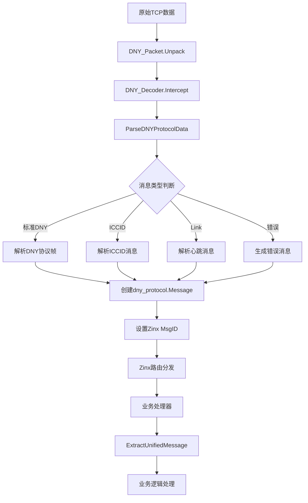
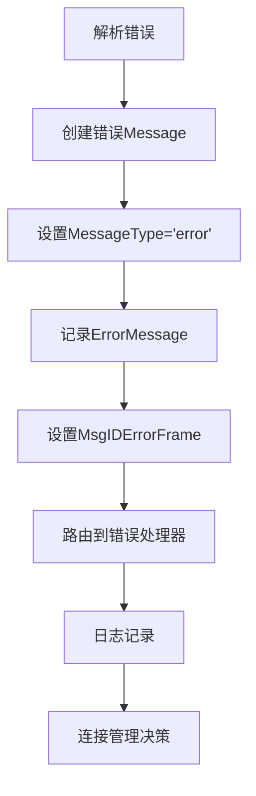

# DNY 协议解析器统一架构设计文档

**版本**: v2.0  
**日期**: 2025 年 6 月 13 日  
**状态**: 已实施

---

## 🏗️ 架构概览

### 重构前后对比

#### 重构前（分散式架构）

```
客户端数据 → DNY_Decoder → 多个解析函数 → 不同的数据结构 → 业务处理器
                          ├─ parseFrame()
                          ├─ HandleSpecialMessage()
                          ├─ calculateDNYCrc()
                          └─ 各种重复逻辑
```

#### 重构后（统一式架构）

```
客户端数据 → DNY_Decoder → ParseDNYProtocolData() → *dny_protocol.Message → 业务处理器
                         ↓
                      统一解析器
                    ├─ 标准DNY帧
                    ├─ ICCID消息
                    ├─ Link心跳
                    └─ 错误处理
```

---

## 📦 核心组件架构

### 1. 统一解析器层

```go
pkg/protocol/dny_protocol_parser.go
├─ ParseDNYProtocolData()        // 主入口函数
├─ CalculatePacketChecksumInternal() // 校验和计算
├─ BuildDNYResponsePacketUnified()   // 响应包构建
├─ IsSpecialMessage()                // 特殊消息检测
└─ LogDNYMessage()                   // 统一日志记录
```

**职责**:

- 统一所有 DNY 协议变体的解析逻辑
- 提供一致的错误处理和日志记录
- 返回标准化的 `*dny_protocol.Message` 结构

### 2. 消息模型层

```go
internal/domain/dny_protocol/frame.go
├─ Message struct                    // 统一消息结构
├─ NewMessage()                      // 消息工厂函数
├─ BuildChargeControlPacket()        // 充电控制包构建
└─ IMessageToDnyMessage()           // Zinx适配函数
```

**消息结构设计**:

```go
type Message struct {
    // Zinx IMessage接口字段
    Id      uint32 // 路由ID
    DataLen uint32 // 数据长度
    Data    []byte // 数据内容
    RawData []byte // 原始数据

    // DNY协议字段
    PacketHeader string // 包头
    PhysicalId   uint32 // 物理ID
    CommandId    uint32 // 命令ID
    MessageId    uint16 // 消息ID
    Checksum     uint16 // 校验和

    // 统一解析扩展字段
    MessageType  string // "standard", "iccid", "heartbeat_link", "error"
    ICCIDValue   string // ICCID值
    ErrorMessage string // 错误信息
}
```

### 3. 解码器适配层

```go
pkg/protocol/dny_decoder.go
├─ DNY_Decoder.Intercept()          // Zinx拦截器
├─ 调用 ParseDNYProtocolData()      // 使用统一解析器
├─ 设置 Zinx MsgID                  // 路由适配
└─ 传递 *dny_protocol.Message       // 附加数据传递
```

**路由映射策略**:

```go
switch parsedMsg.MessageType {
case "standard":
    iMessage.SetMsgID(parsedMsg.CommandId)        // 使用DNY命令ID
case "iccid":
    iMessage.SetMsgID(constants.MsgIDICCID)       // 特殊路由ID
case "heartbeat_link":
    iMessage.SetMsgID(constants.MsgIDLinkHeartbeat) // 特殊路由ID
case "error":
    iMessage.SetMsgID(constants.MsgIDErrorFrame)   // 错误路由ID
}
```

### 4. 处理器兼容层

```go
pkg/protocol/dny_frame_handler_base.go
├─ ExtractUnifiedMessage()          // 新接口：获取统一消息
├─ ExtractDecodedFrame()            // 兼容接口：适配旧结构
├─ HandleError()                    // 统一错误处理
├─ SendResponse()                   // 统一响应发送
└─ 其他兼容性方法
```

**迁移策略**:

```go
// 阶段1：兼容性接口（当前）
decodedFrame, err := h.ExtractDecodedFrame(request)

// 阶段2：新统一接口（目标）
unifiedMsg, err := h.ExtractUnifiedMessage(request)
```

---

## 🔀 数据流架构

### 完整数据流程



### 错误处理流程



---

## 🎯 设计原则与模式

### 1. 单一职责原则 (SRP)

- **统一解析器**: 只负责协议解析
- **消息模型**: 只负责数据结构定义
- **解码器**: 只负责 Zinx 适配
- **处理器**: 只负责业务逻辑

### 2. 开闭原则 (OCP)

```go
// 扩展新的消息类型无需修改现有代码
func ParseDNYProtocolData(data []byte) (*dny_protocol.Message, error) {
    // 检测逻辑可以通过策略模式扩展
    for _, detector := range messageDetectors {
        if detector.CanHandle(data) {
            return detector.Parse(data)
        }
    }
}
```

### 3. 依赖倒置原则 (DIP)

```go
// 高层模块不依赖低层模块，都依赖抽象
type ProtocolParser interface {
    Parse([]byte) (*Message, error)
}

type DNYDecoder struct {
    parser ProtocolParser // 依赖抽象而非具体实现
}
```

### 4. 适配器模式

```go
// 兼容性适配器
func (h *DNYFrameHandlerBase) ExtractDecodedFrame(request ziface.IRequest) (*DecodedDNYFrame, error) {
    unifiedMsg, err := h.ExtractUnifiedMessage(request)
    if err != nil {
        return nil, err
    }
    // 将新结构适配为旧结构
    return adaptToOldFormat(unifiedMsg), nil
}
```

---

## 📋 常量和配置管理

### 常量组织结构

```go
pkg/constants/dny_protocol.go
├─ 消息ID常量
│  ├─ MsgIDErrorFrame    = 0xFF00
│  ├─ MsgIDICCID         = 0xFF01
│  ├─ MsgIDLinkHeartbeat = 0xFF02
│  └─ MsgIDUnknown       = 0xFF03
├─ 协议常量
│  ├─ IOT_SIM_CARD_LENGTH = 20
│  ├─ IOT_LINK_HEARTBEAT  = "link"
│  └─ DNY_MIN_PACKET_LEN  = 12
└─ 命令映射表
   └─ DNYCommandMap
```

### 路由配置

```go
internal/infrastructure/zinx_server/handlers/router.go
├─ 特殊消息路由
│  ├─ constants.MsgIDICCID         → SimCardHandler
│  ├─ constants.MsgIDLinkHeartbeat → LinkHeartbeatHandler
│  └─ constants.MsgIDUnknown       → NonDNYDataHandler
└─ DNY协议路由
   ├─ dny_protocol.CmdHeartbeat    → HeartbeatHandler
   ├─ dny_protocol.CmdChargeControl → ChargeControlHandler
   └─ ...
```

---

## 🔧 扩展点设计

### 1. 新消息类型扩展

```go
// 在ParseDNYProtocolData中添加新的检测逻辑
if dataLen == NEW_MESSAGE_LENGTH && string(data[:prefix]) == NEW_HEADER {
    msg.MessageType = "new_message_type"
    msg.NewMessageField = parseNewMessage(data)
    return msg, nil
}
```

### 2. 新命令处理器扩展

```go
// 在router.go中注册新的处理器
server.AddRouter(dny_protocol.CmdNewCommand, &NewCommandHandler{})
```

### 3. 新校验算法扩展

```go
// 支持多种校验算法
type ChecksumCalculator interface {
    Calculate(data []byte) uint16
}

func ParseWithChecksum(data []byte, calc ChecksumCalculator) (*Message, error)
```

---

## 📈 性能优化设计

### 1. 内存管理

```go
// 对象池减少GC压力
var messagePool = sync.Pool{
    New: func() interface{} {
        return &dny_protocol.Message{}
    },
}

func getPooledMessage() *dny_protocol.Message {
    return messagePool.Get().(*dny_protocol.Message)
}
```

### 2. 缓存策略

```go
// 校验和缓存（可选）
type ChecksumCache struct {
    cache map[string]uint16
    mutex sync.RWMutex
    maxSize int
}
```

### 3. 预编译优化

```go
// 预编译正则表达式
var (
    iccidPattern = regexp.MustCompile(`^[0-9]{20}$`)
    linkPattern  = regexp.MustCompile(`^link$`)
)
```

---

## 🧪 测试架构

### 测试层次结构

```
单元测试
├─ ParseDNYProtocolData_test.go     // 解析器核心逻辑
├─ DNYDecoder_test.go               // 解码器适配逻辑
└─ MessageBuilder_test.go           // 消息构建逻辑

集成测试
├─ ProtocolFlow_test.go             // 端到端协议流程
└─ HandlerIntegration_test.go       // 处理器集成测试

性能测试
├─ ParsePerformance_test.go         // 解析性能基准
└─ MemoryUsage_test.go             // 内存使用测试
```

### 测试数据管理

```go
// 测试用例数据
var testCases = []struct {
    name     string
    input    []byte
    expected MessageType
    wantErr  bool
}{
    {"标准DNY帧", dnyFrameData, "standard", false},
    {"ICCID消息", iccidData, "iccid", false},
    {"Link心跳", linkData, "heartbeat_link", false},
    {"空数据", []byte{}, "error", true},
}
```

---

## 📚 文档和维护

### API 文档结构

```
docs/
├─ api/
│  ├─ protocol_parser.md            // 解析器API文档
│  ├─ message_structure.md          // 消息结构说明
│  └─ handler_development.md        // 处理器开发指南
├─ architecture/
│  ├─ design_patterns.md            // 设计模式说明
│  ├─ data_flow.md                  // 数据流程图
│  └─ extension_guide.md            // 扩展开发指南
└─ maintenance/
   ├─ troubleshooting.md            // 故障排查指南
   ├─ performance_tuning.md         // 性能调优指南
   └─ migration_guide.md            // 迁移指南
```

### 版本管理策略

```
版本号格式: MAJOR.MINOR.PATCH
├─ MAJOR: 不向后兼容的API变更
├─ MINOR: 向后兼容的功能新增
└─ PATCH: 向后兼容的问题修复

发布流程:
1. 开发分支 → 测试验证
2. 合并主分支 → 自动化测试
3. 版本标记 → 发布部署
4. 文档更新 → 通知相关方
```

---

## 🎉 总结

本架构设计实现了以下关键目标：

✅ **统一性**: 单一解析入口，一致的数据结构  
✅ **扩展性**: 易于添加新的消息类型和处理器  
✅ **兼容性**: 平滑的迁移路径，保护现有投资  
✅ **可维护性**: 清晰的职责分工，降低维护成本  
✅ **性能优化**: 内置性能优化机制和扩展点

通过这个统一的架构设计，DNY 协议解析器不仅解决了当前的技术债务问题，还为未来的功能扩展和性能优化奠定了坚实的基础。

---

**文档维护者**: IoT Zinx 架构团队  
**审核者**: 技术委员会  
**最后更新**: 2025 年 6 月 13 日
