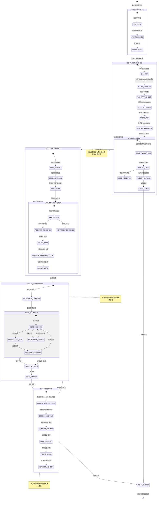
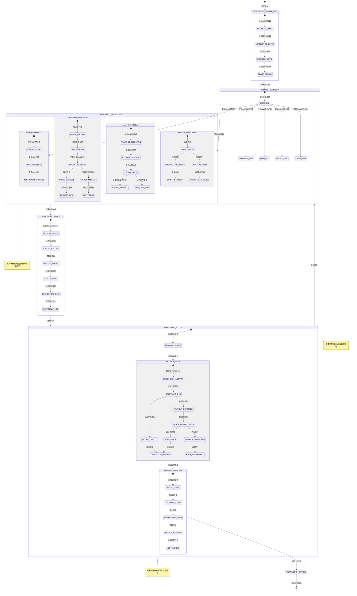

# IoT-Zinx 系统数据流程状态图分析报告

**分析时间**: 2025 年 6 月 19 日  
**分析范围**: TCP 连接、设备注册、心跳机制、充电流程、HTTP 请求的完整数据流程状态图  
**分析目标**: 确保每个数据的状态传递清晰无误，支持系统优化和问题排查

## 系统概述

IoT-Zinx 系统是一个基于 Zinx 框架的 IoT 设备管理平台，采用六边形架构设计，支持 DNY 协议通信。系统包含五个核心数据流程：

1. **TCP 连接流程** - 处理设备连接的建立、维护和断开
2. **设备注册流程** - 管理设备的识别、注册和会话创建
3. **心跳流程** - 维护设备连接活跃状态和超时检测
4. **充电流程** - 控制设备充电的完整业务流程
5. **HTTP 请求流程** - 处理外部 API 请求和数据获取

## 1. TCP 连接流程状态图

### 流程概述

TCP 连接流程管理设备从连接建立到断开的完整生命周期，包括 Zinx 框架层和业务层的双重状态管理。

### 关键状态转换

- **TCP_HANDSHAKE** → **CONN_ESTABLISHED** → **AWAITING_ICCID** → **ACTIVE_CONNECTION** → **DISCONNECTING** → **CONN_CLOSED**

### 核心特性

- 初始读取超时 60 秒，防止空连接占用资源
- 双层会话管理：Zinx 会话 + Monitor 会话
- 原子性清理操作，确保数据一致性
- 心跳超时自动检测和连接清理

## 2. 设备注册流程状态图

### 流程概述

设备注册流程处理从 ICCID 识别到设备完全注册上线的完整过程，支持会话恢复和重连场景。

### 关键状态转换

- **CONN_AWAITING_ICCID** → **ICCID_PROCESSING** → **REGISTRATION_TRIGGERED** → **SESSION_MANAGEMENT** → **DEVICE_BINDING** → **DEVICE_ONLINE**

### 核心特性

- 原子性 ICCID 设置，确保状态一致性
- 支持会话恢复，处理设备重连场景
- 双层会话管理：Monitor 会话 + Zinx 会话
- 主动触发注册机制，提高注册成功率

```mermaid
stateDiagram-v2
    [*] --> CONN_AWAITING_ICCID : TCP连接已建立

    state CONN_AWAITING_ICCID {
        [*] --> WAITING_ICCID_DATA : 等待ICCID数据
        WAITING_ICCID_DATA --> ICCID_RECEIVED : 收到19-25位数字
        WAITING_ICCID_DATA --> INVALID_DATA : 收到无效数据
        INVALID_DATA --> WAITING_ICCID_DATA : 继续等待
    }

    CONN_AWAITING_ICCID --> ICCID_PROCESSING : ICCID数据有效

    state ICCID_PROCESSING {
        [*] --> ICCID_VALIDATION : 验证ICCID格式
        ICCID_VALIDATION --> SESSION_UPDATE : 格式验证通过
        SESSION_UPDATE --> PROPERTY_SYNC : 更新DeviceSession
        PROPERTY_SYNC --> STATE_TRANSITION : 同步到连接属性
        STATE_TRANSITION --> TRIGGER_REGISTRATION : 状态转为ICCID_RECEIVED
    }

    ICCID_PROCESSING --> REGISTRATION_TRIGGERED : ICCID处理完成

    state REGISTRATION_TRIGGERED {
        [*] --> SEND_0x81_CMD : 发送网络状态查询命令
        SEND_0x81_CMD --> WAIT_REGISTER_RESPONSE : 等待设备响应
        WAIT_REGISTER_RESPONSE --> REGISTER_0x20_RECEIVED : 收到0x20注册包
        WAIT_REGISTER_RESPONSE --> HEARTBEAT_RECEIVED : 收到心跳包
        WAIT_REGISTER_RESPONSE --> TIMEOUT_RETRY : 超时重试
        TIMEOUT_RETRY --> SEND_0x81_CMD : 重新发送查询
    }

    REGISTRATION_TRIGGERED --> REGISTER_PROCESSING : 收到注册请求

    state REGISTER_PROCESSING {
        [*] --> FRAME_DECODE : 解码DNY帧
        FRAME_DECODE --> FRAME_VALIDATE : 验证帧有效性
        FRAME_VALIDATE --> PHYSICAL_ID_EXTRACT : 提取物理ID
        PHYSICAL_ID_EXTRACT --> DEVICE_ID_GENERATE : 生成设备ID
        DEVICE_ID_GENERATE --> DATA_VALIDATE : 验证注册数据
        DATA_VALIDATE --> SESSION_OPERATIONS : 数据验证通过
    }

    REGISTER_PROCESSING --> SESSION_MANAGEMENT : 开始会话管理

    state SESSION_MANAGEMENT {
        [*] --> MONITOR_SESSION_CHECK : 检查Monitor会话
        MONITOR_SESSION_CHECK --> CREATE_NEW_SESSION : 会话不存在
        MONITOR_SESSION_CHECK --> RESTORE_EXISTING : 会话已存在

        CREATE_NEW_SESSION --> SESSION_INIT : 初始化新会话
        SESSION_INIT --> ICCID_BIND : 绑定ICCID
        ICCID_BIND --> DEVICE_GROUP_ADD : 添加到设备组

        RESTORE_EXISTING --> SESSION_RESTORE : 恢复会话状态
        SESSION_RESTORE --> RECONNECT_COUNT : 更新重连计数
        RECONNECT_COUNT --> STATUS_UPDATE : 更新会话状态

        DEVICE_GROUP_ADD --> MONITOR_BIND : 绑定到TCPMonitor
        STATUS_UPDATE --> MONITOR_BIND : 绑定到TCPMonitor
    }

    SESSION_MANAGEMENT --> DEVICE_BINDING : 会话管理完成

    state DEVICE_BINDING {
        [*] --> TCP_MONITOR_BIND : 绑定设备到TCPMonitor
        TCP_MONITOR_BIND --> ZINX_SESSION_UPDATE : 更新Zinx会话状态
        ZINX_SESSION_UPDATE --> CONNECTION_SYNC : 同步连接属性
        CONNECTION_SYNC --> TIMEOUT_RESET : 重置读取超时
        TIMEOUT_RESET --> DEVICE_SERVICE_NOTIFY : 通知设备服务
    }

    DEVICE_BINDING --> REGISTRATION_COMPLETE : 设备绑定完成

    state REGISTRATION_COMPLETE {
        [*] --> RESPONSE_PREPARE : 准备注册响应
        RESPONSE_PREPARE --> RESPONSE_SEND : 发送成功响应
        RESPONSE_SEND --> STATE_ACTIVE : 设置连接为活跃状态
        STATE_ACTIVE --> HEARTBEAT_MONITOR_START : 启动心跳监控
        HEARTBEAT_MONITOR_START --> READY_FOR_COMMANDS : 准备接收命令
    }

    REGISTRATION_COMPLETE --> DEVICE_ONLINE : 设备注册成功

    DEVICE_ONLINE --> [*] : 注册流程完成

    note right of ICCID_PROCESSING : 原子性ICCID设置\n确保状态一致性
    note right of SESSION_MANAGEMENT : 支持会话恢复\n处理设备重连场景
    note right of DEVICE_BINDING : 双层会话管理\nMonitor会话+Zinx会话
    note right of REGISTRATION_COMPLETE : 设置活跃状态\n启动业务流程
```

## 3. 心跳流程状态图

### 流程概述

心跳流程维护设备连接的活跃状态，支持多种心跳类型，并提供自动超时检测和连接清理机制。

### 关键状态转换

- **HEARTBEAT_SYSTEM_INIT** → **WAITING_HEARTBEAT** → **HEARTBEAT_PROCESSING** → **HEARTBEAT_UPDATE** → **MONITORING_CYCLE**

### 核心特性

- 支持多种心跳类型：标准心跳(0x01)、主机心跳(0x11)、设备心跳(0x21)、功率心跳(0x06)、Link 心跳
- 统一处理框架，边界检查和数据验证
- 定期检查机制，自动超时处理
- 优雅断开连接，清理相关资源

## 4. 充电流程状态图

### 流程概述

充电流程管理设备充电的完整业务流程，包括充电启动、状态监控、异常处理和充电完成的全生命周期。

### 关键状态转换

- **CHARGE_REQUEST_RECEIVED** → **CHARGE_COMMAND_BUILD** → **COMMAND_SENDING** → **RESPONSE_PROCESSING** → **BUSINESS_LOGIC** → **CHARGE_MONITORING** → **CHARGE_COMPLETION**

### 核心特性

- 构建 DNY 协议包，包含所有充电参数
- 实时监控充电状态，支持异常自动处理
- 多种错误处理策略，确保业务连续性
- 完整的订单和计费管理

```mermaid
stateDiagram-v2
    [*] --> CHARGE_REQUEST_RECEIVED : 收到充电请求

    state CHARGE_REQUEST_RECEIVED {
        [*] --> REQUEST_VALIDATE : 验证请求参数
        REQUEST_VALIDATE --> DEVICE_CHECK : 检查设备在线状态
        DEVICE_CHECK --> CONNECTION_VERIFY : 验证设备连接
        CONNECTION_VERIFY --> PHYSICAL_ID_PARSE : 解析物理ID
        PHYSICAL_ID_PARSE --> MESSAGE_ID_GENERATE : 生成消息ID
    }

    CHARGE_REQUEST_RECEIVED --> CHARGE_COMMAND_BUILD : 请求验证通过

    state CHARGE_COMMAND_BUILD {
        [*] --> PACKET_CONSTRUCT : 构建充电控制协议包
        PACKET_CONSTRUCT --> PARAMS_ENCODE : 编码充电参数

        state PARAMS_ENCODE {
            [*] --> RATE_MODE_SET : 设置费率模式
            RATE_MODE_SET --> BALANCE_SET : 设置余额
            BALANCE_SET --> PORT_SET : 设置端口号
            PORT_SET --> COMMAND_SET : 设置充电命令
            COMMAND_SET --> DURATION_SET : 设置充电时长
            DURATION_SET --> ORDER_SET : 设置订单号
            ORDER_SET --> MAX_DURATION_SET : 设置最大时长
            MAX_DURATION_SET --> MAX_POWER_SET : 设置最大功率
            MAX_POWER_SET --> QR_LIGHT_SET : 设置二维码灯
        }

        PARAMS_ENCODE --> PACKET_READY : 参数编码完成
    }

    CHARGE_COMMAND_BUILD --> COMMAND_SENDING : 命令构建完成

    state COMMAND_SENDING {
        [*] --> MONITOR_NOTIFY : 通知监视器
        MONITOR_NOTIFY --> PACKET_SEND : 发送数据包
        PACKET_SEND --> SEND_SUCCESS : 发送成功
        PACKET_SEND --> SEND_FAILED : 发送失败
        SEND_FAILED --> ERROR_RESPONSE : 返回错误
        SEND_SUCCESS --> WAIT_RESPONSE : 等待设备响应
    }

    COMMAND_SENDING --> RESPONSE_WAITING : 命令已发送

    state RESPONSE_WAITING {
        [*] --> LISTENING : 监听设备响应
        LISTENING --> RESPONSE_RECEIVED : 收到0x82响应
        LISTENING --> TIMEOUT_CHECK : 检查超时
        TIMEOUT_CHECK --> RESPONSE_TIMEOUT : 响应超时
        TIMEOUT_CHECK --> CONTINUE_WAIT : 继续等待
        CONTINUE_WAIT --> LISTENING : 返回监听
    }

    RESPONSE_WAITING --> RESPONSE_PROCESSING : 收到响应

    state RESPONSE_PROCESSING {
        [*] --> FRAME_DECODE : 解码响应帧
        FRAME_DECODE --> DATA_VALIDATE : 验证响应数据
        DATA_VALIDATE --> PARAMS_EXTRACT : 提取控制参数

        state PARAMS_EXTRACT {
            [*] --> GUN_NUMBER_GET : 获取充电枪号
            GUN_NUMBER_GET --> CONTROL_CMD_GET : 获取控制命令
            CONTROL_CMD_GET --> STATUS_PARSE : 解析响应状态
        }

        PARAMS_EXTRACT --> RESPONSE_ANALYZE : 参数提取完成
    }

    RESPONSE_PROCESSING --> BUSINESS_LOGIC : 响应处理完成

    state BUSINESS_LOGIC {
        [*] --> STATUS_CHECK : 检查响应状态
        STATUS_CHECK --> SUCCESS_RESPONSE : 成功响应
        STATUS_CHECK --> NO_CHARGER_ERROR : 未插充电器
        STATUS_CHECK --> PORT_ERROR : 端口故障
        STATUS_CHECK --> OTHER_ERROR : 其他错误

        SUCCESS_RESPONSE --> CHARGE_SUCCESS_HANDLE : 处理成功逻辑
        NO_CHARGER_ERROR --> NO_CHARGER_HANDLE : 处理无充电器错误
        PORT_ERROR --> PORT_ERROR_HANDLE : 处理端口错误
        OTHER_ERROR --> OTHER_ERROR_HANDLE : 处理其他错误
    }

    BUSINESS_LOGIC --> CHARGE_MONITORING : 业务逻辑处理完成

    state CHARGE_MONITORING {
        state CHARGE_SUCCESS_FLOW {
            [*] --> ORDER_UPDATE : 更新订单状态
            ORDER_UPDATE --> CHARGING_RECORD : 创建充电记录
            CHARGING_RECORD --> MONITOR_START : 启动充电监控
            MONITOR_START --> NOTIFICATION_SEND : 发送用户通知
        }

        state MONITOR_LOOP {
            [*] --> STATUS_QUERY : 查询充电状态
            STATUS_QUERY --> STATUS_RESPONSE : 收到状态响应
            STATUS_RESPONSE --> STATUS_ANALYZE : 分析状态变化

            state STATUS_ANALYZE {
                [*] --> CHARGING_NORMAL : 充电正常
                [*] --> CHARGING_COMPLETED : 充电完成
                [*] --> CHARGING_ERROR : 充电异常
                [*] --> CHARGING_STOPPED : 充电停止
            }

            STATUS_ANALYZE --> ACTION_DECIDE : 决定后续动作
        }

        CHARGE_SUCCESS_FLOW --> MONITOR_LOOP : 开始监控循环
    }

    state ERROR_HANDLING {
        state NO_CHARGER_HANDLING {
            [*] --> USER_NOTIFY_NO_CHARGER : 通知用户插入充电器
            USER_NOTIFY_NO_CHARGER --> ORDER_PENDING : 订单设为待处理
            ORDER_PENDING --> RETRY_MECHANISM : 启动重试机制
        }

        state PORT_ERROR_HANDLING {
            [*] --> PORT_FAULT_LOG : 记录端口故障
            PORT_FAULT_LOG --> MAINTENANCE_NOTIFY : 通知维护人员
            MAINTENANCE_NOTIFY --> ORDER_CANCEL : 取消订单
        }

        state OTHER_ERROR_HANDLING {
            [*] --> ERROR_LOG : 记录错误信息
            ERROR_LOG --> ERROR_ANALYSIS : 分析错误原因
            ERROR_ANALYSIS --> RECOVERY_ATTEMPT : 尝试恢复
            RECOVERY_ATTEMPT --> MANUAL_INTERVENTION : 人工干预
        }
    }

    CHARGE_MONITORING --> CHARGE_COMPLETION : 充电流程完成
    ERROR_HANDLING --> CHARGE_COMPLETION : 错误处理完成

    state CHARGE_COMPLETION {
        [*] --> FINAL_STATUS_UPDATE : 更新最终状态
        FINAL_STATUS_UPDATE --> BILLING_CALCULATE : 计算费用
        BILLING_CALCULATE --> RECORD_FINALIZE : 完成记录
        RECORD_FINALIZE --> CLEANUP_RESOURCES : 清理资源
        CLEANUP_RESOURCES --> COMPLETION_NOTIFY : 完成通知
    }

    CHARGE_COMPLETION --> [*] : 充电流程结束

    RESPONSE_TIMEOUT --> ERROR_HANDLING : 响应超时
    ERROR_RESPONSE --> ERROR_HANDLING : 发送失败
    NO_CHARGER_HANDLE --> ERROR_HANDLING : 无充电器错误
    PORT_ERROR_HANDLE --> ERROR_HANDLING : 端口错误
    OTHER_ERROR_HANDLE --> ERROR_HANDLING : 其他错误

    note right of CHARGE_COMMAND_BUILD : 构建DNY协议包\n包含所有充电参数
    note right of CHARGE_MONITORING : 实时监控充电状态\n支持异常自动处理
    note right of ERROR_HANDLING : 多种错误处理策略\n确保业务连续性
```

## 5. HTTP 请求数据流程状态图

### 流程概述

HTTP 请求流程处理外部 API 请求，通过 Gin 框架进行路由匹配，执行业务逻辑，并返回统一格式的响应。

### 关键状态转换

- **HTTP_REQUEST_RECEIVED** → **ROUTING_PROCESS** → **HANDLER_EXECUTION** → **DATA_PROCESSING** → **HTTP_RESPONSE**

### 核心特性

- Gin 框架路由匹配，支持 RESTful API 设计
- 依赖注入模式，统一的处理器上下文
- 统一响应格式，JSON 序列化处理
- 分层错误处理，详细错误信息记录

```mermaid
stateDiagram-v2
    [*] --> HTTP_REQUEST_RECEIVED : 收到HTTP请求

    state HTTP_REQUEST_RECEIVED {
        [*] --> REQUEST_PARSE : 解析HTTP请求
        REQUEST_PARSE --> METHOD_VALIDATE : 验证HTTP方法
        METHOD_VALIDATE --> URL_PARSE : 解析URL路径
        URL_PARSE --> HEADERS_EXTRACT : 提取请求头
        HEADERS_EXTRACT --> BODY_PARSE : 解析请求体
    }

    HTTP_REQUEST_RECEIVED --> ROUTING_PROCESS : 请求解析完成

    state ROUTING_PROCESS {
        [*] --> ROUTE_MATCH : 匹配路由规则
        ROUTE_MATCH --> HANDLER_LOCATE : 定位处理器

        state HANDLER_LOCATE {
            [*] --> DEVICE_API : /api/v1/devices
            [*] --> DEVICE_STATUS_API : /api/v1/device/:deviceId/status
            [*] --> COMMAND_API : /api/v1/device/command
            [*] --> DNY_COMMAND_API : /api/v1/command/dny
            [*] --> CHARGING_START_API : /api/v1/charging/start
            [*] --> CHARGING_STOP_API : /api/v1/charging/stop
            [*] --> HEALTH_CHECK_API : /api/v1/health
        }

        HANDLER_LOCATE --> CONTEXT_PREPARE : 准备处理器上下文
    }

    ROUTING_PROCESS --> HANDLER_EXECUTION : 路由匹配成功

    state HANDLER_EXECUTION {
        [*] --> CONTEXT_GET : 获取全局处理器上下文
        CONTEXT_GET --> SERVICE_VALIDATE : 验证服务可用性
        SERVICE_VALIDATE --> PARAMS_BIND : 绑定请求参数
        PARAMS_BIND --> PARAMS_VALIDATE : 验证参数有效性
        PARAMS_VALIDATE --> BUSINESS_LOGIC : 执行业务逻辑

        state BUSINESS_LOGIC {
            state DEVICE_LIST_LOGIC {
                [*] --> DEVICE_SERVICE_CALL : 调用设备服务
                DEVICE_SERVICE_CALL --> ENHANCED_LIST_GET : 获取增强设备列表
                ENHANCED_LIST_GET --> DEVICE_COUNT : 统计设备数量
            }

            state DEVICE_STATUS_LOGIC {
                [*] --> DEVICE_ID_EXTRACT : 提取设备ID
                DEVICE_ID_EXTRACT --> BUSINESS_STATUS_GET : 获取业务状态
                BUSINESS_STATUS_GET --> CONNECTION_INFO_GET : 获取连接信息
                CONNECTION_INFO_GET --> STATUS_MERGE : 合并状态信息
            }

            state COMMAND_SEND_LOGIC {
                [*] --> DEVICE_ONLINE_CHECK : 检查设备在线
                DEVICE_ONLINE_CHECK --> COMMAND_CONSTRUCT : 构造命令
                COMMAND_CONSTRUCT --> COMMAND_SEND : 发送命令
                COMMAND_SEND --> RESULT_WAIT : 等待结果
            }

            state CHARGING_LOGIC {
                [*] --> CHARGE_SERVICE_GET : 获取充电服务
                CHARGE_SERVICE_GET --> CHARGE_REQUEST_BUILD : 构建充电请求
                CHARGE_REQUEST_BUILD --> CHARGE_COMMAND_SEND : 发送充电命令
                CHARGE_COMMAND_SEND --> CHARGE_RESULT_WAIT : 等待充电结果
            }
        }

        BUSINESS_LOGIC --> RESPONSE_PREPARE : 业务逻辑完成
    }

    HANDLER_EXECUTION --> DATA_PROCESSING : 处理器执行完成

    state DATA_PROCESSING {
        [*] --> DATA_TRANSFORM : 数据转换
        DATA_TRANSFORM --> RESPONSE_FORMAT : 格式化响应

        state RESPONSE_FORMAT {
            [*] --> SUCCESS_RESPONSE : 成功响应格式
            [*] --> ERROR_RESPONSE : 错误响应格式

            state SUCCESS_RESPONSE {
                [*] --> CODE_SET_SUCCESS : 设置成功码(0)
                CODE_SET_SUCCESS --> MESSAGE_SET_SUCCESS : 设置成功消息
                MESSAGE_SET_SUCCESS --> DATA_ATTACH : 附加响应数据
            }

            state ERROR_RESPONSE {
                [*] --> ERROR_CODE_SET : 设置错误码
                ERROR_CODE_SET --> ERROR_MESSAGE_SET : 设置错误消息
                ERROR_MESSAGE_SET --> ERROR_DETAILS_ADD : 添加错误详情
            }
        }

        RESPONSE_FORMAT --> JSON_SERIALIZE : JSON序列化
    }

    DATA_PROCESSING --> HTTP_RESPONSE : 数据处理完成

    state HTTP_RESPONSE {
        [*] --> STATUS_CODE_SET : 设置HTTP状态码
        STATUS_CODE_SET --> HEADERS_SET : 设置响应头
        HEADERS_SET --> BODY_WRITE : 写入响应体
        BODY_WRITE --> RESPONSE_SEND : 发送响应
        RESPONSE_SEND --> CONNECTION_CLOSE : 关闭连接
    }

    HTTP_RESPONSE --> [*] : HTTP请求处理完成

    state ERROR_HANDLING {
        [*] --> ERROR_TYPE_CHECK : 检查错误类型
        ERROR_TYPE_CHECK --> PARAM_ERROR : 参数错误(400)
        ERROR_TYPE_CHECK --> NOT_FOUND_ERROR : 资源不存在(404)
        ERROR_TYPE_CHECK --> SERVER_ERROR : 服务器错误(500)
        ERROR_TYPE_CHECK --> SERVICE_ERROR : 服务不可用(503)

        PARAM_ERROR --> ERROR_LOG : 记录错误日志
        NOT_FOUND_ERROR --> ERROR_LOG : 记录错误日志
        SERVER_ERROR --> ERROR_LOG : 记录错误日志
        SERVICE_ERROR --> ERROR_LOG : 记录错误日志

        ERROR_LOG --> ERROR_RESPONSE_BUILD : 构建错误响应
    }

    ROUTING_PROCESS --> ERROR_HANDLING : 路由失败
    HANDLER_EXECUTION --> ERROR_HANDLING : 处理器异常
    DATA_PROCESSING --> ERROR_HANDLING : 数据处理异常

    ERROR_HANDLING --> HTTP_RESPONSE : 错误处理完成

    note right of ROUTING_PROCESS : Gin框架路由匹配\n支持RESTful API设计
    note right of HANDLER_EXECUTION : 依赖注入模式\n统一的处理器上下文
    note right of DATA_PROCESSING : 统一响应格式\nJSON序列化处理
    note right of ERROR_HANDLING : 分层错误处理\n详细错误信息记录
```

## 总结与建议

### 数据流程完整性验证

通过以上五个状态图的详细分析，IoT-Zinx 系统的数据流程具备以下特点：

1. **状态转换清晰** - 每个流程的状态转换都有明确的触发条件和结果
2. **错误处理完善** - 各流程都包含完整的异常处理和恢复机制
3. **数据一致性保证** - 通过原子性操作和状态同步确保数据一致性
4. **监控机制健全** - 实时监控和定期检查确保系统稳定运行

### 优化建议

1. **性能优化** - 可考虑在高并发场景下优化状态转换的性能
2. **监控增强** - 增加更多的状态转换监控点，便于问题排查
3. **文档维护** - 定期更新状态图，确保与代码实现保持一致
4. **测试覆盖** - 针对关键状态转换路径增加自动化测试

### 使用指南

本报告中的状态图可用于：

- 系统架构理解和新人培训
- 问题排查和故障定位
- 系统优化和性能调优
- 代码审查和质量保证

---

**报告生成时间**: 2025 年 6 月 19 日
**版本**: v1.0
**维护者**: IoT-Zinx 开发团队
