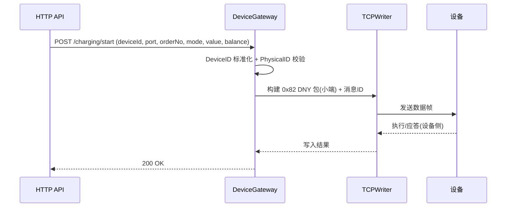

# AP3000 协议映射与业务规范

本文档对项目与《AP3000-设备与服务器通信协议》的映射关系、API 控制契约、业务校验规则、改进清单与后续计划进行统一说明。

## 1. 协议遵循要点
- 包头: "DNY" (0x44 0x4E 0x59)
- 长度: 2 字节，小端；= 物理ID + 消息ID + 命令 + 数据(n) + 校验(2)
- 校验: 全包累加和的低 2 字节（不含校验本身）
- 字节序: 默认小端
- 消息ID: 每条命令唯一（重发保持一致），超时建议 15 秒
- 发送节流: 同一设备命令之间 ≥ 0.5 秒
- 物理ID编码: 文档 1.0.2 第7条，严格遵循

实现文件：
- 构包与拆包：`pkg/protocol/dny_packet.go`
- 发送通道：`pkg/network/tcp_writer.go`
- 网关接口：`pkg/gateway/device_gateway.go`
- HTTP 层：`internal/adapter/http/gateway_handlers.go`

## 2. API ↔ 指令映射
- 充电控制（开始/停止）
  - HTTP：
    - `POST /api/v1/charging/start` → 0x82（开始充电）
    - `POST /api/v1/charging/stop` → 0x82（停止充电）
  - 网关：`SendChargingCommandWithParams`
  - 字段与单位：
    - 端口: API 1-based，协议 0-based（0x00=第1路）
    - 订单号: 16 字节
    - 余额/有效期: 4 字节，小端（单位：分；包月时为时间戳）
    - 时长/电量: 2 字节，小端（时长：秒；电量：0.1度）
    - 其它：最大充电时长、过载功率、二维码灯、短路检测、带充满自停等按协议设置
- 设备定位
  - HTTP：`POST /api/v1/device/locate` → 0x96（声光寻找设备）
  - 网关：`SendLocationCommand`
  - 参数：定位时间 1 字节（秒）
- 状态与详情
  - HTTP：`GET /api/v1/device/{id}/status` / `/detail`
  - 网关：`IsDeviceOnline` / `GetDeviceDetail`
  - 数据源：`core.TCPManager` 单一数据源

## 3. 设备ID与 PhysicalID 一致性
- 外部传入 `deviceId` 必须通过 `utils.DeviceIDProcessor.SmartConvertDeviceID` 标准化（十进制/6位/8位十六进制）
- 发送前校验 `PhysicalID`：以解析自 `deviceId` 的值为准；如与 `Device` 存储不一致，需修正为解析值

## 4. 业务校验与错误处理
- 幂等保护：`charging/start|stop` 支持 `orderNo` 窗口幂等（默认 60s，可配置）
- 参数校验：
  - 端口号不可为 0；订单号 ≤16 字节
  - 按时间/电量充电时 `value>0`；余额>0（如业务需要）
  - `mode` 合法值：0=计时，1=包月，2=计量，3=计次（按协议行为处理）
- 超时与重试：`TCPWriter` 统一写超时与重试（见 `configs/gateway.yaml`）

## 5. 日志与可观测性
- 命令发送需输出结构化日志字段：`deviceID, physicalID, msgID, cmd, dataHex, packetHex, packetLen`
- 建议关闭 `fmt.Printf`，统一使用结构化日志（logrus）

## 6. 架构一致性与数据源
- `core.TCPManager` 是设备数据的单一来源
- 避免从连接会话派生业务事实；修改 `Device` 字段需加锁

## 7. 改进与待办（建议）
- 节流：在 `DeviceGateway` 或 `TCPWriter` 层引入 per-device 发送节流（≥0.5s）
- 消息ID：在实际封包处写入动态消息ID（确保 `DNYPacket` 与 Builder 一致）
- 日志：去除 `fmt.Printf` 调试输出，统一 `logger`
- 工具化：把散落的十六进制/校验/字节序工具函数统一到 `pkg/utils`
- 清理：移除重复/废弃的协议解析逻辑（已集中在拦截器/DNYPacket）

## 8. 附：时序图（充电开始）

## 9. 参考
- 协议文档：`docs/协议/AP3000-设备与服务器通信协议.md`
- 配置：`configs/gateway.yaml`
- 发送：`pkg/gateway/device_gateway.go`、`pkg/network/tcp_writer.go`
- 构包：`pkg/protocol/dny_packet.go`

## 10. 智能降功率（基于 0x82 过载功率）

- 目标：在充电中动态下调本次订单的功率上限，保护被充设备与电网负载。
- 原理：重复下发 0x82，保持 `充电命令=1` 与 `订单号` 不变，仅更新“过载功率(2B，小端，单位瓦)”并可选“最大充电时长(2B，小端，0=不修改)”。
- 区分：
  - 0x82：本次订单动态参数（含过载功率）
  - 0x8A：仅修改“时长/电量”，不涉及功率
  - 0x85：设备持久化上限，非本次订单动态调功

### 配置
`configs/gateway.yaml::smartCharging`
- `enabled`: 是否启用
- `stepPercent`: 每次下调比例（0-1，建议0.1）
- `stepIntervalSeconds`: 下调间隔秒数（建议180s）
- `peakHoldSeconds`: 峰值保持时长秒（建议300s）
- `minPowerW`: 收尾最低功率（建议≈50-80W）
- `changeThresholdW`: 变化阈值，低于该值不下发（防抖，建议≥30W）
- `stabilizeWindowSeconds`: 低功率稳定窗口（可用于停机策略扩展）
- `sampleRate`: 心跳采样率，1=全量

### 代码落点
- 控制器：`pkg/gateway/dynamic_power_controller.go`
- 心跳接入：
  - `internal/infrastructure/zinx_server/handlers/power_heartbeat_handler.go`
  - `internal/infrastructure/zinx_server/handlers/port_power_heartbeat_handler.go`
- 网关方法：`pkg/gateway/device_gateway.go::UpdateChargingOverloadPower`
- 启动：`main.go` 调用 `gateway.InitDynamicPowerController()`

### 注意事项
- 同设备命令间隔≥0.5秒；消息ID唯一，超时15秒最多重发2次。
- 端口号协议0起，外部1起；`订单号`必须与当前订单一致。
- 幂等与观测：结构化日志、失败重试、第三方推送按原有规范执行。

## 11. 事件契约（推送给第三方的字段）

所有事件统一字段：
- `event_id`(string)：UUID；亦作为 `Idempotency-Key`
- `event_type`(string)：见 `pkg/notification/types.go`
- `device_id`(string)：8位十六进制（物理ID标准化）
- `port_number`(int)：对外1-based；无端口事件为0或省略
- `timestamp`(int64)：秒
- `data`(object)：事件特定负载

关键事件负载：
- charging_power：
  - `realtime_power`(float, 单位W)；`realtime_power_raw`(uint16, 0.1W)
  - `orderNo`(string, ≤16B)
  - `charge_duration`(uint16, 秒)
  - 可选：`message_id`、`command`、`power_time`
- power_heartbeat：同上，另包含 `cumulative_energy`(度) 与 `_raw`(0.01度)
- charging_start / end / failed：至少包含 `orderNo`、`port_number`、`message_id`
- settlement：结算明细（详见协议 0x03），单位遵循协议约定

限频与采样：
- `notification.sampling[event_type]=N`：每N条取1条
- `notification.throttle[event_type]=Go duration`：设备+端口维度时间窗内仅保留首条
