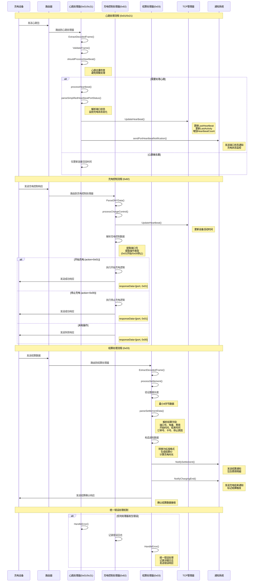

# IoT-Zinx业务模块分析图

## 设备注册模块(0x20)详细时序图

```mermaid
sequenceDiagram
    participant Device as 充电设备
    participant DNYDecoder as DNY解码器
    participant Router as 路由器
    participant RegisterHandler as 设备注册处理器
    participant TCPManager as TCP管理器
    participant DeviceService as 设备服务
    participant ResponseSender as 响应发送器

    %% 1. 数据接收和解析
    Note over Device,ResponseSender: 1. 数据接收和解析阶段
    Device->>DNYDecoder: 发送设备注册包(0x20)
    DNYDecoder->>DNYDecoder: ParseDNYProtocolData()
    Note right of DNYDecoder: 解析DNY帧结构<br/>提取PhysicalID<br/>提取MessageID<br/>提取Command=0x20<br/>提取Payload
    DNYDecoder->>Router: 设置MsgID=0x20

    %% 2. 路由到处理器
    Note over Device,ResponseSender: 2. 路由到处理器
    Router->>RegisterHandler: DeviceRegisterHandler.Handle()
    
    %% 3. 数据提取和验证
    Note over Device,ResponseSender: 3. 数据提取和验证
    RegisterHandler->>RegisterHandler: ExtractDecodedFrame()
    Note right of RegisterHandler: 提取DecodedDNYFrame<br/>验证数据完整性
    RegisterHandler->>RegisterHandler: ValidateFrame()
    Note right of RegisterHandler: 验证帧类型<br/>验证数据长度<br/>验证校验和
    
    %% 4. 会话管理
    Note over Device,ResponseSender: 4. 会话管理
    RegisterHandler->>RegisterHandler: GetOrCreateDeviceSession()
    RegisterHandler->>RegisterHandler: UpdateDeviceSessionFromFrame()
    
    %% 5. 智能注册决策
    Note over Device,ResponseSender: 5. 智能注册决策
    RegisterHandler->>RegisterHandler: analyzeRegistrationRequest()
    RegisterHandler->>TCPManager: GetSessionByDeviceID()
    TCPManager-->>RegisterHandler: 返回设备会话状态
    
    alt 新设备注册
        RegisterHandler->>RegisterHandler: decision.Action = "accept"
        Note right of RegisterHandler: 新设备首次注册<br/>需要完整注册流程
    else 设备重复注册
        RegisterHandler->>RegisterHandler: decision.Action = "ignore"
        Note right of RegisterHandler: 短时间内重复注册<br/>智能忽略请求
    else 设备状态更新
        RegisterHandler->>RegisterHandler: decision.Action = "update"
        Note right of RegisterHandler: 更新心跳时间<br/>不触发完整流程
    end

    %% 6. 设备注册处理
    Note over Device,ResponseSender: 6. 设备注册处理
    alt decision.Action == "accept"
        RegisterHandler->>RegisterHandler: handleDeviceRegister()
        
        %% 6.1 获取ICCID
        RegisterHandler->>RegisterHandler: 从连接属性获取ICCID
        Note right of RegisterHandler: 验证ICCID存在<br/>ICCID格式验证
        
        %% 6.2 TCP管理器注册
        RegisterHandler->>TCPManager: RegisterDeviceWithDetails()
        TCPManager->>TCPManager: RegisterDevice()
        Note right of TCPManager: 更新ConnectionSession<br/>建立设备索引<br/>创建/更新DeviceGroup
        TCPManager->>TCPManager: 建立deviceIndex映射
        TCPManager->>TCPManager: 建立iccidIndex映射
        TCPManager-->>RegisterHandler: 注册成功
        
        %% 6.3 验证注册结果
        RegisterHandler->>TCPManager: GetConnectionByDeviceID()
        TCPManager-->>RegisterHandler: 返回绑定连接
        RegisterHandler->>RegisterHandler: 验证连接绑定成功
        
        %% 6.4 会话同步
        RegisterHandler->>RegisterHandler: 更新DeviceSession
        Note right of RegisterHandler: 设置DeviceID<br/>设置PhysicalID<br/>更新LastActivity<br/>同步到连接
        
        %% 6.5 业务通知
        RegisterHandler->>DeviceService: HandleDeviceOnline()
        Note right of DeviceService: 通知设备上线<br/>更新设备状态<br/>触发业务逻辑
        
        %% 6.6 第三方通知
        RegisterHandler->>RegisterHandler: sendThirdPartyNotification()
        Note right of RegisterHandler: 解析设备信息<br/>构建通知数据<br/>发送第三方通知
        
    else decision.Action == "ignore"
        RegisterHandler->>RegisterHandler: 智能忽略处理
        Note right of RegisterHandler: 记录忽略原因<br/>直接发送响应
        
    else decision.Action == "update"
        RegisterHandler->>RegisterHandler: handleRegistrationUpdate()
        RegisterHandler->>TCPManager: UpdateHeartbeat()
        Note right of TCPManager: 更新LastHeartbeat<br/>更新LastActivity<br/>增加HeartbeatCount
    end

    %% 7. 响应生成和发送
    Note over Device,ResponseSender: 7. 响应生成和发送
    RegisterHandler->>ResponseSender: sendRegisterResponse()
    ResponseSender->>ResponseSender: 构造DNY响应帧
    Note right of ResponseSender: 设置PhysicalID<br/>设置MessageID<br/>设置Command=0x20<br/>设置Status=Success<br/>计算Checksum
    ResponseSender->>Device: 发送注册成功响应

    %% 8. 错误处理
    Note over Device,ResponseSender: 8. 错误处理分支
    alt 注册失败
        RegisterHandler->>ResponseSender: sendRegisterErrorResponse()
        ResponseSender->>Device: 发送注册失败响应
        Note right of ResponseSender: Status=Error<br/>包含错误信息
    end

    %% 9. 统计更新
    Note over Device,ResponseSender: 9. 统计更新
    RegisterHandler->>RegisterHandler: updateRegistrationMetrics()
    Note right of RegisterHandler: 更新注册统计<br/>记录注册时间<br/>更新连接计数
```

## 核心业务模块对比图

## 业务模块特点

### 设备注册模块 (0x20)
- **智能决策**: accept/ignore/update三种处理策略
- **完整流程**: 从数据验证到第三方通知的完整链路
- **状态管理**: 设备索引建立和DeviceGroup管理
- **错误处理**: 完善的错误处理和响应机制

### 心跳模块 (0x01/0x21)
- **去重机制**: 避免频繁处理重复心跳
- **状态监控**: 端口状态解析和充电状态变化检测
- **连接保活**: 实时更新心跳时间和连接状态
- **通知推送**: 端口状态变化的实时通知

### 充电控制模块 (0x82)
- **操作解析**: 充电启停操作的准确识别
- **状态反馈**: 操作结果的及时响应
- **错误处理**: 未知操作的安全处理
- **活动更新**: 设备活动时间的实时更新

### 结算模块 (0x03)
- **数据解析**: 完整的结算字段解析
- **格式转换**: 标准化的通知数据格式
- **多重通知**: 结算和充电结束的双重通知
- **确认机制**: 结算数据接收的确认响应

---

**图表版本**: v1.0  
**更新时间**: 2025-08-07  
**图表类型**: Mermaid Sequence Diagram  
**适用范围**: IoT-Zinx核心业务模块分析
