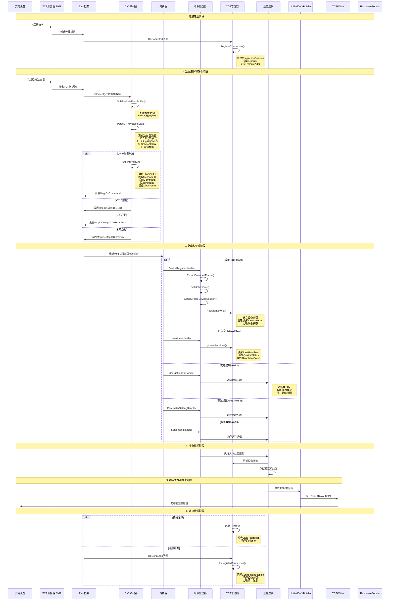

# IoT-Zinx数据流分析图

## 完整数据流时序图

## 数据流关键节点

### 1. 连接建立阶段
- TCP连接建立
- 创建ConnectionSession
- 注册到TCPManager

### 2. 数据接收和解析阶段
- TCP数据流接收
- DNY协议解析
- 数据包类型识别
- 消息ID设置

### 3. 路由和处理阶段
- 根据命令ID路由
- 调用对应Handler
- 执行业务逻辑
- 更新设备状态

### 4. 响应生成和发送阶段
- 构造响应数据
- DNY帧编码
- TCP数据发送

### 5. 连接管理阶段
- 心跳监控
- 超时检测
- 资源清理

## 数据处理特点

### TCP粘包处理
- 自动分割数据包
- 缓冲区管理
- 完整性验证

### 协议解析
- 多协议支持
- 智能识别
- 错误恢复

### 状态管理
- 实时状态更新
- 多层状态同步
- 统计信息维护

---

**图表版本**: v1.1  
**更新时间**: 2025-08-23  
**图表类型**: Mermaid Sequence Diagram  
**适用范围**: IoT-Zinx完整数据流分析
