# IoT-Zinx系统架构图

## 整体架构图

```mermaid
graph TB
    %% 外部系统
    subgraph "外部系统"
        Device[充电设备]
        Client[HTTP客户端]
        Admin[管理界面]
    end

    %% 网关层
    subgraph "IoT-Zinx网关系统"
        %% 接口层
        subgraph "接口层 (Ports)"
            TCPPort[TCP服务器<br/>:8999]
            HTTPPort[HTTP服务器<br/>:8080]
        end

        %% 适配器层
        subgraph "适配器层 (Adapters)"
            ZinxAdapter[Zinx网络适配器]
            HTTPAdapter[HTTP API适配器]
            ConfigAdapter[配置适配器]
            LogAdapter[日志适配器]
        end

        %% 应用层
        subgraph "应用层 (Application)"
            ServiceMgr[服务管理器]
            DeviceService[设备服务]
            ChargingService[充电服务]
            HeartbeatMgr[心跳管理器]
        end

        %% 领域层
        subgraph "领域层 (Domain)"
            DNYProtocol[DNY协议模型]
            DeviceModel[设备模型]
            ChargingModel[充电模型]
        end

        %% 基础设施层
        subgraph "基础设施层 (Infrastructure)"
            %% 核心组件
            subgraph "核心组件 (pkg/core)"
                TCPManager[TCP管理器]
                PortManager[端口管理器]
                ConnectionSession[连接会话]
                DeviceGroup[设备组]
            end

            %% 协议处理
            subgraph "协议处理 (pkg/protocol)"
                DNYParser[DNY协议解析器]
                SimpleHandlerBase[简化处理器基类]
                DataPack[数据包处理器]
                ResponseSender[响应发送器]
            end

            %% 网络组件
            subgraph "网络组件 (pkg/network)"
                CommandManager[命令管理器]
                ConnectionHooks[连接钩子]
            end

            %% 命令处理器
            subgraph "命令处理器 (handlers)"
                DeviceRegisterHandler[设备注册处理器<br/>0x20]
                HeartbeatHandler[心跳处理器<br/>0x01/0x21]
                ChargeControlHandler[充电控制处理器<br/>0x82]
                ParameterHandler[参数设置处理器<br/>0x83/0x84]
                SettlementHandler[结算处理器<br/>0x03]
                TimeHandler[时间同步处理器<br/>0x22]
            end
        end
    end

    %% 数据流连接
    Device -->|TCP连接| TCPPort
    Client -->|HTTP请求| HTTPPort
    Admin -->|管理请求| HTTPPort

    TCPPort --> ZinxAdapter
    HTTPPort --> HTTPAdapter

    ZinxAdapter --> ServiceMgr
    HTTPAdapter --> ServiceMgr

    ServiceMgr --> DeviceService
    ServiceMgr --> ChargingService
    ServiceMgr --> HeartbeatMgr

    DeviceService --> DNYProtocol
    ChargingService --> ChargingModel
    HeartbeatMgr --> DeviceModel

    %% 基础设施连接
    ZinxAdapter --> TCPManager
    ZinxAdapter --> DNYParser
    ZinxAdapter --> CommandManager

    TCPManager --> ConnectionSession
    TCPManager --> DeviceGroup
    TCPManager --> PortManager

    DNYParser --> SimpleHandlerBase
    SimpleHandlerBase --> DeviceRegisterHandler
    SimpleHandlerBase --> HeartbeatHandler
    SimpleHandlerBase --> ChargeControlHandler
    SimpleHandlerBase --> ParameterHandler
    SimpleHandlerBase --> SettlementHandler
    SimpleHandlerBase --> TimeHandler

    CommandManager --> ResponseSender
    ResponseSender --> DataPack

    %% 配置和日志
    ConfigAdapter --> ServiceMgr
    LogAdapter --> ServiceMgr

    %% 样式
    classDef external fill:#e1f5fe
    classDef port fill:#f3e5f5
    classDef adapter fill:#e8f5e8
    classDef application fill:#fff3e0
    classDef domain fill:#fce4ec
    classDef infrastructure fill:#f1f8e9
    classDef handler fill:#e0f2f1

    class Device,Client,Admin external
    class TCPPort,HTTPPort port
    class ZinxAdapter,HTTPAdapter,ConfigAdapter,LogAdapter adapter
    class ServiceMgr,DeviceService,ChargingService,HeartbeatMgr application
    class DNYProtocol,DeviceModel,ChargingModel domain
    class TCPManager,PortManager,ConnectionSession,DeviceGroup,DNYParser,SimpleHandlerBase,DataPack,ResponseSender,CommandManager,ConnectionHooks infrastructure
    class DeviceRegisterHandler,HeartbeatHandler,ChargeControlHandler,ParameterHandler,SettlementHandler,TimeHandler handler
```

## 架构说明

### 六边形架构设计

IoT-Zinx采用六边形架构（端口与适配器架构），实现了业务逻辑与技术实现的清晰分离：

1. **外部系统**: 充电设备、HTTP客户端、管理界面
2. **接口层**: TCP和HTTP服务器端口
3. **适配器层**: 各种技术适配器
4. **应用层**: 业务服务和管理器
5. **领域层**: 核心业务模型
6. **基础设施层**: 技术实现组件

### 核心设计原则

- **依赖倒置**: 业务逻辑不依赖具体技术实现
- **单一职责**: 每个组件专注于特定功能
- **开放封闭**: 易于扩展新功能，稳定现有接口
- **接口隔离**: 清晰的模块边界和接口定义

### 数据流向

1. 外部请求通过端口进入系统
2. 适配器将技术格式转换为业务格式
3. 应用层协调业务逻辑执行
4. 领域层处理核心业务规则
5. 基础设施层提供技术支持
6. 响应沿相反路径返回

---

**图表版本**: v1.0  
**更新时间**: 2025-08-07  
**图表类型**: Mermaid Graph TB  
**适用范围**: IoT-Zinx整体架构概览
