# IoT-Zinx设备管理图

## 设备状态转换图

```mermaid
stateDiagram-v2
    [*] --> Connected: TCP连接建立
    
    Connected --> ICCIDReceived: 接收ICCID数据
    Connected --> Registered: 直接设备注册(0x20)
    Connected --> Disconnected: 连接断开
    Connected --> Error: 连接错误
    
    ICCIDReceived --> Registered: 设备注册成功(0x20)
    ICCIDReceived --> Disconnected: 连接断开
    ICCIDReceived --> Error: 连接错误
    
    Registered --> Online: 接收心跳包(0x01/0x21)
    Registered --> Disconnected: 连接断开
    Registered --> Error: 连接错误
    
    Online --> Offline: 心跳超时
    Online --> Disconnected: 连接断开
    Online --> Error: 连接错误
    
    Offline --> Online: 心跳恢复
    Offline --> Disconnected: 连接断开
    Offline --> Error: 连接错误
    
    Error --> [*]: 清理资源
    Disconnected --> [*]: 清理资源
    
    note right of Connected
        状态: StateConnected
        操作: 创建ConnectionSession
        数据: ConnID, RemoteAddr
    end note
    
    note right of ICCIDReceived
        状态: StateICCIDReceived
        操作: 记录ICCID信息
        数据: ICCID
    end note
    
    note right of Registered
        状态: StateRegistered
        操作: 建立设备索引
        数据: DeviceID, PhysicalID
        创建: DeviceGroup
    end note
    
    note right of Online
        状态: StateOnline
        操作: 更新心跳时间
        数据: LastHeartbeat
        状态: DeviceStatusOnline
    end note
    
    note right of Offline
        状态: StateOffline
        操作: 标记离线
        状态: DeviceStatusOffline
    end note
```

## 设备数据结构关系图

## 设备管理机制

### 连接生命周期管理

1. **连接建立**
   - TCP连接创建
   - 分配唯一ConnID
   - 创建ConnectionSession
   - 记录连接时间和地址

2. **ICCID接收**
   - 识别20字节ICCID数据
   - 建立ICCID索引
   - 准备设备注册

3. **设备注册**
   - 处理0x20注册命令
   - 建立DeviceID索引
   - 创建或更新DeviceGroup
   - 设置设备属性

4. **在线状态**
   - 接收心跳包维持在线
   - 更新LastHeartbeat时间
   - 监控设备活动

5. **离线检测**
   - 心跳超时检测
   - 标记设备离线
   - 保持连接等待恢复

6. **连接清理**
   - 连接断开处理
   - 清理所有索引
   - 释放相关资源

### 多索引管理

- **connections**: ConnID → ConnectionSession
- **deviceIndex**: DeviceID → ConnectionSession  
- **iccidIndex**: ICCID → ConnectionSession
- **deviceGroups**: ICCID → DeviceGroup

### 设备组管理

- 基于ICCID的设备分组
- 支持主从设备关系
- 统一的组状态管理
- 组内设备协调

### 状态同步机制

- 实时状态更新
- 多层状态验证
- 统计信息维护
- 错误状态处理

---

**图表版本**: v1.1  
**更新时间**: 2025-08-23  
**图表类型**: Mermaid State Diagram + ER Diagram  
**适用范围**: IoT-Zinx设备连接和状态管理
