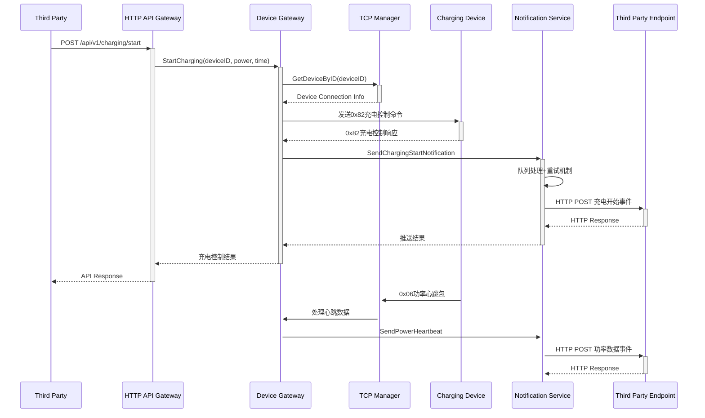
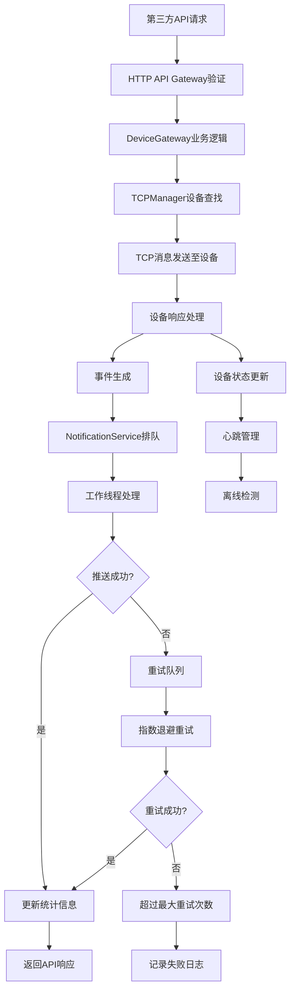
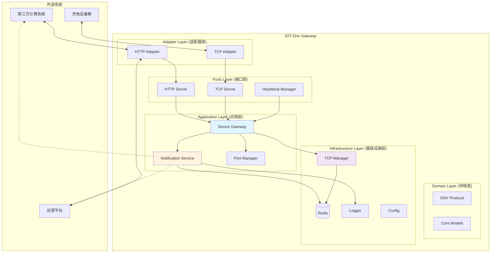
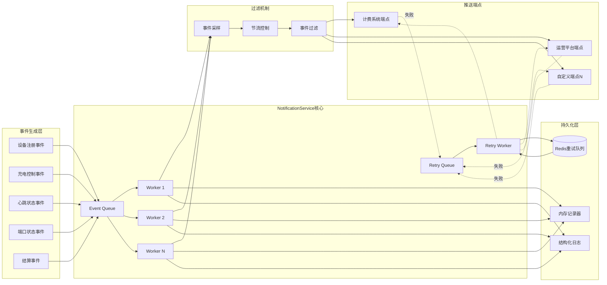

# IOT-Zinx 系统全面分析报告

> **专题分析**: 充电业务逻辑安全漏洞的详细分析请参考 [`charging-business-logic-vulnerabilities.md`](../vulnerability-analysis/charging-business-logic-vulnerabilities.md)

## 1. 系统概述

IOT-Zinx是一个基于TCP的充电设备管理网关系统，采用六边形架构设计，实现设备注册、心跳管理、充电控制和实时状态监控。系统集成了完整的事件推送机制，支持与第三方系统的实时数据同步。

## 2. 完整业务流程分析

### 2.1 第三方API请求 → IOT服务 → 设备 → IOT推送第三方的完整流程

### 2.2 核心业务流程时序

## 3. 系统架构图

### 3.1 完整系统架构

### 3.2 事件推送机制架构

## 4. 核心技术特性

### 4.1 事件驱动架构特性
- **异步处理**: 所有设备通信和通知推送采用异步模式
- **事件溯源**: 完整记录设备状态变更历史
- **容错机制**: 支持重试、熔断和降级策略

### 4.2 可扩展性设计
- **水平扩展**: 支持多实例部署和负载均衡
- **插件化**: 通知端点支持动态配置和扩展
- **协议适配**: 支持多种设备通信协议

### 4.3 监控和可观测性
- **结构化日志**: 统一的日志格式和级别
- **指标收集**: 关键业务指标的实时监控
- **链路追踪**: 完整的请求链路跟踪

## 5. 业务漏洞概述

> **注意**: 详细的充电业务逻辑漏洞分析请参考 [`charging-business-logic-vulnerabilities.md`](../vulnerability-analysis/charging-business-logic-vulnerabilities.md)

### 5.1 漏洞分类概述
- **严重漏洞**: 订单状态管理、充电状态机缺失
- **高风险漏洞**: 幂等性问题、功率控制安全
- **中等风险漏洞**: 通知事件推送机制相关问题
- **低风险漏洞**: 参数验证、日志安全

### 5.2 修复优先级建议
1. **立即修复**: 订单状态管理和端口号一致性问题
2. **短期修复**: 充电状态机和幂等性控制
3. **中期优化**: 通知可靠性和安全增强
4. **长期改进**: 参数验证完善和监控体系

## 6. 监控和告警建议

### 6.1 关键指标监控
- 事件推送成功率
- 端点响应时间
- 重试队列长度
- 事件采样丢弃率

### 6.2 告警规则
- 推送成功率低于95%
- 重试队列积压超过1000
- 端点响应时间超过10秒
- 关键事件推送失败

## 7. 总结

IOT-Zinx系统整体架构设计良好，采用了六边形架构和事件驱动模式。但在事件推送机制中存在一些业务逻辑漏洞，特别是在幂等性保证、重试机制和端口号转换方面需要改进。建议优先修复高风险漏洞，并建立完善的监控告警机制来保证系统的稳定性和数据一致性。

系统的可扩展性和容错性较好，通过合理的配置和代码优化，可以支撑大规模充电设备的管理需求。