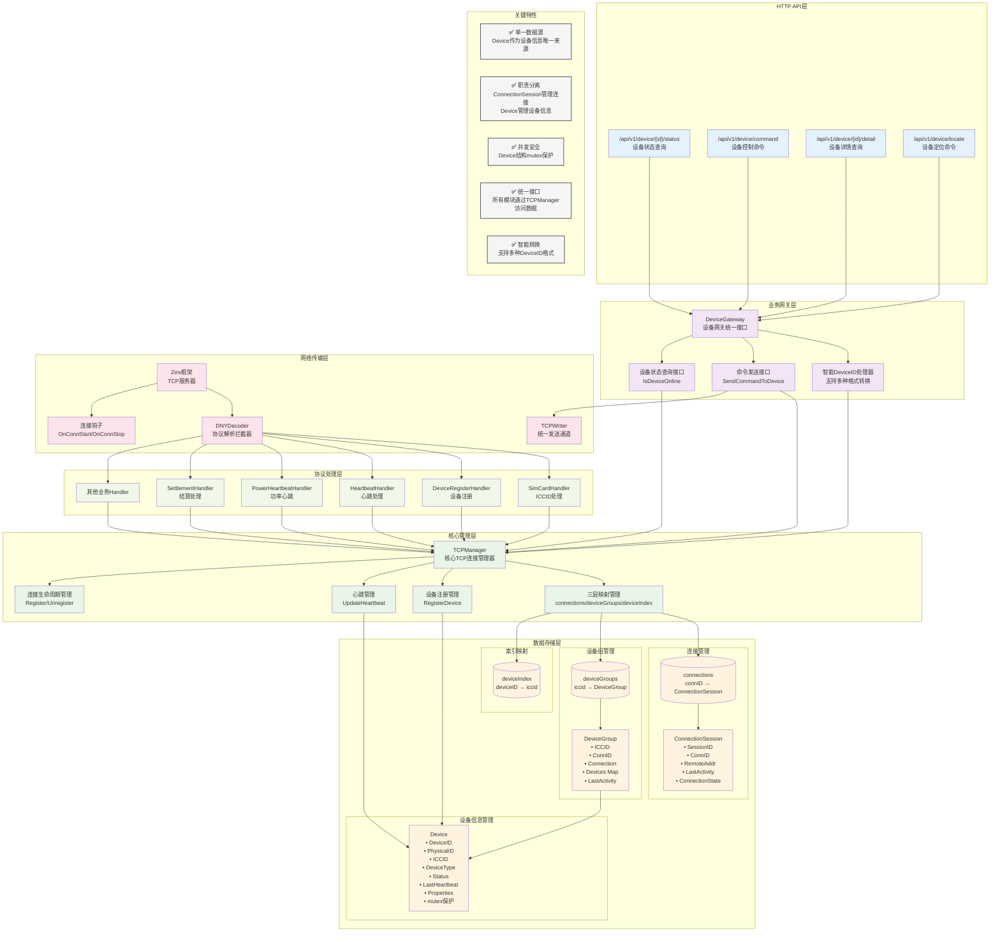
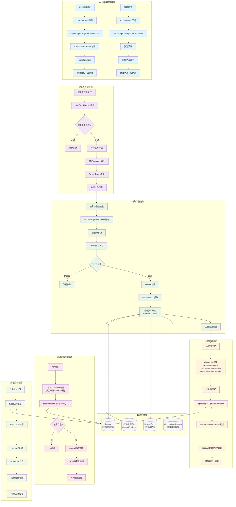
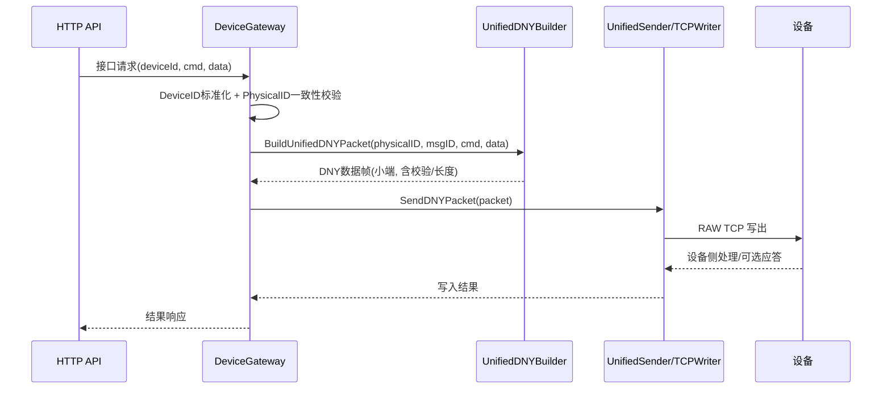

## 唯一发送链路与实现锚点

- 唯一链路：HTTP API → DeviceGateway → UnifiedDNYBuilder → UnifiedSender/TCPWriter → RAW TCP → 设备
- 实现文件：
  - 构包：`pkg/protocol/unified_dny_builder.go::BuildUnifiedDNYPacket`
  - 发送：`pkg/network/unified_sender.go`、`pkg/network/tcp_writer.go`
  - 消息ID：`pkg/export.go::Protocol.GetNextMessageID()`（每命令唯一；重发沿用原ID）
  - 发送节流（≥0.5s/设备）：`pkg/gateway/send.go::SendCommandToDevice`
  - 超时与重发：`pkg/network/command_manager.go`（15s、最多重发2次）

## AP3000 协议关键约束（落实于实现）

- 帧格式（小端，长度含校验）：`DNY(3)` + `Length(2)` + `PhysicalID(4)` + `MessageID(2)` + `Command(1)` + `Data(n)` + `Checksum(2)`
- 校验：自 `DNY` 起至校验字段前字节累加和的低2字节（见 `UnifiedDNYBuilder.calculateChecksum`）
- 字节序：除特别标注外均为小端；长度/物理ID/消息ID/数值字段一律小端
- 发送节流：同设备命令间隔 ≥ 0.5 秒（`DeviceGateway.SendCommandToDevice`）
- 消息ID：每命令唯一，重发保持一致；超时 15 秒，最多重发 2 次（`CommandManager`）
- 设备ID对外 API：`utils.DeviceIDProcessor.SmartConvertDeviceID` 标准化
- 统一构包/发送：仅允许 `BuildUnifiedDNYPacket` + `UnifiedSender/TCPWriter`，禁止二次封装
- 日志：下发与上行帧输出结构化字段 `deviceID/physicalID/msgID/cmd/dataHex/packetHex`

