# 总体架构图

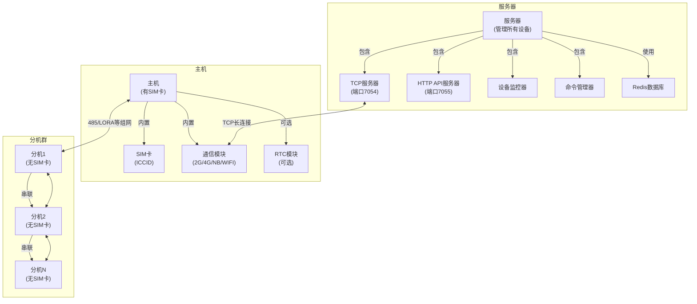

# DNY协议数据框架

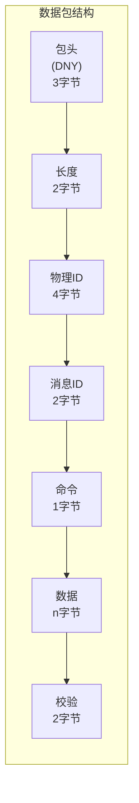

# 设备类型分类图

```mermaid
graph TD
    Device["设备类型"]
    Device --> SinglePort["单路插座\n(识别码03)"]
    Device --> DualPort["双路插座\n(识别码04)"]
    Device --> TenPort["10路充电桩\n(识别码05)"]
    Device --> SixteenPort["16路充电桩\n(识别码06)"]
    Device --> TwelvePort["12路充电桩\n(识别码07)"]
    Device --> Master["主机\n(识别码09)"]
    Device --> LeakageMaster["漏保主机\n(识别码0A)"]
    
    SinglePort --> OldSingle["旧款485单路"]
    SinglePort --> NewSingle["新款485单路"]
    
    DualPort --> OldDual["旧款485双路"]
    DualPort --> NewDual["新款485双路"]
    DualPort --> NBDual["新款NB双模"]
    DualPort --> WIFIDual["新款WIFI双模"]
    DualPort --> LoraDual["新款Lora双模"]
    
    TenPort --> OldTen["旧款10路"]
    TenPort --> NewTen["新款10路"]
    
    SixteenPort --> OldSixteen["旧款16路"]
    SixteenPort --> NewSixteen["新款16路"]
    
    Master --> OldMaster["旧款主机"]
    Master --> LoraMaster["LORA主机"]
    Master --> WirelessMaster["无线主机"]
    
    LeakageMaster --> StandardLeakage["标准漏保主机"]
    LeakageMaster --> AdvancedLeakage["高级漏保主机"]
    %% 说明：设备类型与识别码的对应关系
```

# 数据流图

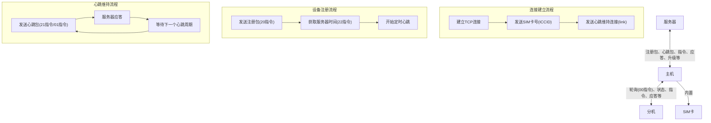

# 状态机图

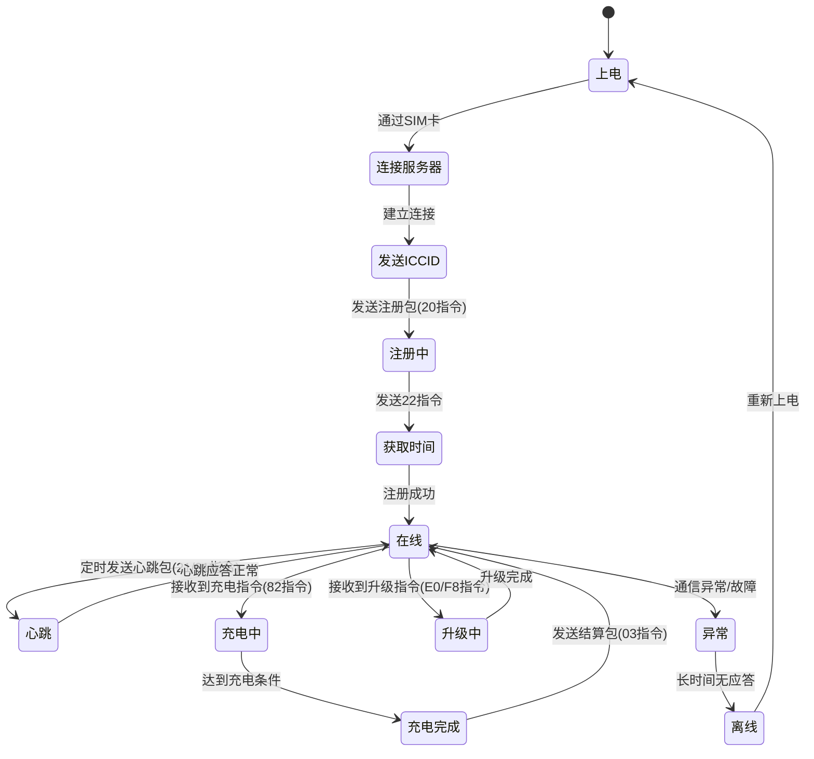

# 实体关系图

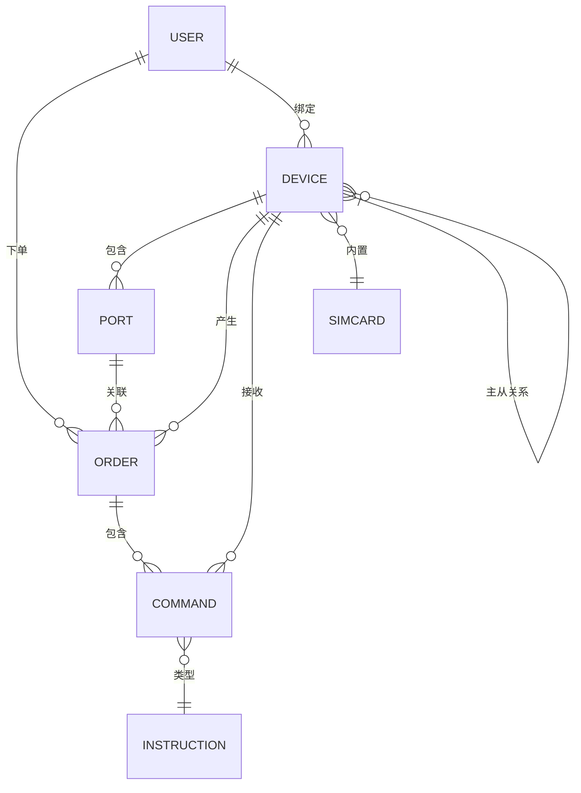

# 服务器组件架构图

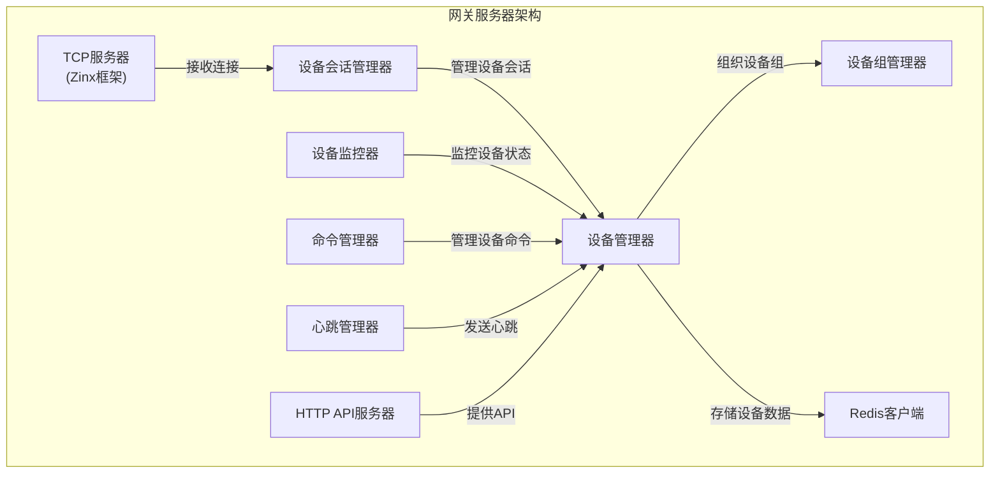

# 设备通信分析图

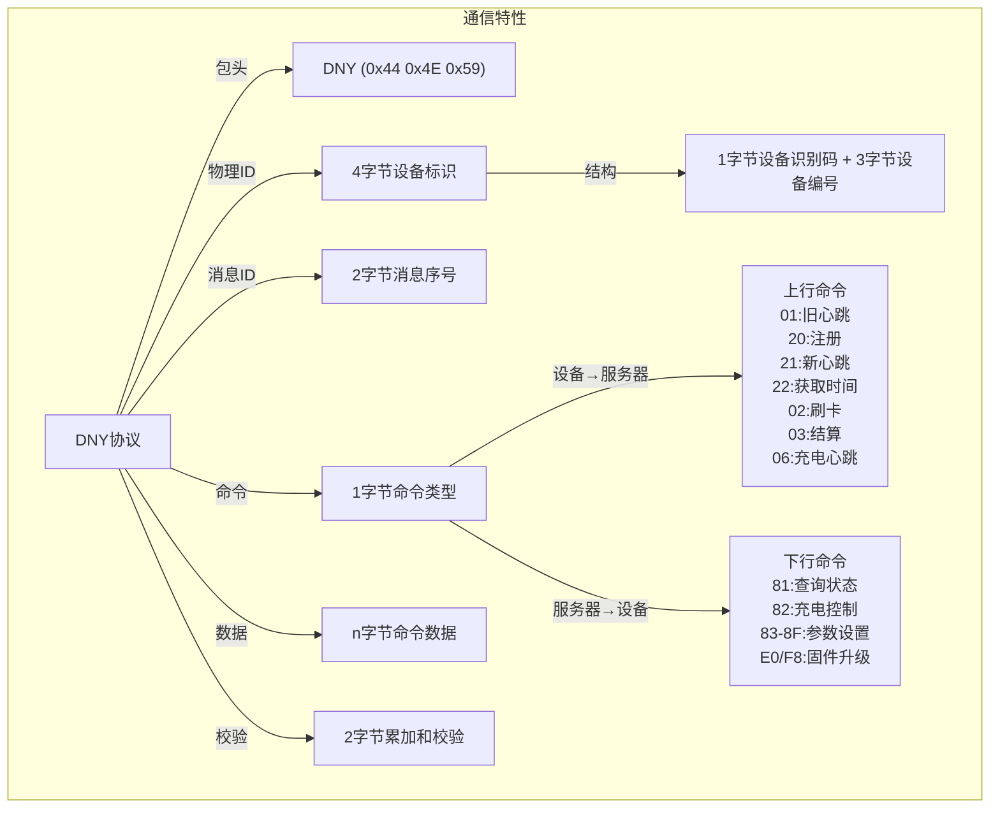

# 泳道图

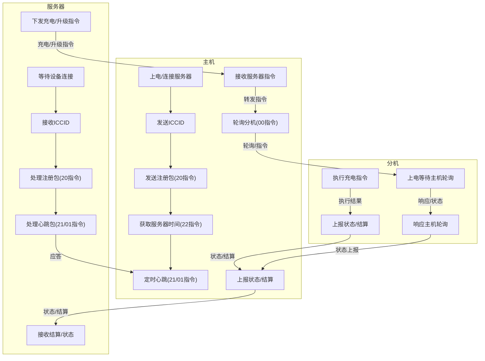

# 注册流程图

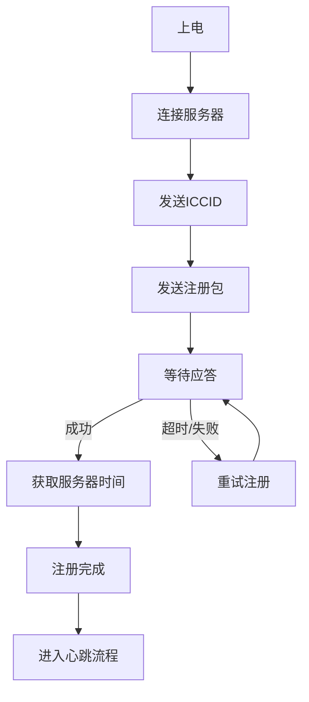

# 心跳流程图

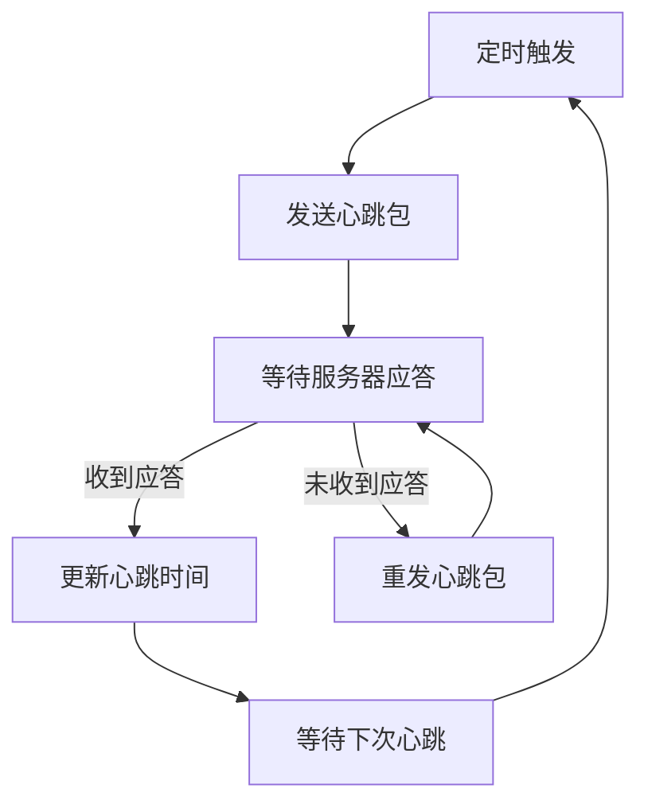

# 充电流程图

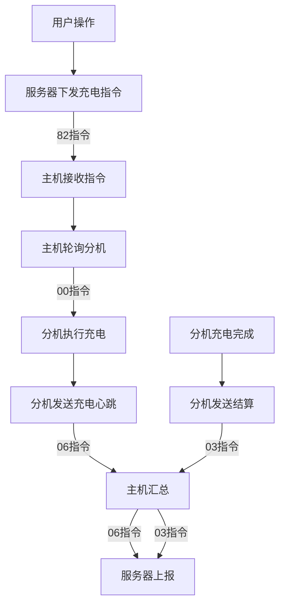

# 升级流程图

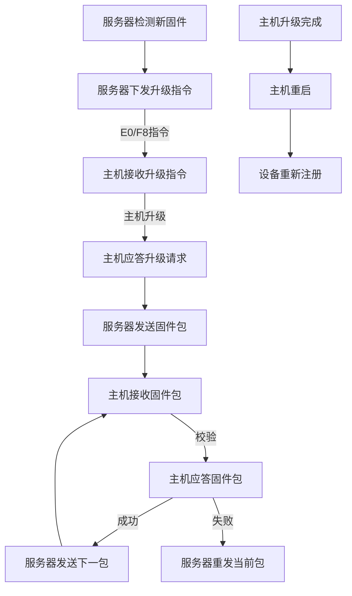

# 充电时序图

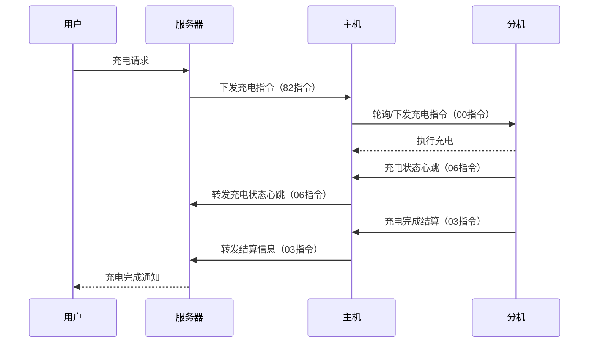

# 升级时序图

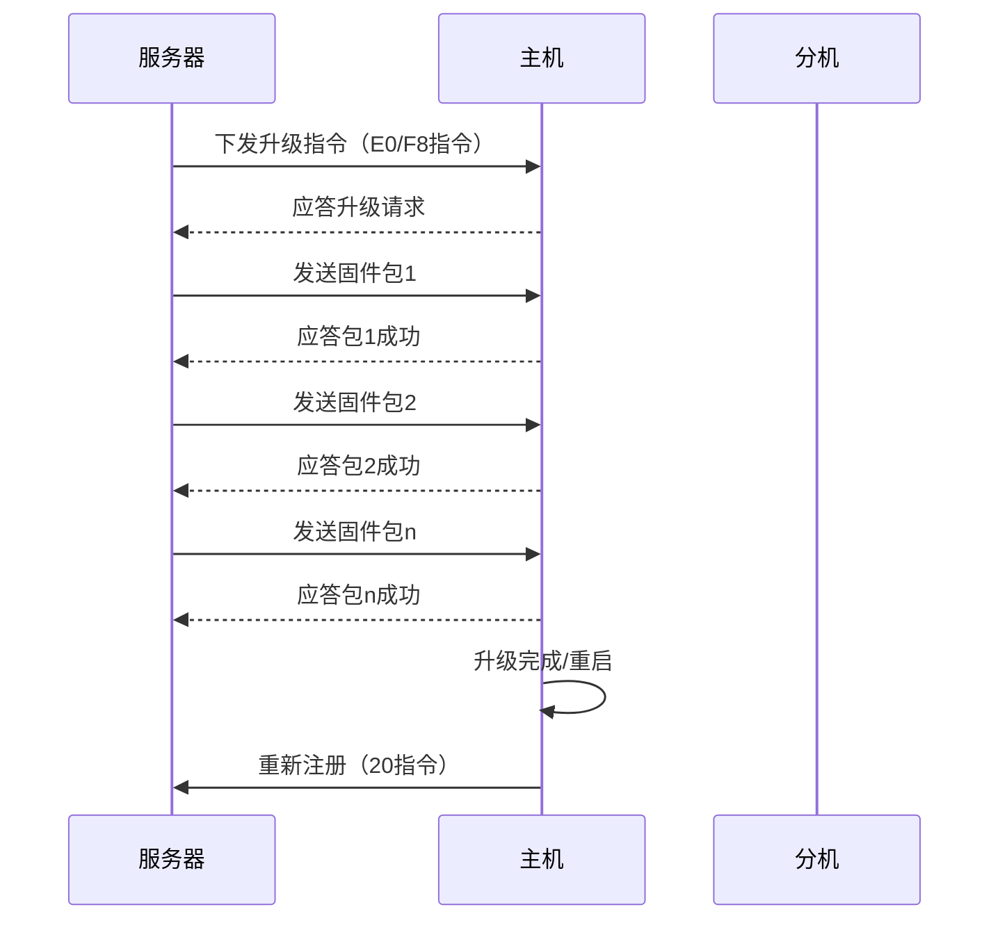

# 主要命令数据流图

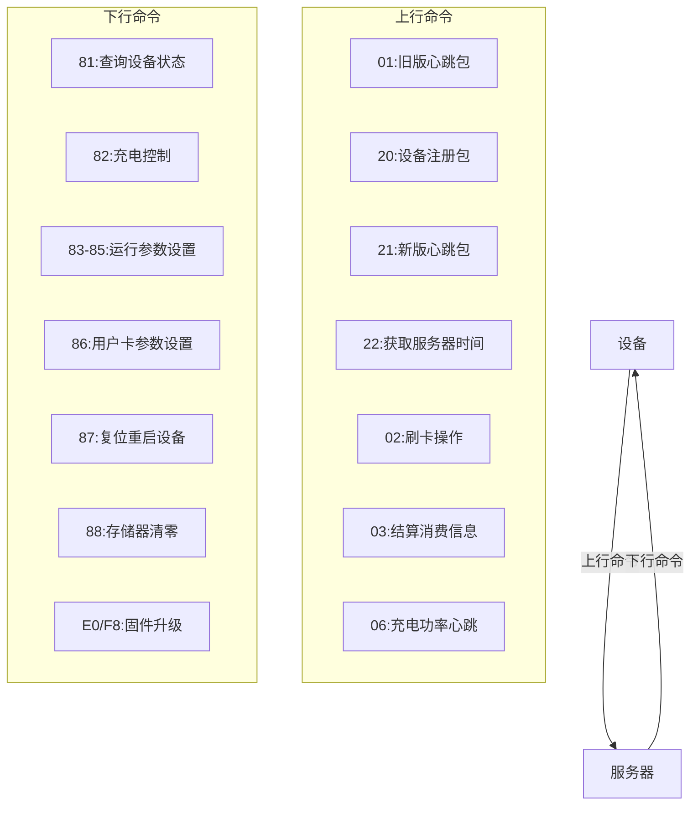

# 网关内部组件通信图

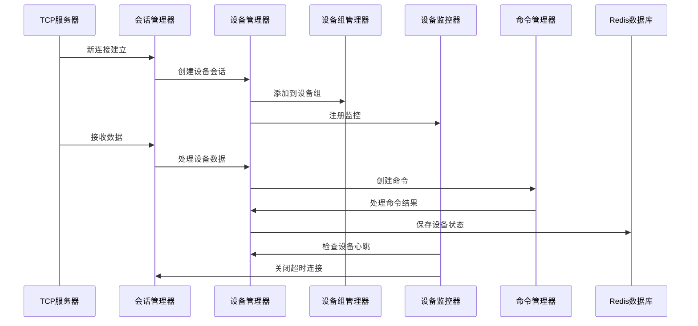
