# 总体架构图

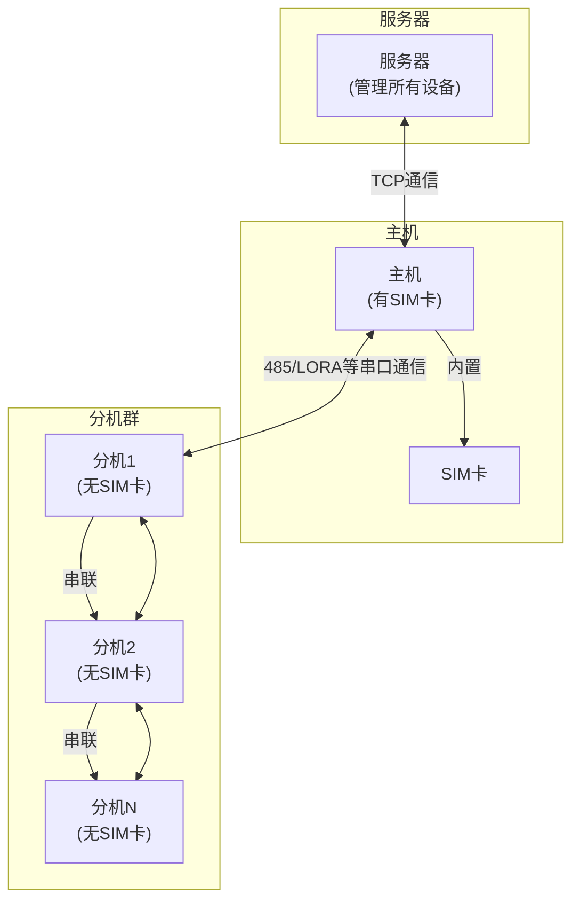
```mermaid
graph TD
    subgraph 服务器
        S["服务器\n(管理所有设备)"]
    end
    subgraph 主机
        M["主机\n(有SIM卡)"]
        SIM["SIM卡"]
        M -- "内置" --> SIM
    end
    subgraph 分机群
        F1["分机1\n(无SIM卡)"]
        F2["分机2\n(无SIM卡)"]
        F3["分机N\n(无SIM卡)"]
        F1 -- "串联" --> F2
        F2 -- "串联" --> F3
    end
    S <--> |"TCP通信"| M
    M <--> |"485/LORA等串口通信"| F1
    F1 <--> F2
    F2 <--> F3
    %% 说明：主机通过SIM卡与服务器通信，分机通过串联方式与主机通信
```

# 数据流图

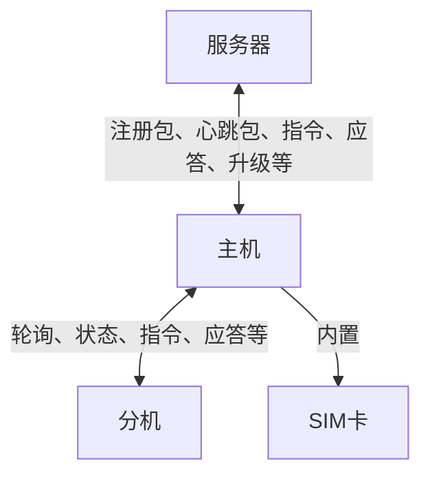
```mermaid
flowchart TD
    S["服务器"]
    M["主机"]
    F["分机"]
    SIM["SIM卡"]
    S <--> |"注册包、心跳包、指令、应答、升级等"| M
    M <--> |"轮询、状态、指令、应答等"| F
    M -- "内置" --> SIM
    %% 说明：主机与服务器之间通过SIM卡进行TCP通信，主机与分机之间通过串口通信
```

# 状态机图

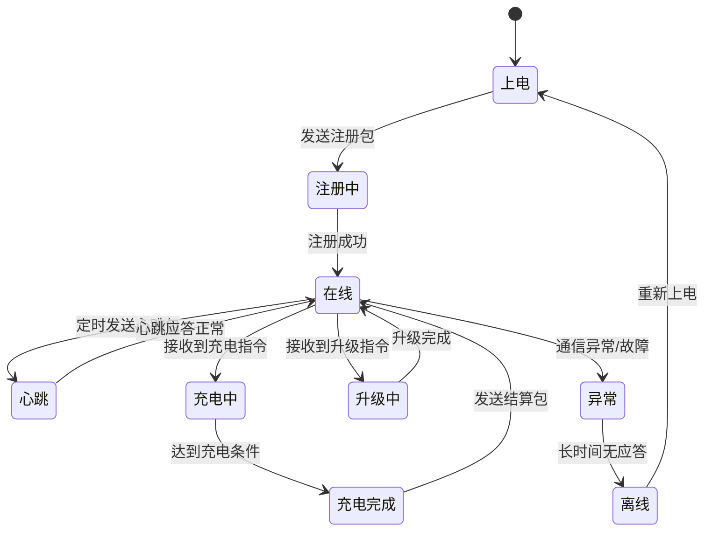
```mermaid
stateDiagram-v2
    [*] --> 上电
    上电 --> 注册中: 发送注册包
    注册中 --> 在线: 注册成功
    在线 --> 心跳: 定时发送心跳包
    心跳 --> 在线: 心跳应答正常
    在线 --> 充电中: 接收到充电指令
    充电中 --> 充电完成: 达到充电条件
    充电完成 --> 在线: 发送结算包
    在线 --> 升级中: 接收到升级指令
    升级中 --> 在线: 升级完成
    在线 --> 异常: 通信异常/故障
    异常 --> 离线: 长时间无应答
    离线 --> 上电: 重新上电
    %% 说明：主机和分机状态流转类似，分机无SIM卡，主机有SIM卡
```

# 实体关系图

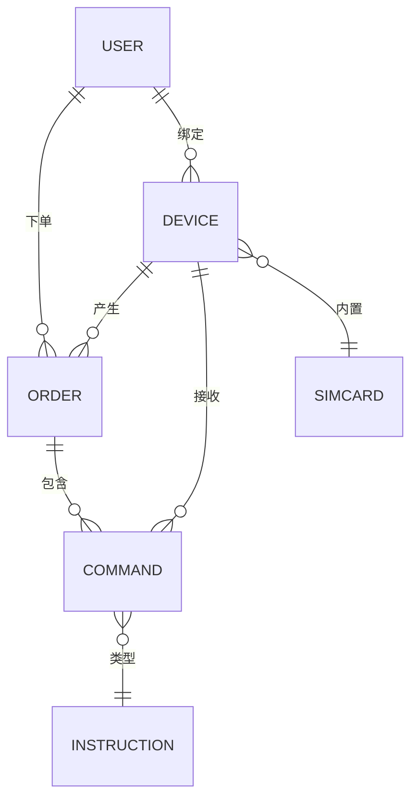
```mermaid
erDiagram
    USER ||--o{ ORDER : 下单
    USER ||--o{ DEVICE : 绑定
    DEVICE ||--o{ ORDER : 产生
    DEVICE ||--o{ COMMAND : 接收
    DEVICE }o--|| SIMCARD : 内置
    ORDER ||--o{ COMMAND : 包含
    COMMAND }o--|| INSTRUCTION : 类型
    %% 说明：用户可绑定多个设备和订单，设备可接收多个指令，主机内置SIM卡
```

# 泳道图

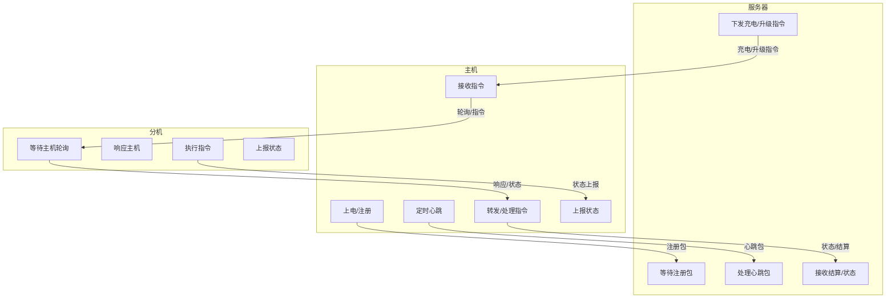
```mermaid
%% Mermaid泳道图
flowchart TD
    subgraph 服务器
        S1["等待注册包"]
        S2["处理心跳包"]
        S3["下发充电/升级指令"]
        S4["接收结算/状态"]
    end
    subgraph 主机
        M1["上电/注册"]
        M2["定时心跳"]
        M3["接收指令"]
        M4["转发/处理指令"]
        M5["上报状态"]
    end
    subgraph 分机
        F1["等待主机轮询"]
        F2["响应主机"]
        F3["执行指令"]
        F4["上报状态"]
    end
    M1 -- "注册包" --> S1
    M2 -- "心跳包" --> S2
    S3 -- "充电/升级指令" --> M3
    M3 -- "轮询/指令" --> F1
    F1 -- "响应/状态" --> M4
    M4 -- "状态/结算" --> S4
    F3 -- "状态上报" --> M5
    %% 说明：主机、分机、服务器三方协作流程
```

# 注册流程图

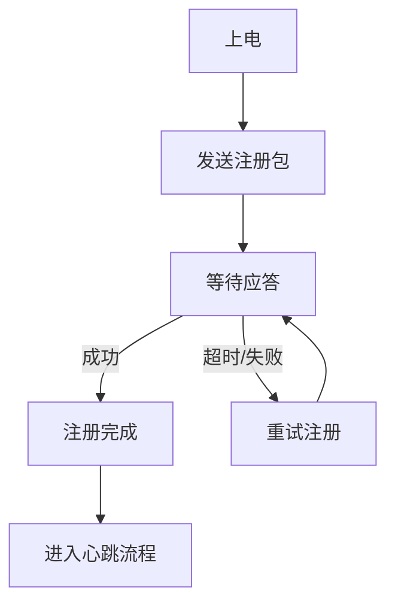
```mermaid
flowchart TD
    上电 --> 发送注册包
    发送注册包 --> 等待应答
    等待应答 -- "成功" --> 注册完成
    等待应答 -- "超时/失败" --> 重试注册
    重试注册 --> 等待应答
    注册完成 --> 进入心跳流程
    %% 说明：主机和分机注册流程类似，主机通过SIM卡与服务器通信
```

# 心跳流程图

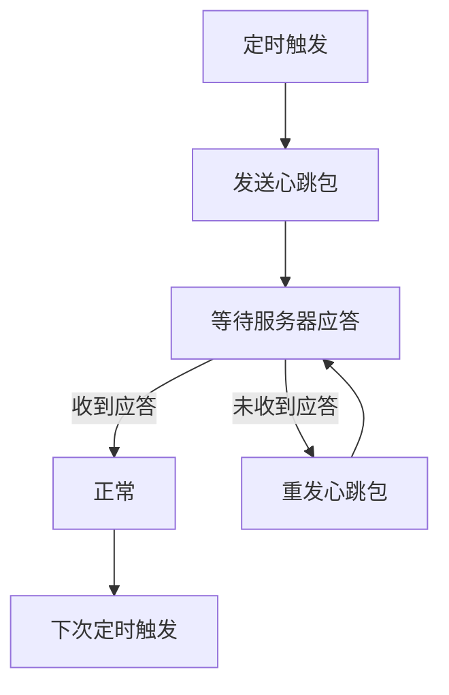
```mermaid
flowchart TD
    定时触发 --> 发送心跳包
    发送心跳包 --> 等待服务器应答
    等待服务器应答 -- "收到应答" --> 正常
    等待服务器应答 -- "未收到应答" --> 重发心跳包
    重发心跳包 --> 等待服务器应答
    正常 --> 下次定时触发
    %% 说明：主机和分机心跳机制，保证设备在线状态
```

# 充电流程图

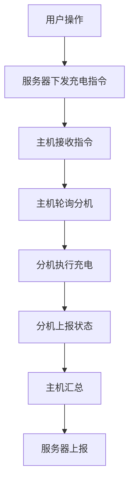
```mermaid
flowchart TD
    用户操作 --> 服务器下发充电指令
    服务器下发充电指令 --> 主机接收指令
    主机接收指令 --> 主机轮询分机
    主机轮询分机 --> 分机执行充电
    分机执行充电 --> 分机上报状态
    分机上报状态 --> 主机汇总
    主机汇总 --> 服务器上报
    %% 说明：充电流程涉及服务器、主机、分机多方协作
```

# 升级流程图

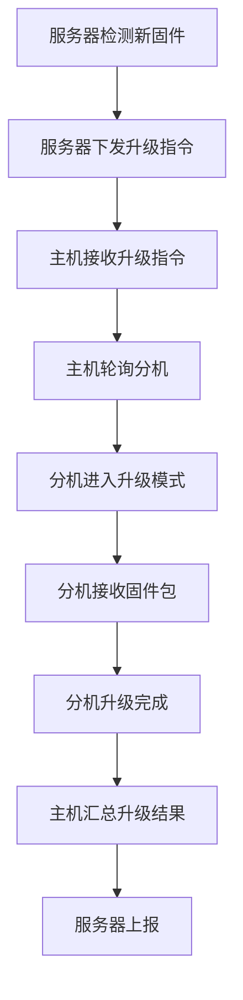
```mermaid
flowchart TD
    服务器检测新固件 --> 服务器下发升级指令
    服务器下发升级指令 --> 主机接收升级指令
    主机接收升级指令 --> 主机轮询分机
    主机轮询分机 --> 分机进入升级模式
    分机进入升级模式 --> 分机接收固件包
    分机接收固件包 --> 分机升级完成
    分机升级完成 --> 主机汇总升级结果
    主机汇总升级结果 --> 服务器上报
    %% 说明：升级流程需保证数据完整性和重试机制
```

# 充电时序图

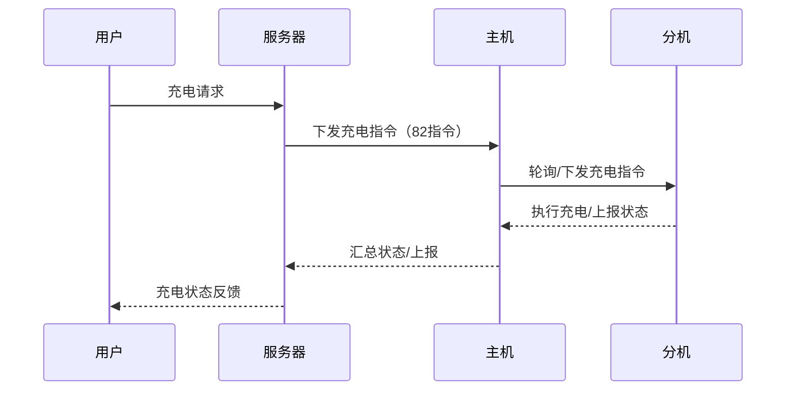
```mermaid
sequenceDiagram
    participant U as 用户
    participant S as 服务器
    participant M as 主机
    participant F as 分机
    U->>S: 充电请求
    S->>M: 下发充电指令（82指令）
    M->>F: 轮询/下发充电指令
    F-->>M: 执行充电/上报状态
    M-->>S: 汇总状态/上报
    S-->>U: 充电状态反馈
    %% 说明：充电过程涉及多方消息交互，需保证一致性
```

# 升级时序图

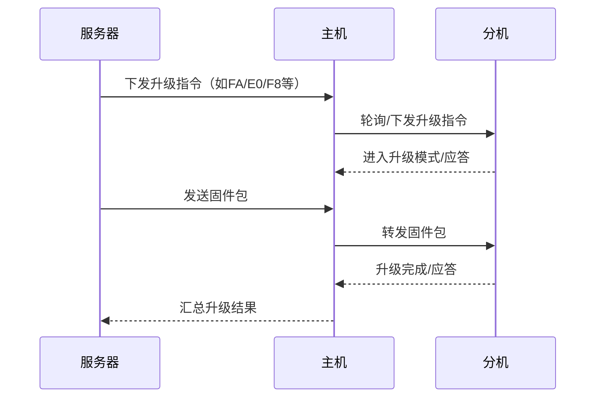
```mermaid
sequenceDiagram
    participant S as 服务器
    participant M as 主机
    participant F as 分机
    S->>M: 下发升级指令（如FA/E0/F8等）
    M->>F: 轮询/下发升级指令
    F-->>M: 进入升级模式/应答
    S->>M: 发送固件包
    M->>F: 转发固件包
    F-->>M: 升级完成/应答
    M-->>S: 汇总升级结果
    %% 说明：升级过程需保证包完整性和重试机制
```

# 指令数据流图

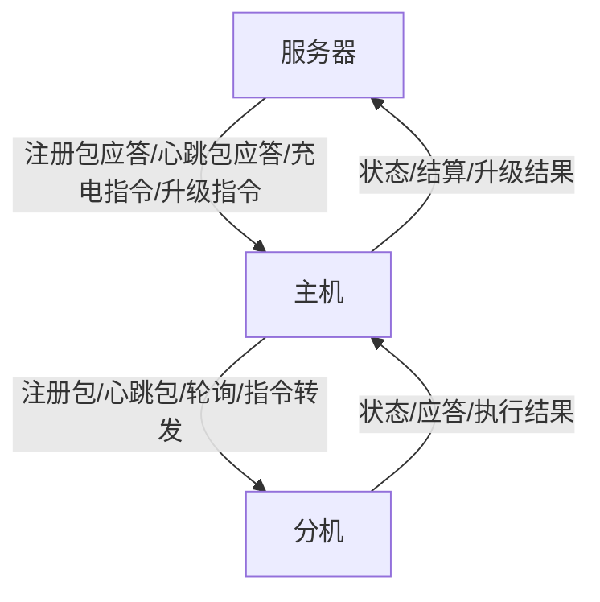
```mermaid
flowchart TD
    S["服务器"]
    M["主机"]
    F["分机"]
    S -- "注册包应答/心跳包应答/充电指令/升级指令" --> M
    M -- "注册包/心跳包/轮询/指令转发" --> F
    F -- "状态/应答/执行结果" --> M
    M -- "状态/结算/升级结果" --> S
    %% 说明：主要指令在三方之间流转，需保证消息ID一致性和重试机制
```
