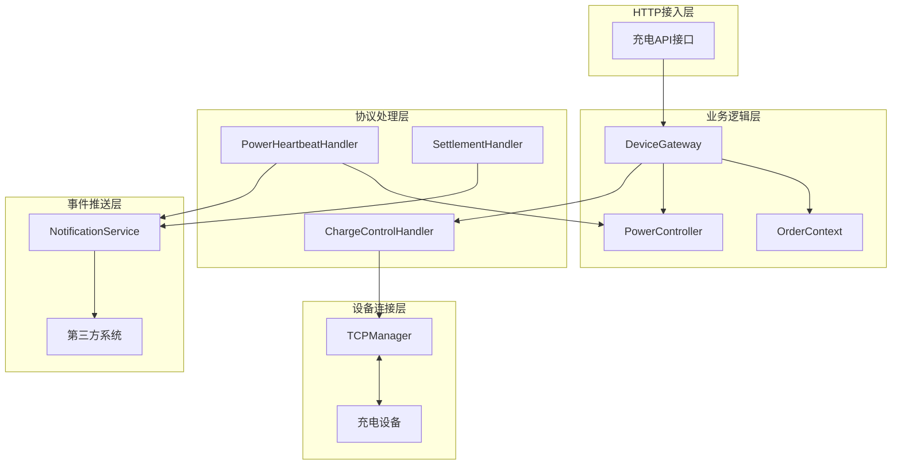
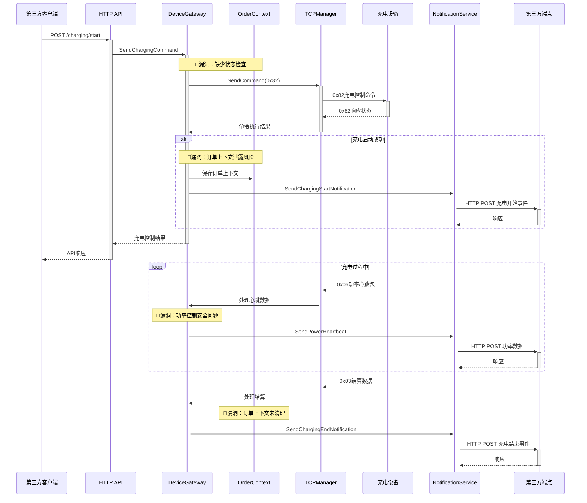

# IOT-Zinx 充电桩业务逻辑漏洞深度分析

> **相关文档**: 系统整体架构和技术特性请参考 [`iot-zinx-comprehensive-analysis.md`](../architecture/iot-zinx-comprehensive-analysis.md)

## 1. 执行摘要

本文档专门分析IOT-Zinx系统中充电桩相关的业务逻辑漏洞。基于系统的六边形架构设计，重点关注充电控制、订单状态管理、功率控制等核心充电业务功能中存在的安全隐患和业务逻辑缺陷，这些问题可能导致订单混乱、计费错误、设备损坏等严重后果。

### 1.1 漏洞统计
- **严重漏洞**: 2个 (订单状态管理、充电状态机缺失)
- **高风险漏洞**: 2个 (幂等性问题、功率控制安全)
- **中等风险漏洞**: 2个 (心跳去重、通知可靠性)
- **低风险漏洞**: 2个 (参数验证、日志泄露)

## 2. 充电业务功能架构分析

### 2.1 核心组件关系图



### 2.2 数据流分析



## 3. 严重漏洞详细分析

### 3.0 功能拆解与流程总览（新增）

- 开始/停止充电（HTTP → 网关 → 0x82 指令）：
  - HTTP 层：internal/adapter/http/charging_handlers.go::HandleStartCharging/HandleStopCharging
  - 网关层：pkg/gateway/charging.go::SendChargingCommandWithParams/SendStopChargingCommand
  - 设备应答：internal/infrastructure/zinx_server/handlers/charge_control_handler.go
- 充电过程心跳：0x06（功率/能量/状态）
  - 处理：internal/infrastructure/zinx_server/handlers/power_heartbeat_handler.go、port_power_heartbeat_handler.go
- 结算：0x03（或0x23分时结算）
  - 处理：internal/infrastructure/zinx_server/handlers/settlement_handler.go、time_billing_settlement_handler.go
- 通知：pkg/notification/*，第三方事件推送
- 协议规范：docs/协议/AP3000-设备与服务器通信协议.md；映射：docs/architecture/ap3000-mapping.md

### 3.1 订单状态管理漏洞 (CVE-Critical-001)

#### 3.1.1 漏洞描述
**文件位置**: `pkg/gateway/charging.go:102-108`

**问题代码**:
```go
// 只在成功开始充电时保存订单上下文
if action == 0x01 && orderNo != "" {
    key := g.makeOrderCtxKey(deviceID, int(port-1))
    g.orderCtxMu.Lock()
    g.orderCtx[key] = OrderContext{
        OrderNo: orderNo,
        Mode: mode,
        Value: actualValue,
        Balance: balance,
    }
    g.orderCtxMu.Unlock()
}
```

#### 3.1.2 漏洞分析
1. **内存泄露**: 订单上下文只在充电开始时保存，但从未主动清理
2. **订单重复**: 同一端口可以重复启动充电，导致订单覆盖
3. **状态不一致**: 设备异常断电时订单上下文仍然存在
4. **并发冲突**: 多个请求可能同时操作同一端口的订单上下文

#### 3.1.3 影响评估
- **业务影响**: 可能导致重复计费、订单状态混乱
- **技术影响**: 内存泄露导致系统性能下降
- **安全影响**: 敏感订单信息长期驻留内存

#### 3.1.4 攻击场景
```bash
# 攻击者可以通过重复调用充电接口导致订单混乱
curl -X POST "http://gateway/api/v1/charging/start" \
  -H "Content-Type: application/json" \
  -d '{"device_id":"DEV001","port":1,"order_no":"ORDER001"}'

# 立即发送停止命令
curl -X POST "http://gateway/api/v1/charging/stop" \
  -H "Content-Type: application/json" \
  -d '{"device_id":"DEV001","port":1,"order_no":"ORDER002"}'

# 订单上下文混乱，可能导致计费错误
```

#### 3.1.5 修复建议
```go
// 建议的修复方案
type OrderManager struct {
    orders map[string]*OrderState
    mutex  sync.RWMutex
}

type OrderState struct {
    OrderNo    string
    Status     OrderStatus
    DeviceID   string
    Port       int
    StartTime  time.Time
    EndTime    *time.Time
    LastUpdate time.Time
}

type OrderStatus int

const (
    OrderStatusPending OrderStatus = iota
    OrderStatusCharging
    OrderStatusCompleted
    OrderStatusCancelled
    OrderStatusFailed
)

func (om *OrderManager) CreateOrder(deviceID string, port int, orderNo string) error {
    om.mutex.Lock()
    defer om.mutex.Unlock()
    
    key := fmt.Sprintf("%s:%d", deviceID, port)
    
    // 检查是否已有进行中的订单
    if existing, exists := om.orders[key]; exists {
        if existing.Status == OrderStatusCharging || existing.Status == OrderStatusPending {
            return fmt.Errorf("端口 %s:%d 已有进行中的订单: %s", deviceID, port, existing.OrderNo)
        }
    }
    
    om.orders[key] = &OrderState{
        OrderNo:    orderNo,
        Status:     OrderStatusPending,
        DeviceID:   deviceID,
        Port:       port,
        StartTime:  time.Now(),
        LastUpdate: time.Now(),
    }
    
    return nil
}

func (om *OrderManager) UpdateOrderStatus(deviceID string, port int, status OrderStatus) error {
    om.mutex.Lock()
    defer om.mutex.Unlock()
    
    key := fmt.Sprintf("%s:%d", deviceID, port)
    order, exists := om.orders[key]
    if !exists {
        return fmt.Errorf("订单不存在: %s", key)
    }
    
    order.Status = status
    order.LastUpdate = time.Now()
    
    if status == OrderStatusCompleted || status == OrderStatusCancelled || status == OrderStatusFailed {
        endTime := time.Now()
        order.EndTime = &endTime
        
        // 异步清理过期订单
        go om.cleanupExpiredOrders()
    }
    
return nil
}
```

#### 3.1.6 修复实现要点与清理策略（新增）
- 订单上下文清理触发点：
  - 收到 0x03/0x23 结算包并校验通过后；
  - 收到“充电结束”事件（含由 0x44/0x43 等引发的结束）后；
  - 发生明确失败（设备返回错误状态且确认未执行）后。
- 清理范围：deviceID+port 键下的 OrderContext，包括 orderNo、mode、value、balance 等。
- 并发与幂等：清理操作需可重入，且不影响其他端口订单；建议使用细粒度互斥或基于 CAS 的 map 更新。
- 观测性：在清理时输出结构化日志，包含 deviceID、port、orderNo、触发原因。

---

### 3.2 充电状态机缺失漏洞 (CVE-Critical-002)

#### 3.2.1 漏洞描述
**文件位置**: `internal/infrastructure/zinx_server/handlers/power_heartbeat_handler.go`

**问题分析**:
系统缺乏完整的充电状态机，只通过心跳包中的端口状态来判断充电状态，无法处理复杂的状态转换和异常情况。

#### 3.2.2 漏洞分析
1. **状态不一致**: 心跳包丢失或延迟时状态判断错误
2. **异常状态处理**: 无法处理设备异常状态（如过温、短路）
3. **状态转换验证**: 缺乏状态转换的合法性验证
4. **并发状态冲突**: 多个端口状态可能相互影响

#### 3.2.3 当前状态判断逻辑
```go
// 当前的简单状态判断
portStatus := rawData[portIndex+2]
isCharging := portStatus == 0x01 || portStatus == 0x05 // 充电中或浮充

// 问题：缺乏状态转换验证和异常处理
```

#### 3.2.4 修复建议
```go
// 完整的充电状态机实现
type ChargingState int

const (
    StateIdle ChargingState = iota
    StatePlugged
    StateCharging
    StateFloatCharging
    StateCompleted
    StateFault
    StateEmergencyStop
)

type ChargingStateMachine struct {
    currentState ChargingState
    deviceID     string
    port         int
    transitions  map[ChargingState][]ChargingState
    stateChanges chan StateChange
    mutex        sync.RWMutex
}

type StateChange struct {
    DeviceID  string
    Port      int
    FromState ChargingState
    ToState   ChargingState
    Timestamp time.Time
    Reason    string
    Data      map[string]interface{}
}

func NewChargingStateMachine(deviceID string, port int) *ChargingStateMachine {
    return &ChargingStateMachine{
        currentState: StateIdle,
        deviceID:     deviceID,
        port:         port,
        transitions: map[ChargingState][]ChargingState{
            StateIdle:          {StatePlugged, StateFault},
            StatePlugged:       {StateCharging, StateIdle, StateFault},
            StateCharging:      {StateFloatCharging, StateCompleted, StateFault, StateEmergencyStop},
            StateFloatCharging: {StateCompleted, StateFault, StateEmergencyStop},
            StateCompleted:     {StateIdle, StateFault},
            StateFault:         {StateIdle}, // 故障修复后回到空闲
            StateEmergencyStop: {StateIdle, StateFault},
        },
        stateChanges: make(chan StateChange, 100),
    }
}

func (csm *ChargingStateMachine) TransitionTo(newState ChargingState, reason string, data map[string]interface{}) error {
    csm.mutex.Lock()
    defer csm.mutex.Unlock()
    
    // 验证状态转换的合法性
    allowedTransitions, exists := csm.transitions[csm.currentState]
    if !exists {
        return fmt.Errorf("未定义状态 %v 的转换规则", csm.currentState)
    }
    
    allowed := false
    for _, allowedState := range allowedTransitions {
        if allowedState == newState {
            allowed = true
            break
        }
    }
    
    if !allowed {
        return fmt.Errorf("不允许从 %v 转换到 %v", csm.currentState, newState)
    }
    
    // 记录状态变更
    change := StateChange{
        DeviceID:  csm.deviceID,
        Port:      csm.port,
        FromState: csm.currentState,
        ToState:   newState,
        Timestamp: time.Now(),
        Reason:    reason,
        Data:      data,
    }
    
    // 更新状态
    oldState := csm.currentState
    csm.currentState = newState
    
    // 异步发送状态变更事件
    go func() {
        select {
        case csm.stateChanges <- change:
        default:
            // 队列满时记录警告
            logger.Warn("状态变更队列已满，丢弃事件", map[string]interface{}{
                "device_id": csm.deviceID,
                "port":      csm.port,
                "change":    change,
            })
        }
    }()
    
    return nil
}
```

### 3.3 端口号映射一致性漏洞 (CVE-Critical-003)

#### 3.3.1 漏洞描述
文件位置对比：
- 简版命令：pkg/gateway/charging.go::SendChargingCommand → commandData := []byte{port, action}
- 完整命令：pkg/gateway/charging.go::SendChargingCommandWithParams → commandData[5] = port - 1

简版命令未进行 1-based→0-based 的端口转换，完整命令进行了 port-1。若外部均以1-based端口传入，两条路径发往设备的端口可能不一致，引发错误口通断电的严重后果。

#### 3.3.2 影响评估
- 严重：可能导致非目标端口上电/断电，带来安全与业务风险。
- 可重现：通过 Web 控制台或 API 分别走简版与完整版命令，观察设备端口行为差异。

#### 3.3.3 复现场景
- 前置：设备有至少2个端口；外部以 port=1 发起。
- 路径A（简版）：SendChargingCommand(deviceID, 1, 0x01) → 设备收到端口=0x01（协议视为第2路）。
- 路径B（完整）：SendChargingCommandWithParams(deviceID, 1, ...) → 设备收到端口=0x00（协议视为第1路）。

#### 3.3.4 修复建议
- 统一端口转换策略：
  - 网关层对所有“发送到设备的端口字段”一律采用协议0-based（port-1），对外暴露/日志/通知一律1-based。
- 代码调整建议：
  - SendChargingCommand 在构造 commandData 时将第一个字节改为 port-1；同时在日志中继续使用 displayPort=port。
- 回归测试要点：
  - 覆盖端口[1..N]双路径一致性；
  - 设备应答端口映射正确（0-based→1-based显示）；
  - 0xFF（智能选择端口）保持透传不变。

---

## 4. 高风险漏洞详细分析

### 4.1 充电命令幂等性问题 (CVE-High-001)

#### 4.1.1 漏洞描述
**文件位置**: `internal/adapter/http/charging_handlers.go:45-51`

**问题代码**:
```go
// 直接发送充电命令，没有状态检查
if err := h.deviceGateway.SendChargingCommandWithParams(standardDeviceID, req.Port, 0x01, req.OrderNo, req.Mode, req.Value, req.Balance); err != nil {
    c.JSON(http.StatusInternalServerError, APIResponse{Code: 500, Message: "充电启动失败", Data: gin.H{"error": err.Error()}})
    return
}
```

#### 4.1.2 漏洞影响
1. **重复充电**: 同一端口可能被重复启动
2. **订单冲突**: 不同订单操作同一端口
3. **计费混乱**: 重复的充电命令可能导致计费错误

#### 4.1.3 修复建议
```go
func (h *ChargingHandlers) HandleStartCharging(c *gin.Context) {
    var req ChargingStartRequest
    if err := c.ShouldBindJSON(&req); err != nil {
        c.JSON(http.StatusBadRequest, APIResponse{Code: 400, Message: "参数错误", Data: gin.H{"error": err.Error()}})
        return
    }
    
    standardDeviceID := utils.ProcessDeviceID(req.DeviceID)
    
    // 幂等性检查
    if err := h.checkChargingIdempotency(standardDeviceID, req.Port, req.OrderNo); err != nil {
        c.JSON(http.StatusConflict, APIResponse{Code: 409, Message: "充电状态冲突", Data: gin.H{"error": err.Error()}})
        return
    }
    
    // 设备状态检查
    if !h.isDeviceOnline(standardDeviceID) {
        c.JSON(http.StatusServiceUnavailable, APIResponse{Code: 503, Message: "设备离线", Data: nil})
        return
    }
    
    // 端口状态检查
    portStatus, err := h.getPortStatus(standardDeviceID, req.Port)
    if err != nil {
        c.JSON(http.StatusInternalServerError, APIResponse{Code: 500, Message: "获取端口状态失败", Data: gin.H{"error": err.Error()}})
        return
    }
    
    if !canStartCharging(portStatus) {
        c.JSON(http.StatusConflict, APIResponse{Code: 409, Message: "端口状态不允许充电", Data: gin.H{"status": portStatus}})
        return
    }
    
    // 使用分布式锁确保原子操作
    lockKey := fmt.Sprintf("charging_lock:%s:%d", standardDeviceID, req.Port)
    if !h.acquireLock(lockKey, 30*time.Second) {
        c.JSON(http.StatusTooManyRequests, APIResponse{Code: 429, Message: "设备正在处理其他充电请求", Data: nil})
        return
    }
    defer h.releaseLock(lockKey)
    
    // 发送充电命令
    if err := h.deviceGateway.SendChargingCommandWithParams(standardDeviceID, req.Port, 0x01, req.OrderNo, req.Mode, req.Value, req.Balance); err != nil {
        c.JSON(http.StatusInternalServerError, APIResponse{Code: 500, Message: "充电启动失败", Data: gin.H{"error": err.Error()}})
        return
    }
    
    c.JSON(http.StatusOK, APIResponse{Code: 0, Message: "充电启动成功", Data: gin.H{"device_id": standardDeviceID, "port": req.Port, "order_no": req.OrderNo}})
}

func (h *ChargingHandlers) checkChargingIdempotency(deviceID string, port int, orderNo string) error {
    // 检查是否已有相同订单的充电请求
    existing := h.orderManager.GetOrder(deviceID, port)
    if existing != nil {
        if existing.OrderNo == orderNo {
            // 相同订单，检查状态
            if existing.Status == OrderStatusCharging {
                return nil // 幂等，返回成功
            }
        } else {
            // 不同订单，检查是否有冲突
            if existing.Status == OrderStatusCharging || existing.Status == OrderStatusPending {
                return fmt.Errorf("端口已有进行中的订单: %s", existing.OrderNo)
            }
        }
    }
    return nil
}
```

### 4.2 功率控制安全漏洞 (CVE-High-002)

#### 4.2.1 漏洞描述
**文件位置**: `pkg/gateway/dynamic_power_controller.go:89-95`

**问题代码**:
```go
// 智能降功率控制逻辑
target := int(math.Max(float64(lastOver)*(1.0-step), float64(minW)))
if abs(target-lastOver) < d.cfg.ChangeThresholdW {
    return // 防抖机制可能导致功率无法及时调整
}
```

#### 4.2.2 漏洞分析
1. **防抖延迟**: 防抖机制可能导致危险功率持续时间过长
2. **最小功率限制**: 最小功率可能不足以保护设备
3. **计算精度**: 浮点数计算可能导致精度丢失
4. **异常处理**: 缺乏对异常功率值的处理

#### 4.2.3 修复建议
```go
type SafePowerController struct {
    cfg                *PowerControlConfig
    emergencyThreshold int     // 紧急停止阈值
    maxContinuousTime  time.Duration // 最大连续高功率时间
    powerHistory       *PowerHistory
    mutex              sync.RWMutex
}

type PowerHistory struct {
    records    []PowerRecord
    maxRecords int
}

type PowerRecord struct {
    Timestamp time.Time
    Power     int
    Action    string
    DeviceID  string
    Port      int
}

func (spc *SafePowerController) CalculateSafePower(deviceID string, port int, currentPower, overloadPower int) (int, error) {
    spc.mutex.Lock()
    defer spc.mutex.Unlock()
    
    // 紧急安全检查
    if currentPower > spc.emergencyThreshold {
        // 立即紧急停止
        spc.recordPowerAction(deviceID, port, 0, "emergency_stop")
        return 0, fmt.Errorf("功率超过紧急阈值 %dW，执行紧急停止", spc.emergencyThreshold)
    }
    
    // 检查连续高功率时间
    if spc.isHighPowerTooLong(deviceID, port, overloadPower) {
        reducedPower := int(float64(overloadPower) * 0.8) // 立即降低20%
        spc.recordPowerAction(deviceID, port, reducedPower, "continuous_high_power_protection")
        return reducedPower, nil
    }
    
    // 标准功率控制逻辑
    step := spc.cfg.StepPercent
    minW := spc.cfg.MinPowerW
    
    // 使用更安全的计算方式
    reductionAmount := int(float64(overloadPower) * step)
    target := overloadPower - reductionAmount
    
    // 确保不低于安全最小值
    safeMinPower := max(minW, spc.calculateSafeMinPower(deviceID, port))
    target = max(target, safeMinPower)
    
    // 记录功率调整历史
    spc.recordPowerAction(deviceID, port, target, "normal_reduction")
    
    return target, nil
}

func (spc *SafePowerController) isHighPowerTooLong(deviceID string, port int, power int) bool {
    now := time.Now()
    threshold := now.Add(-spc.maxContinuousTime)
    
    continuousHighPowerTime := time.Duration(0)
    for i := len(spc.powerHistory.records) - 1; i >= 0; i-- {
        record := spc.powerHistory.records[i]
        if record.DeviceID != deviceID || record.Port != port {
            continue
        }
        if record.Timestamp.Before(threshold) {
            break
        }
        if record.Power >= power {
            continuousHighPowerTime += time.Minute // 假设每条记录间隔1分钟
        } else {
            break // 功率中断
        }
    }
    
    return continuousHighPowerTime > spc.maxContinuousTime
}

func (spc *SafePowerController) calculateSafeMinPower(deviceID string, port int) int {
    // 根据设备类型和历史数据计算安全最小功率
    deviceType := spc.getDeviceType(deviceID)
    switch deviceType {
    case "AC_CHARGER":
        return 300 // 交流充电桩最小300W
    case "DC_CHARGER":
        return 1000 // 直流充电桩最小1000W
    default:
        return 200 // 默认最小200W
    }
}
```

### 4.3 停止充电订单校验缺失 (CVE-High-003)

#### 4.3.1 漏洞描述
- 文件位置：internal/adapter/http/charging_handlers.go::HandleStopCharging
- 问题：调用 SendChargingCommandWithParams(..., action=0x00, orderNo=req.OrderNo) 前，未校验 req.OrderNo 是否与设备当前正在充电的订单一致。
- 协议约束：AP3000 明确“远程停止充电需要下发对当前正在充电的订单号，如果订单号对不上则无法远程停止”。

#### 4.3.2 影响评估
- 高风险：远程停充接口对用户表现为“已停止”，实际设备未执行，导致计费与安全风险。

#### 4.3.3 修复建议
- 在 HTTP 层/网关层增加订单匹配校验：
  - 基于 DeviceGateway 维护的进行中订单（deviceID+port）校验 orderNo 一致性；
  - 若不一致：返回 409 冲突并提示当前订单号；
  - 若为空：允许“无订单号”方案仅在明确业务允许且设备端支持时开放，否则拒绝。
- 可选：通过最近一次 0x06/0x04 帧内的订单号作为兜底匹配。

#### 4.3.4 回归测试
- 进行中订单与停止参数匹配/不匹配两类场景；
- 不同设备型号行为差异（若存在），确保最小公约数策略。

---

## 5. 中等风险漏洞分析

### 5.1 心跳去重机制问题 (CVE-Medium-001)

#### 5.1.1 问题描述
固定5秒的去重间隔可能导致重要状态变化被忽略，特别是在功率异常或设备故障时。

#### 5.1.2 修复建议
```go
type AdaptiveHeartbeatFilter struct {
    lastHeartbeat    map[string]time.Time
    minInterval      map[string]time.Duration
    criticalEvents   map[string]bool
    mutex            sync.RWMutex
}

func (ahf *AdaptiveHeartbeatFilter) ShouldProcess(deviceID string, eventType string, data map[string]interface{}) bool {
    ahf.mutex.Lock()
    defer ahf.mutex.Unlock()
    
    key := fmt.Sprintf("%s:%s", deviceID, eventType)
    now := time.Now()
    
    // 检查是否为关键事件
    if ahf.isCriticalEvent(eventType, data) {
        ahf.lastHeartbeat[key] = now
        return true // 关键事件总是处理
    }
    
    // 获取动态间隔
    interval := ahf.getDynamicInterval(deviceID, eventType, data)
    
    if lastTime, exists := ahf.lastHeartbeat[key]; exists {
        if now.Sub(lastTime) < interval {
            return false // 在去重间隔内，跳过
        }
    }
    
    ahf.lastHeartbeat[key] = now
    return true
}

func (ahf *AdaptiveHeartbeatFilter) isCriticalEvent(eventType string, data map[string]interface{}) bool {
    // 定义关键事件
    switch eventType {
    case "power_alarm":
        return true
    case "fault_status":
        return true
    case "emergency_stop":
        return true
    case "power_heartbeat":
        // 检查功率是否异常
        if power, ok := data["power"].(int); ok {
            return power > 15000 || power < 100 // 异常功率值
        }
    }
    return false
}

func (ahf *AdaptiveHeartbeatFilter) getDynamicInterval(deviceID string, eventType string, data map[string]interface{}) time.Duration {
    // 根据事件类型和设备状态动态调整间隔
    switch eventType {
    case "power_heartbeat":
        if power, ok := data["power"].(int); ok {
            if power > 10000 {
                return 1 * time.Second // 高功率时更频繁
            }
        }
        return 5 * time.Second // 正常功率
    case "status_heartbeat":
        return 10 * time.Second // 状态心跳可以较慢
    default:
        return 5 * time.Second // 默认间隔
    }
}
```

### 5.2 通知机制可靠性问题 (CVE-Medium-002)

#### 5.2.1 问题描述
当前通知系统在重试失败后会永久丢弃事件，对于关键业务事件（如充电开始/结束）这是不可接受的。

#### 5.2.2 修复建议
```go
type ReliableNotificationService struct {
    service           *NotificationService
    deadLetterQueue   chan *NotificationEvent
    criticalEvents    map[string]bool
    persistentStorage PersistentStorage
}

type PersistentStorage interface {
    SaveEvent(event *NotificationEvent) error
    LoadEvents() ([]*NotificationEvent, error)
    MarkEventProcessed(eventID string) error
}

func (rns *ReliableNotificationService) SendNotification(event *NotificationEvent) error {
    // 标记关键事件
    if rns.isCriticalEvent(event.EventType) {
        event.IsCritical = true
        // 关键事件先持久化
        if err := rns.persistentStorage.SaveEvent(event); err != nil {
            logger.Error("保存关键事件失败", map[string]interface{}{
                "event_id":   event.EventID,
                "event_type": event.EventType,
                "error":      err,
            })
            // 即使持久化失败，也要尝试发送
        }
    }
    
    return rns.service.SendNotification(event)
}

func (rns *ReliableNotificationService) handleFailedEvent(event *NotificationEvent) {
    if event.IsCritical {
        // 关键事件进入死信队列
        select {
        case rns.deadLetterQueue <- event:
            logger.Warn("关键事件进入死信队列", map[string]interface{}{
                "event_id":   event.EventID,
                "event_type": event.EventType,
            })
        default:
            // 死信队列满，记录到持久存储
            if err := rns.persistentStorage.SaveEvent(event); err != nil {
                logger.Error("保存失败事件到持久存储失败", map[string]interface{}{
                    "event_id":   event.EventID,
                    "event_type": event.EventType,
                    "error":      err,
                })
            }
        }
    }
}

func (rns *ReliableNotificationService) startDeadLetterProcessor() {
    go func() {
        ticker := time.NewTicker(1 * time.Minute)
        defer ticker.Stop()
        
        for {
            select {
            case event := <-rns.deadLetterQueue:
                // 使用指数退避重试死信事件
                rns.retryDeadLetterEvent(event)
            case <-ticker.C:
                // 定期从持久存储加载未处理事件
                rns.loadAndRetryPersistentEvents()
            }
        }
    }()
}

func (rns *ReliableNotificationService) isCriticalEvent(eventType string) bool {
    criticalTypes := map[string]bool{
        "charging_start":  true,
        "charging_end":    true,
        "charging_failed": true,
        "settlement":      true,
        "device_offline":  true,
    }
    return criticalTypes[eventType]
}
```

## 6. 低风险漏洞分析

### 6.1 参数验证不完整 (CVE-Low-001)

#### 6.1.1 问题分析
当前参数验证过于简单，可能导致无效数据进入系统。

#### 6.1.2 修复建议
```go
type ChargingRequestValidator struct {
    orderNoPattern *regexp.Regexp
    deviceIDPattern *regexp.Regexp
}

func NewChargingRequestValidator() *ChargingRequestValidator {
    return &ChargingRequestValidator{
        orderNoPattern:  regexp.MustCompile(`^[A-Za-z0-9]{8,16}$`),
        deviceIDPattern: regexp.MustCompile(`^[A-Za-z0-9]{6,20}$`),
    }
}

func (v *ChargingRequestValidator) ValidateStartRequest(req *ChargingStartRequest) error {
    var errors []string
    
    // 设备ID验证
    if !v.deviceIDPattern.MatchString(req.DeviceID) {
        errors = append(errors, "设备ID格式无效")
    }
    
    // 订单号验证
    if !v.orderNoPattern.MatchString(req.OrderNo) {
        errors = append(errors, "订单号格式无效")
    }
    
    // 端口号验证
    if req.Port < 1 || req.Port > 32 {
        errors = append(errors, "端口号必须在1-32之间")
    }
    
    // 充电模式验证
    if req.Mode != 1 && req.Mode != 2 && req.Mode != 3 {
        errors = append(errors, "充电模式无效")
    }
    
    // 充电参数验证
    switch req.Mode {
    case 1: // 按时长充电
        if req.Value < 1 || req.Value > 1440 { // 1分钟到24小时
            errors = append(errors, "充电时长必须在1-1440分钟之间")
        }
    case 2: // 按电量充电
        if req.Value < 1 || req.Value > 100 { // 1kWh到100kWh
            errors = append(errors, "充电电量必须在1-100kWh之间")
        }
    case 3: // 按余额充电
        if req.Balance < 100 || req.Balance > 100000 { // 1元到1000元（分）
            errors = append(errors, "余额必须在100-100000分之间")
        }
    }
    
    if len(errors) > 0 {
        return fmt.Errorf("参数验证失败: %s", strings.Join(errors, "; "))
    }
    
    return nil
}
```

### 6.2 日志敏感信息泄露 (CVE-Low-002)

#### 6.2.1 修复建议
```go
type SecureLogger struct {
    logger *logrus.Logger
    maskPatterns map[string]*regexp.Regexp
}

func NewSecureLogger() *SecureLogger {
    return &SecureLogger{
        logger: logrus.New(),
        maskPatterns: map[string]*regexp.Regexp{
            "device_id": regexp.MustCompile(`"device_id":"([^"]*?)"`),
            "iccid":     regexp.MustCompile(`"iccid":"([^"]*?)"`),
            "order_no":  regexp.MustCompile(`"order_no":"([^"]*?)"`),
        },
    }
}

func (sl *SecureLogger) LogWithMasking(level logrus.Level, message string, fields logrus.Fields) {
    // 创建安全的字段副本
    safeFields := make(logrus.Fields)
    for key, value := range fields {
        safeFields[key] = sl.maskSensitiveValue(key, value)
    }
    
    sl.logger.WithFields(safeFields).Log(level, message)
}

func (sl *SecureLogger) maskSensitiveValue(key string, value interface{}) interface{} {
    strValue, ok := value.(string)
    if !ok {
        return value
    }
    
    switch key {
    case "device_id", "iccid":
        if len(strValue) > 6 {
            return strValue[:3] + "***" + strValue[len(strValue)-3:]
        }
        return "***"
    case "order_no":
        if len(strValue) > 8 {
            return strValue[:4] + "***" + strValue[len(strValue)-4:]
        }
        return "***"
    default:
        return value
    }
}
```

## 7. 修复优先级和路线图

### 7.1 立即修复 (1-2周)
1. **订单状态管理漏洞** - 实现完整的订单管理器
2. **充电命令幂等性** - 添加状态检查和分布式锁

### 7.2 短期修复 (3-4周)
1. **充电状态机** - 实现完整的状态机管理
2. **功率控制安全** - 添加安全保护机制

### 7.3 中期改进 (1-2个月)
1. **通知可靠性** - 实现死信队列和持久化
2. **心跳去重优化** - 实现自适应去重机制

### 7.4 长期优化 (3-6个月)
1. **参数验证增强** - 完善所有接口的参数验证
2. **日志安全** - 实现敏感信息脱敏

## 8. 测试建议

### 8.1 单元测试
- 订单管理器的并发测试
- 状态机转换的边界测试
- 功率控制的安全测试

### 8.2 集成测试
- 完整充电流程的端到端测试
- 异常场景的恢复测试
- 高并发场景的压力测试

### 8.3 安全测试
- 参数注入攻击测试
- 状态机绕过测试
- 权限越权测试

## 9. 总结

IOT-Zinx系统在充电业务方面存在多个关键的业务逻辑漏洞，其中订单状态管理和状态机缺失是最严重的问题。建议按照优先级逐步修复这些问题，同时建立完善的测试和监控机制，确保修复的有效性和系统的长期稳定性。

通过实施本文档提出的修复建议，系统的安全性、可靠性和可维护性将得到显著提升，能够更好地支撑充电桩的商业化运营需求。