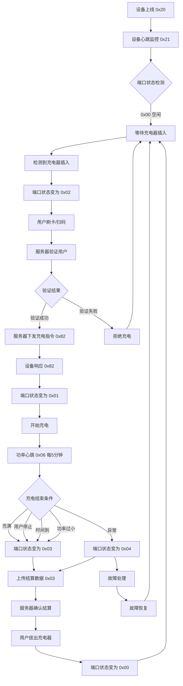
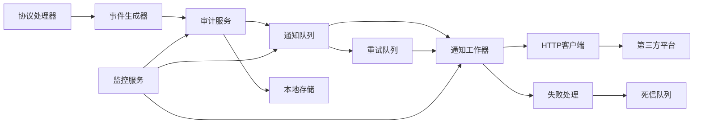
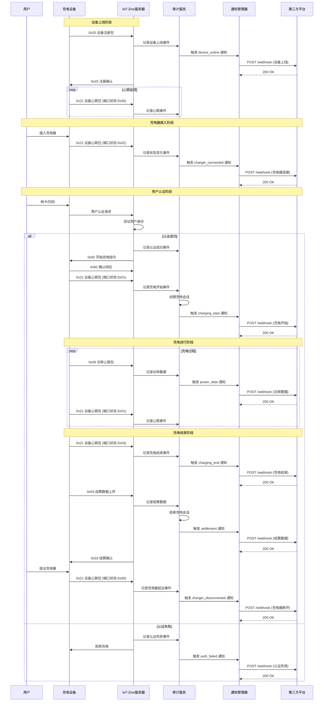
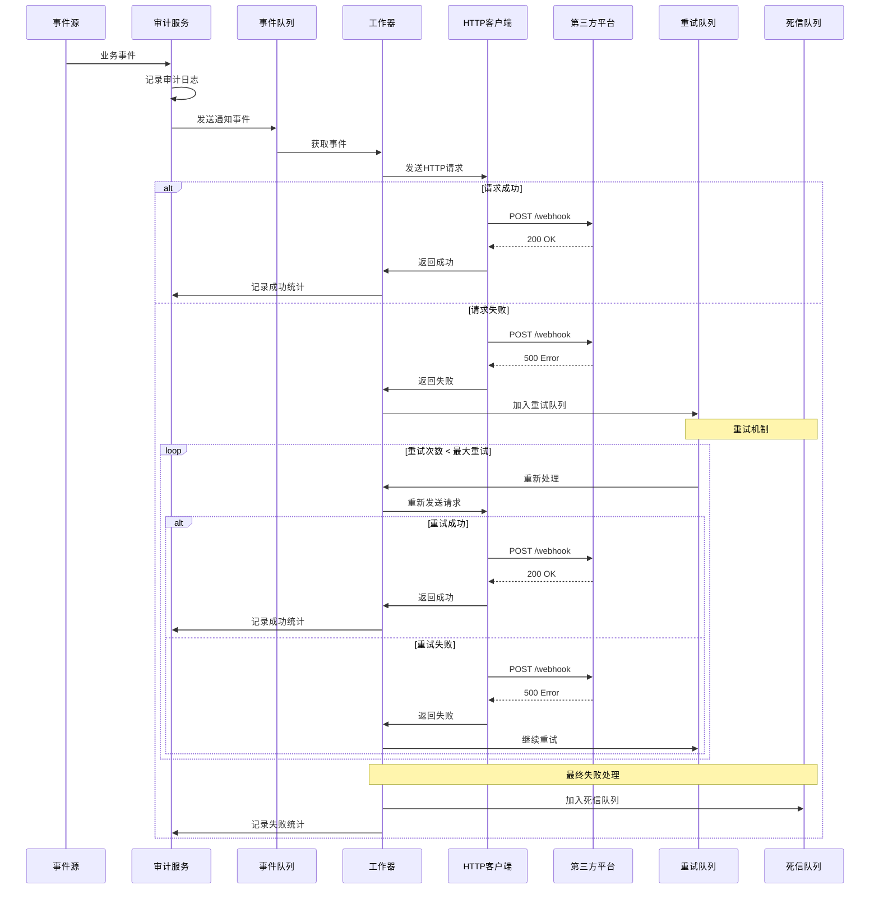
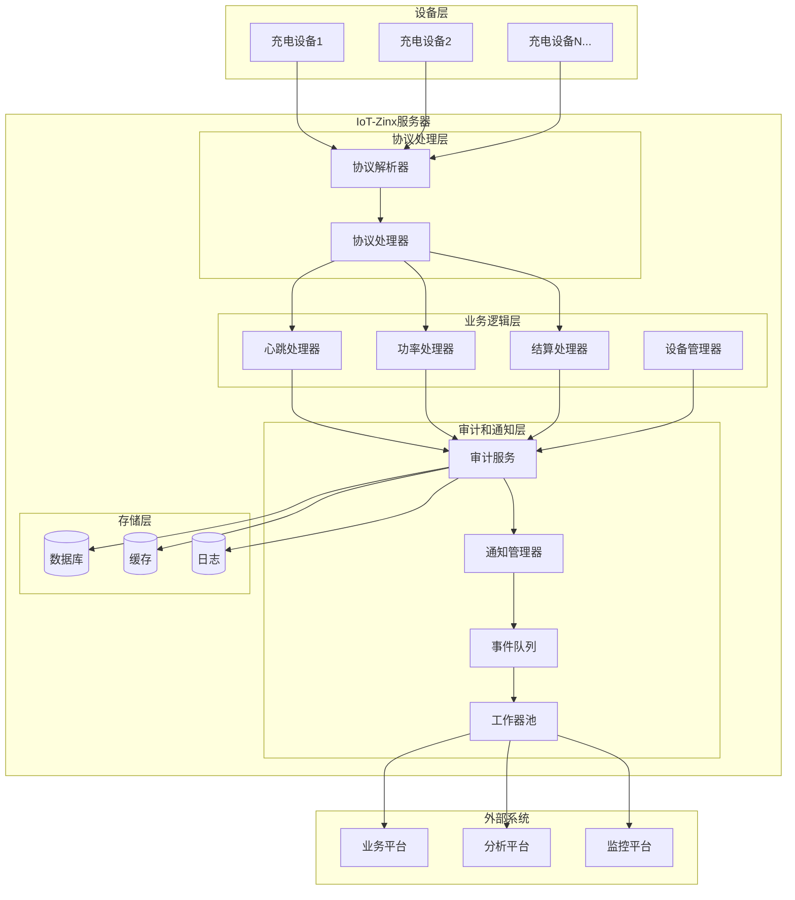
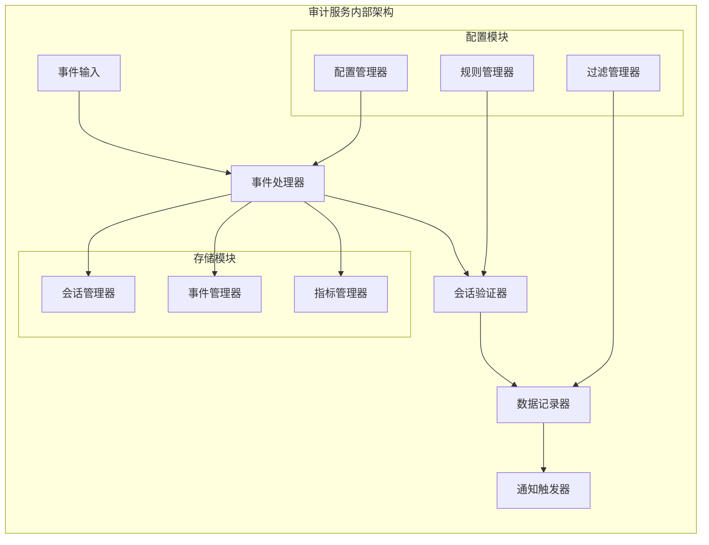
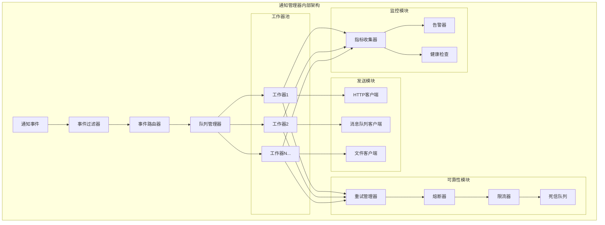
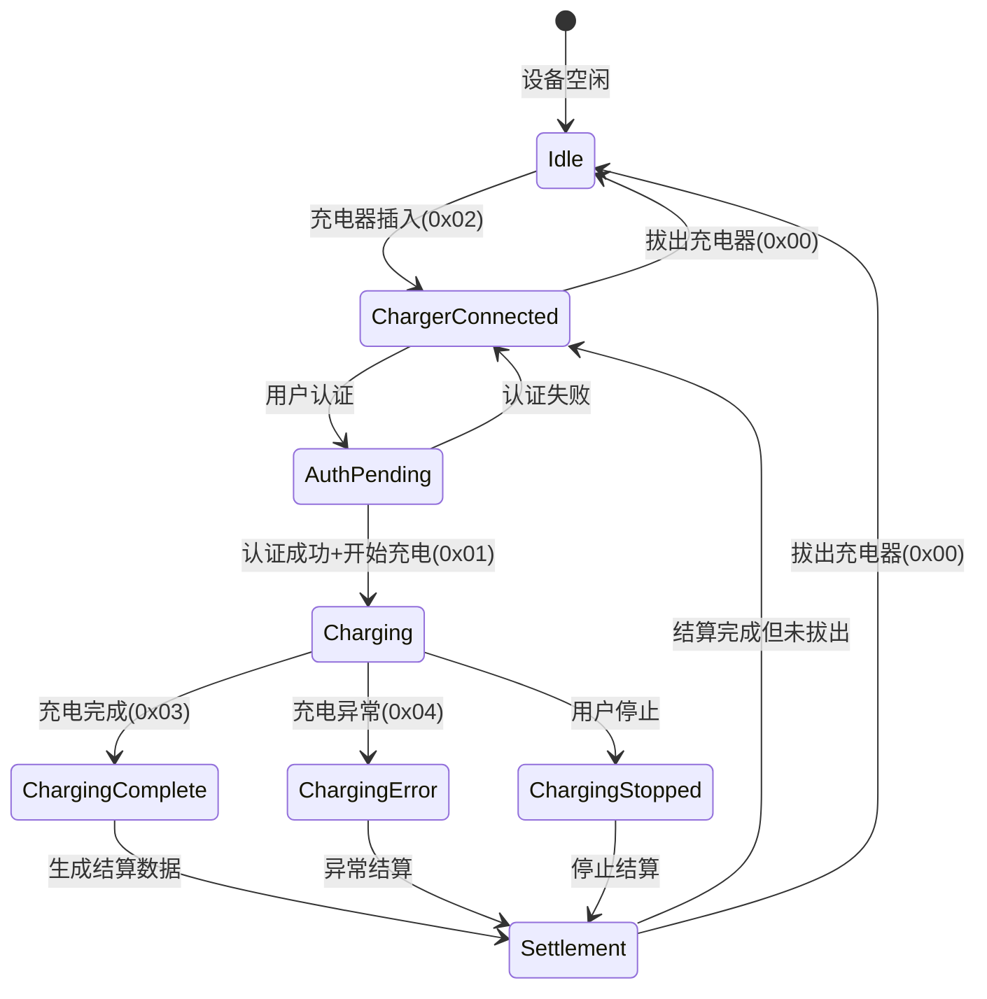

# IoT-Zinx 充电流程审计和第三方平台通知系统设计方案

## 概述

基于 AP3000 协议分析和系统日志数据，设计一个完整的充电流程审计系统和第三方平台异步通知机制，确保 100%数据一致性且不影响现有系统性能。

## 1. 充电流程完整分析

### 1.1 协议指令分析

基于 AP3000 通信协议和系统日志，关键协议指令包括：

| 指令 | 名称               | 方向          | 触发时机          | 业务含义         |
| ---- | ------------------ | ------------- | ----------------- | ---------------- |
| 0x20 | 设备注册包         | 设备 → 服务器 | 设备上线/周期注册 | 设备生命周期管理 |
| 0x21 | 设备心跳包         | 设备 → 服务器 | 每 20 秒          | 端口状态监控     |
| 0x01 | 设备心跳包         | 设备 → 服务器 | 每 20 秒          | 设备整体状态     |
| 0x06 | 端口充电功率心跳包 | 设备 → 服务器 | 充电中每 5 分钟   | 充电过程数据     |
| 0x03 | 结算消费信息上传   | 设备 → 服务器 | 充电结束          | 结算数据         |
| 0x82 | 服务器充电控制指令 | 服务器 → 设备 | 远程充电控制      | 充电启停控制     |
| 0x12 | 主机获取服务器时间 | 设备 → 服务器 | 设备需要同步时间  | 时间同步         |
| 0x11 | 主机心跳包         | 设备 → 服务器 | 定期上报          | 设备状态信息     |
| 0x35 | 设备版本上传       | 设备 → 服务器 | 设备注册后        | 版本信息         |

### 1.2 端口状态定义

根据协议文档和日志分析，端口状态包括：

```
0x00: 空闲状态 - 无充电器连接
0x01: 充电中 - 正在充电
0x02: 有充电器但未充电 - 充电器已插入但未开始充电
0x03: 有充电器但未充电(已充满) - 充电完成但充电器未拔出
0x04: 故障状态 - 端口故障
0x05: 预约状态 - 端口被预约
0x06: 准备中 - 端口准备开始充电
0x07: 暂停中 - 充电暂停
```

### 1.3 完整充电流程状态图



## 2. 充电流程审计系统设计

### 2.1 审计事件定义

基于充电流程分析，需要审计的关键事件：

#### 2.1.1 设备生命周期事件

- **设备上线**: 0x20 设备注册包
- **设备下线**: 连接断开或超时
- **设备心跳**: 0x01/0x21 心跳包
- **时间同步**: 0x12 时间请求

#### 2.1.2 充电流程事件

- **充电器插入**: 端口状态 0x00 → 0x02
- **充电开始**: 端口状态 0x02 → 0x01
- **充电进行**: 0x06 功率心跳包
- **充电结束**: 端口状态 0x01 → 0x03
- **充电器拔出**: 端口状态 0x03 → 0x00
- **充电异常**: 各种错误状态

#### 2.1.3 业务流程事件

- **用户认证**: 刷卡/扫码验证
- **充电控制**: 0x82 控制指令
- **结算处理**: 0x03 结算数据
- **费用计算**: 电量费用结算

#### 2.1.4 故障事件

- **设备故障**: 各种设备级故障
- **端口故障**: 端口级故障
- **通信故障**: 协议异常
- **业务故障**: 业务逻辑错误

### 2.2 审计数据结构

```go
// 充电会话审计记录
type ChargingSessionAudit struct {
    SessionID       string    `json:"session_id"`       // 会话ID
    DeviceID        string    `json:"device_id"`        // 设备ID
    PortNumber      int       `json:"port_number"`      // 端口号
    OrderID         string    `json:"order_id"`         // 订单ID
    UserID          string    `json:"user_id"`          // 用户ID
    CardNumber      string    `json:"card_number"`      // 卡号

    // 时间信息
    StartTime       time.Time `json:"start_time"`       // 开始时间
    EndTime         time.Time `json:"end_time"`         // 结束时间
    Duration        int       `json:"duration"`         // 持续时间(秒)

    // 充电数据
    TotalEnergy     float64   `json:"total_energy"`     // 总电量(度)
    MaxPower        int       `json:"max_power"`        // 最大功率(W)
    AvgPower        int       `json:"avg_power"`        // 平均功率(W)
    TotalFee        int       `json:"total_fee"`        // 总费用(分)

    // 状态信息
    StartReason     string    `json:"start_reason"`     // 开始原因
    StopReason      int       `json:"stop_reason"`      // 停止原因
    StopReasonDesc  string    `json:"stop_reason_desc"` // 停止原因描述
    FinalStatus     int       `json:"final_status"`     // 最终状态

    // 审计信息
    Events          []AuditEvent `json:"events"`        // 事件列表
    CreatedAt       time.Time `json:"created_at"`       // 创建时间
    UpdatedAt       time.Time `json:"updated_at"`       // 更新时间
}

// 审计事件
type AuditEvent struct {
    EventID         string    `json:"event_id"`         // 事件ID
    EventType       string    `json:"event_type"`       // 事件类型
    Timestamp       time.Time `json:"timestamp"`        // 时间戳
    DeviceID        string    `json:"device_id"`        // 设备ID
    PortNumber      int       `json:"port_number"`      // 端口号
    ProtocolCommand byte      `json:"protocol_command"` // 协议指令
    OldStatus       int       `json:"old_status"`       // 原状态
    NewStatus       int       `json:"new_status"`       // 新状态
    Data            map[string]interface{} `json:"data"` // 事件数据
    Description     string    `json:"description"`      // 事件描述
}
```

## 3. 第三方平台通知系统设计

### 3.1 通知事件类型

#### 3.1.1 设备事件

```json
{
  "event_type": "device_online",
  "device_id": "04A26CF3",
  "timestamp": 1625097600,
  "data": {
    "iccid": "898604D9162390488297",
    "device_type": 33,
    "firmware_version": "1.00",
    "port_count": 2,
    "signal_strength": 85,
    "temperature": 25.5,
    "voltage": 235.9
  }
}
```

#### 3.1.2 充电事件

```json
{
  "event_type": "charging_start",
  "device_id": "04A26CF3",
  "port_number": 1,
  "timestamp": 1625097600,
  "data": {
    "session_id": "sess_20250630_001",
    "order_id": "ORDER_2025061900",
    "user_id": "user123",
    "card_number": "1234567890",
    "start_mode": 1,
    "max_power_limit": 2000,
    "estimated_duration": 3600
  }
}
```

#### 3.1.3 功率数据事件

```json
{
  "event_type": "power_data",
  "device_id": "04A26CF3",
  "port_number": 1,
  "timestamp": 1625097600,
  "data": {
    "session_id": "sess_20250630_001",
    "current_power": 1850,
    "cumulative_energy": 0.85,
    "voltage": 235.9,
    "current": 7.8,
    "temperature": 28.5,
    "charging_duration": 1800,
    "remaining_time": 1200
  }
}
```

#### 3.1.4 结算事件

```json
{
  "event_type": "settlement",
  "device_id": "04A26CF3",
  "port_number": 1,
  "timestamp": 1625097600,
  "data": {
    "session_id": "sess_20250630_001",
    "order_id": "ORDER_2025061900",
    "user_id": "user123",
    "card_number": "1234567890",
    "start_time": "2025-06-30T10:04:33+08:00",
    "end_time": "2025-06-30T10:34:33+08:00",
    "total_duration": 1800,
    "total_energy": 0.95,
    "max_power": 1880,
    "avg_power": 1650,
    "total_fee": 285,
    "stop_reason": 1,
    "stop_reason_desc": "充满自停"
  }
}
```

### 3.2 异步通知架构



### 3.3 通知管理器设计

```go
// 通知管理器
type ChargingNotificationManager struct {
    config          *NotificationConfig
    eventQueue      chan *NotificationEvent
    retryQueue      chan *RetryableEvent
    deadLetterQueue chan *DeadLetterEvent
    workers         []*NotificationWorker
    httpClient      *http.Client
    auditService    *ChargingAuditService
    metrics         *NotificationMetrics
    mutex           sync.RWMutex
}

// 通知配置
type NotificationConfig struct {
    Enabled         bool              `yaml:"enabled"`
    Endpoints       []EndpointConfig  `yaml:"endpoints"`
    QueueSize       int               `yaml:"queue_size"`
    WorkerCount     int               `yaml:"worker_count"`
    RetryCount      int               `yaml:"retry_count"`
    RetryInterval   time.Duration     `yaml:"retry_interval"`
    Timeout         time.Duration     `yaml:"timeout"`
    RateLimit       RateLimitConfig   `yaml:"rate_limit"`
    CircuitBreaker  CircuitBreakerConfig `yaml:"circuit_breaker"`
}

// 端点配置
type EndpointConfig struct {
    Name        string            `yaml:"name"`
    URL         string            `yaml:"url"`
    Method      string            `yaml:"method"`
    Headers     map[string]string `yaml:"headers"`
    ApiKey      string            `yaml:"api_key"`
    Secret      string            `yaml:"secret"`
    Events      []string          `yaml:"events"`
    Timeout     time.Duration     `yaml:"timeout"`
    RetryCount  int               `yaml:"retry_count"`
    Enabled     bool              `yaml:"enabled"`
}
```

## 4. 系统集成方案

### 4.1 集成点设计

#### 4.1.1 设备心跳处理增强

在现有的心跳处理器中添加审计和通知：

```go
// 在 HeartbeatHandler 中添加
func (h *HeartbeatHandler) processWithAudit(deviceID string, heartbeatData *HeartbeatData) {
    // 原有处理逻辑
    oldStatus := h.getPortStatus(deviceID, heartbeatData.PortNumber)

    // 处理心跳数据
    h.processHeartbeat(deviceID, heartbeatData)

    // 审计和通知
    if h.auditService != nil {
        auditEvent := &AuditEvent{
            EventType:       "device_heartbeat",
            DeviceID:        deviceID,
            PortNumber:      heartbeatData.PortNumber,
            ProtocolCommand: 0x21,
            OldStatus:       oldStatus,
            NewStatus:       heartbeatData.PortStatus,
            Timestamp:       time.Now(),
            Data:           heartbeatData.ToMap(),
        }
        h.auditService.RecordEvent(auditEvent)

        // 检查状态变化
        if oldStatus != heartbeatData.PortStatus {
            h.notifyPortStatusChange(deviceID, heartbeatData.PortNumber, oldStatus, heartbeatData.PortStatus)
        }
    }
}
```

#### 4.1.2 功率心跳处理增强

```go
// 在 PowerHeartbeatHandler 中添加
func (h *PowerHeartbeatHandler) processWithAudit(deviceID string, powerData *PowerHeartbeatData) {
    // 原有处理逻辑
    h.processPowerHeartbeat(deviceID, powerData)

    // 审计和通知
    if h.auditService != nil {
        auditEvent := &AuditEvent{
            EventType:       "power_heartbeat",
            DeviceID:        deviceID,
            PortNumber:      powerData.PortNumber,
            ProtocolCommand: 0x06,
            Timestamp:       time.Now(),
            Data:           powerData.ToMap(),
        }
        h.auditService.RecordEvent(auditEvent)

        // 通知充电进行中
        h.notifyChargingProgress(deviceID, powerData)
    }
}
```

#### 4.1.3 结算处理增强

```go
// 在 SettlementHandler 中添加
func (h *SettlementHandler) processWithAudit(deviceID string, settlementData *SettlementData) {
    // 原有处理逻辑
    result := h.processSettlement(deviceID, settlementData)

    // 审计和通知
    if h.auditService != nil {
        auditEvent := &AuditEvent{
            EventType:       "settlement",
            DeviceID:        deviceID,
            PortNumber:      settlementData.PortNumber,
            ProtocolCommand: 0x03,
            Timestamp:       time.Now(),
            Data:           settlementData.ToMap(),
        }
        h.auditService.RecordEvent(auditEvent)

        // 结束充电会话
        h.auditService.EndChargingSession(deviceID, settlementData.PortNumber, settlementData)

        // 通知结算完成
        h.notifySettlement(deviceID, settlementData)
    }

    return result
}
```

### 4.2 配置管理

```yaml
# config/notification.yaml
charging_audit:
  enabled: true
  storage:
    type: "mysql" # mysql, postgresql, mongodb
    connection: "user:pass@tcp(localhost:3306)/iot_audit"
    retention_days: 365

  events:
    device_events: true
    charging_events: true
    power_events: true
    settlement_events: true
    error_events: true

notification:
  enabled: true
  queue_size: 10000
  worker_count: 10

  endpoints:
    - name: "business_platform"
      url: "https://api.business.com/webhook/charging"
      method: "POST"
      api_key: "${BUSINESS_API_KEY}"
      secret: "${BUSINESS_SECRET}"
      timeout: 10s
      retry_count: 3
      events:
        - "device_*"
        - "charging_*"
        - "settlement"
      enabled: true

    - name: "analytics_platform"
      url: "https://analytics.business.com/events"
      method: "POST"
      api_key: "${ANALYTICS_API_KEY}"
      timeout: 5s
      retry_count: 1
      events:
        - "power_data"
        - "settlement"
      enabled: true

  rate_limit:
    enabled: true
    requests_per_second: 100
    burst: 200

  circuit_breaker:
    enabled: true
    failure_threshold: 10
    success_threshold: 5
    timeout: 30s

  retry:
    max_attempts: 3
    initial_interval: 1s
    max_interval: 30s
    multiplier: 2.0
```

## 5. 实现计划

### 5.1 第一阶段：核心组件实现

1. **ChargingAuditService**: 充电流程审计服务
2. **NotificationManager**: 通知管理器
3. **EventQueue**: 事件队列系统
4. **配置管理**: 配置加载和热更新

### 5.2 第二阶段：系统集成

1. **协议处理器增强**: 在现有处理器中添加审计点
2. **数据库设计**: 审计数据存储结构
3. **监控仪表板**: 实时监控界面
4. **测试覆盖**: 完整的单元测试和集成测试

### 5.3 第三阶段：优化和运维

1. **性能优化**: 批量处理和性能调优
2. **运维工具**: 日志分析和故障排查工具
3. **文档完善**: 部署和运维文档
4. **培训材料**: 使用和维护指南

## 6. 质量保证

### 6.1 数据一致性保证

- **事务性处理**: 确保审计数据的一致性
- **幂等性设计**: 防止重复处理
- **数据校验**: 完整的数据验证机制

### 6.2 性能保证

- **异步处理**: 不阻塞主业务流程
- **批量操作**: 提高数据库写入效率
- **资源控制**: 合理的资源使用限制

### 6.3 可靠性保证

- **重试机制**: 自动重试失败的操作
- **熔断保护**: 防止级联故障
- **监控告警**: 及时发现和处理问题

这个设计方案确保了与现有系统的完全兼容，通过异步处理保证性能不受影响，同时提供了完整的充电流程审计和第三方平台通知功能。

## 7. 详细时序图

### 7.1 完整充电流程时序图



### 7.2 异步通知处理时序图



## 8. 系统架构详细设计

### 8.1 整体架构图



### 8.2 审计服务架构



### 8.3 通知管理器架构



## 9. 核心算法设计

### 9.1 充电会话状态机



### 9.2 事件过滤算法

```go
// 事件过滤器接口
type EventFilter interface {
    Filter(event *AuditEvent) bool
    GetPriority() int
}

// 频率过滤器 - 防止高频事件
type FrequencyFilter struct {
    eventCounts map[string]*RateLimiter
    maxRate     int
    window      time.Duration
}

func (f *FrequencyFilter) Filter(event *AuditEvent) bool {
    key := fmt.Sprintf("%s-%s-%d", event.DeviceID, event.EventType, event.PortNumber)
    limiter := f.eventCounts[key]
    if limiter == nil {
        limiter = NewRateLimiter(f.maxRate, f.window)
        f.eventCounts[key] = limiter
    }
    return limiter.Allow()
}

// 状态变化过滤器 - 只通知状态变化
type StatusChangeFilter struct {
    lastStatus map[string]int
}

func (f *StatusChangeFilter) Filter(event *AuditEvent) bool {
    if event.EventType != "port_status_change" {
        return true
    }

    key := fmt.Sprintf("%s-%d", event.DeviceID, event.PortNumber)
    lastStatus, exists := f.lastStatus[key]
    if !exists || lastStatus != event.NewStatus {
        f.lastStatus[key] = event.NewStatus
        return true
    }
    return false
}
```

### 9.3 重试策略算法

```go
// 指数退避重试策略
type ExponentialBackoffRetry struct {
    maxAttempts   int
    baseDelay     time.Duration
    maxDelay      time.Duration
    multiplier    float64
    jitterFunc    func(time.Duration) time.Duration
}

func (r *ExponentialBackoffRetry) GetDelay(attempt int) time.Duration {
    if attempt >= r.maxAttempts {
        return -1 // 不再重试
    }

    delay := time.Duration(float64(r.baseDelay) * math.Pow(r.multiplier, float64(attempt)))
    if delay > r.maxDelay {
        delay = r.maxDelay
    }

    if r.jitterFunc != nil {
        delay = r.jitterFunc(delay)
    }

    return delay
}

// 添加随机抖动
func AddJitter(delay time.Duration) time.Duration {
    jitter := time.Duration(rand.Int63n(int64(delay / 10))) // 10%的随机抖动
    return delay + jitter
}
```

## 10. 数据库设计

### 10.1 审计表结构

```sql
-- 充电会话表
CREATE TABLE charging_sessions (
    id BIGINT AUTO_INCREMENT PRIMARY KEY,
    session_id VARCHAR(64) UNIQUE NOT NULL,
    device_id VARCHAR(32) NOT NULL,
    port_number INT NOT NULL,
    order_id VARCHAR(64),
    user_id VARCHAR(64),
    card_number VARCHAR(32),

    start_time TIMESTAMP NOT NULL,
    end_time TIMESTAMP,
    duration INT, -- 持续时间(秒)

    total_energy DECIMAL(10,4), -- 总电量(度)
    max_power INT, -- 最大功率(W)
    avg_power INT, -- 平均功率(W)
    total_fee INT, -- 总费用(分)

    start_reason VARCHAR(64),
    stop_reason INT,
    stop_reason_desc VARCHAR(256),
    final_status INT,

    created_at TIMESTAMP DEFAULT CURRENT_TIMESTAMP,
    updated_at TIMESTAMP DEFAULT CURRENT_TIMESTAMP ON UPDATE CURRENT_TIMESTAMP,

    INDEX idx_device_port (device_id, port_number),
    INDEX idx_session_time (start_time, end_time),
    INDEX idx_order_id (order_id),
    INDEX idx_user_id (user_id)
);

-- 审计事件表
CREATE TABLE audit_events (
    id BIGINT AUTO_INCREMENT PRIMARY KEY,
    event_id VARCHAR(64) UNIQUE NOT NULL,
    session_id VARCHAR(64),
    event_type VARCHAR(64) NOT NULL,
    timestamp TIMESTAMP NOT NULL,
    device_id VARCHAR(32) NOT NULL,
    port_number INT,
    protocol_command TINYINT,
    old_status INT,
    new_status INT,
    event_data JSON,
    description TEXT,

    created_at TIMESTAMP DEFAULT CURRENT_TIMESTAMP,

    INDEX idx_session_id (session_id),
    INDEX idx_device_time (device_id, timestamp),
    INDEX idx_event_type (event_type),
    INDEX idx_protocol_command (protocol_command),
    FOREIGN KEY (session_id) REFERENCES charging_sessions(session_id)
);

-- 通知记录表
CREATE TABLE notification_logs (
    id BIGINT AUTO_INCREMENT PRIMARY KEY,
    event_id VARCHAR(64) NOT NULL,
    endpoint_name VARCHAR(64) NOT NULL,
    url VARCHAR(512) NOT NULL,
    method VARCHAR(16) NOT NULL,
    request_headers JSON,
    request_body JSON,
    response_status INT,
    response_headers JSON,
    response_body TEXT,
    response_time_ms INT,
    attempt_count INT DEFAULT 1,
    success BOOLEAN NOT NULL,
    error_message TEXT,

    created_at TIMESTAMP DEFAULT CURRENT_TIMESTAMP,

    INDEX idx_event_id (event_id),
    INDEX idx_endpoint (endpoint_name),
    INDEX idx_success_time (success, created_at),
    FOREIGN KEY (event_id) REFERENCES audit_events(event_id)
);

-- 通知统计表
CREATE TABLE notification_metrics (
    id BIGINT AUTO_INCREMENT PRIMARY KEY,
    endpoint_name VARCHAR(64) NOT NULL,
    date DATE NOT NULL,
    hour TINYINT NOT NULL,
    total_sent INT DEFAULT 0,
    total_success INT DEFAULT 0,
    total_failed INT DEFAULT 0,
    total_retried INT DEFAULT 0,
    avg_response_time_ms INT DEFAULT 0,

    created_at TIMESTAMP DEFAULT CURRENT_TIMESTAMP,
    updated_at TIMESTAMP DEFAULT CURRENT_TIMESTAMP ON UPDATE CURRENT_TIMESTAMP,

    UNIQUE KEY uk_endpoint_date_hour (endpoint_name, date, hour)
);
```

## 11. 性能优化策略

### 11.1 批量处理优化

```go
// 批量审计事件处理器
type BatchAuditProcessor struct {
    eventBatch    []*AuditEvent
    batchSize     int
    flushInterval time.Duration
    ticker        *time.Ticker
    mutex         sync.Mutex
}

func (p *BatchAuditProcessor) AddEvent(event *AuditEvent) {
    p.mutex.Lock()
    defer p.mutex.Unlock()

    p.eventBatch = append(p.eventBatch, event)
    if len(p.eventBatch) >= p.batchSize {
        p.flush()
    }
}

func (p *BatchAuditProcessor) flush() {
    if len(p.eventBatch) == 0 {
        return
    }

    // 批量写入数据库
    err := p.auditService.BatchInsertEvents(p.eventBatch)
    if err != nil {
        log.Errorf("批量写入审计事件失败: %v", err)
        // 可以考虑写入本地文件作为备份
    }

    p.eventBatch = p.eventBatch[:0] // 清空切片但保留容量
}
```

### 11.2 内存池优化

```go
// 事件对象池
var auditEventPool = sync.Pool{
    New: func() interface{} {
        return &AuditEvent{}
    },
}

func GetAuditEvent() *AuditEvent {
    return auditEventPool.Get().(*AuditEvent)
}

func PutAuditEvent(event *AuditEvent) {
    // 重置对象状态
    event.Reset()
    auditEventPool.Put(event)
}
```

### 11.3 缓存策略

```go
// 会话缓存管理器
type SessionCacheManager struct {
    cache        map[string]*ChargingSession
    ttl          time.Duration
    cleanupTicker *time.Ticker
    mutex        sync.RWMutex
}

func (c *SessionCacheManager) GetSession(sessionID string) (*ChargingSession, bool) {
    c.mutex.RLock()
    defer c.mutex.RUnlock()

    session, exists := c.cache[sessionID]
    if !exists {
        return nil, false
    }

    if time.Since(session.LastAccess) > c.ttl {
        return nil, false
    }

    session.LastAccess = time.Now()
    return session, true
}
```

这个完整的设计方案提供了：

1. 详细的充电流程分析和状态转换
2. 完整的审计事件设计和数据结构
3. 异步通知系统架构
4. 详细的时序图和架构图
5. 核心算法和优化策略
6. 完整的数据库设计
7. 性能优化方案

确保了与现有系统的完全兼容，通过异步处理保证性能不受影响。
