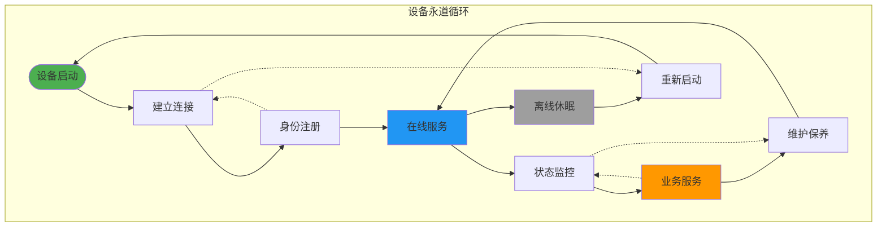
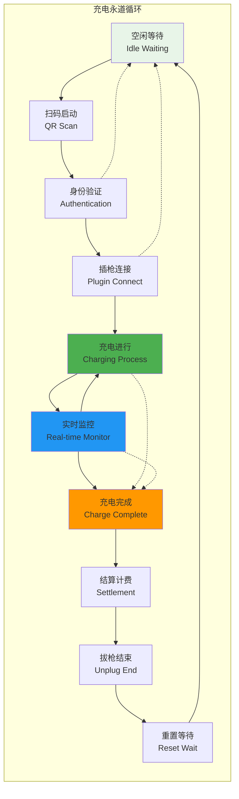
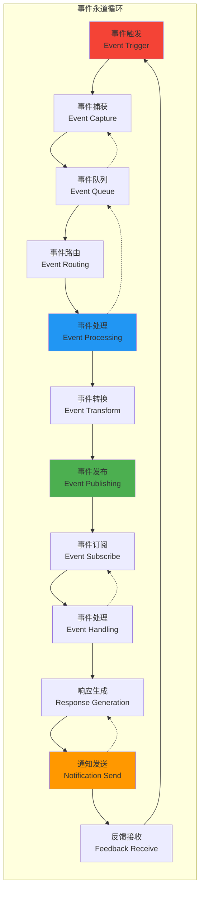
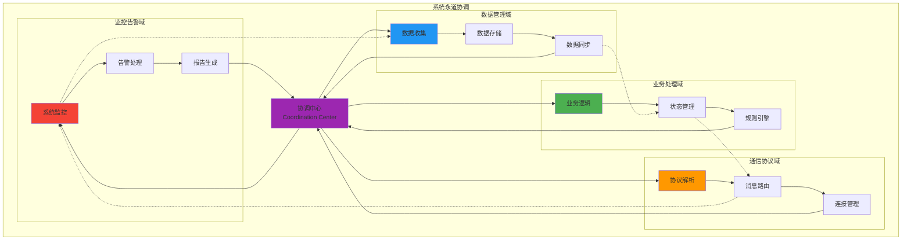

# IoT-Zinx 咏道图（永道循环）

## 🌊 咏道图说明

咏道图展示了 IoT-Zinx 系统中数据流转的永续循环，体现了"道法自然"的设计理念 - 数据如水，自然流转，生生不息。

## ♾️ 核心咏道循环

```mermaid
graph LR
    subgraph "生命之始 (Genesis)"
        A1[设备接入<br/>Device Connect]
        A2[身份确立<br/>Identity Establish]
        A3[注册登记<br/>Registration]
    end

    subgraph "存在之道 (Existence)"
        B1[心跳律动<br/>Heartbeat Rhythm]
        B2[状态流转<br/>State Flow]
        B3[数据汇聚<br/>Data Convergence]
    end

    subgraph "服务之道 (Service)"
        C1[业务响应<br/>Business Response]
        C2[能量传递<br/>Energy Transfer]
        C3[价值实现<br/>Value Creation]
    end

    subgraph "通达之道 (Communication)"
        D1[信息传播<br/>Information Spread]
        D2[事件扩散<br/>Event Diffusion]
        D3[系统同步<br/>System Sync]
    end

    subgraph "归根之道 (Return)"
        E1[数据沉淀<br/>Data Precipitation]
        E2[状态归档<br/>State Archive]
        E3[经验积累<br/>Experience Accumulation]
    end

    subgraph "更新之道 (Renewal)"
        F1[系统优化<br/>System Optimization]
        F2[能力提升<br/>Capability Enhancement]
        F3[服务进化<br/>Service Evolution]
    end

    %% 永续循环流转
    A1 --> A2 --> A3
    A3 --> B1
    B1 --> B2 --> B3
    B3 --> C1
    C1 --> C2 --> C3
    C3 --> D1
    D1 --> D2 --> D3
    D3 --> E1
    E1 --> E2 --> E3
    E3 --> F1
    F1 --> F2 --> F3
    F3 --> A1

    %% 内在连接
    B2 -.-> D2
    C2 -.-> E1
    D1 -.-> F1

    style A1 fill:#e8f5e8
    style B1 fill:#e3f2fd
    style C1 fill:#fff3e0
    style D1 fill:#fce4ec
    style E1 fill:#f3e5f5
    style F1 fill:#e0f2f1
```

## 🎋 业务永道流转

### 设备生命周期咏道

### 充电业务咏道

## 🌀 数据流转咏道

### 数据生命周期咏道

```mermaid
graph TB
    subgraph "数据永道流转"
        Generate[数据产生<br/>Data Generation]
        Collect[数据采集<br/>Data Collection]
        Parse[数据解析<br/>Data Parsing]
        Validate[数据验证<br/>Data Validation]
        Process[数据处理<br/>Data Processing]
        Store[数据存储<br/>Data Storage]
        Index[数据索引<br/>Data Indexing]
        Query[数据查询<br/>Data Query]
        Analyze[数据分析<br/>Data Analysis]
        Insight[洞察发现<br/>Insight Discovery]
        Decision[决策支持<br/>Decision Support]
        Action[行动执行<br/>Action Execution]
        Feedback[反馈循环<br/>Feedback Loop]
        Optimize[优化改进<br/>Optimization]
    end

    Generate --> Collect
    Collect --> Parse
    Parse --> Validate
    Validate --> Process
    Process --> Store
    Store --> Index
    Index --> Query
    Query --> Analyze
    Analyze --> Insight
    Insight --> Decision
    Decision --> Action
    Action --> Feedback
    Feedback --> Optimize
    Optimize --> Generate

    %% 质量环路
    Validate -.-> Collect
    Process -.-> Parse
    Store -.-> Validate
    Analyze -.-> Query

    style Generate fill:#e8f5e8
    style Process fill:#2196f3
    style Insight fill:#ff9800
    style Action fill:#4caf50
```

## 🔄 事件驱动咏道

### 事件流转永道

## 🎯 系统协调咏道

### 组件协调永道

## 🌊 道法自然的设计理念

### 1. 无为而治 (Non-interference Governance)

- **自然流转**: 数据按照自然规律流转，减少人工干预
- **自动平衡**: 系统自动调节负载和资源分配
- **自愈能力**: 系统具备自我修复和恢复能力

### 2. 顺势而为 (Follow Natural Trends)

- **事件驱动**: 基于事件的自然响应机制
- **按需分配**: 根据实际需求分配系统资源
- **渐进演化**: 系统功能随业务需求自然演进

### 3. 生生不息 (Continuous Vitality)

- **永续循环**: 数据和业务的持续循环流转
- **新陈代谢**: 旧数据自然老化，新数据持续产生
- **成长进化**: 系统在运行中不断学习和优化

### 4. 和谐统一 (Harmonious Unity)

- **组件协调**: 各组件协调工作，形成统一整体
- **数据一致**: 保持全局数据的一致性和完整性
- **接口标准**: 统一的接口标准实现无缝集成

## 🎭 咏道图的哲学意义

> **"道生一，一生二，二生三，三生万物"**
>
> 在 IoT-Zinx 系统中：
>
> - **道**: 数据流转的根本规律
> - **一**: 统一的数据总线架构
> - **二**: 设备与系统的二元对话
> - **三**: 采集-处理-反馈的三元循环
> - **万物**: 衍生出的无穷业务场景

### 永道循环的核心价值

1. **可持续性**: 系统运行的永续性和稳定性
2. **自适应性**: 面对变化的自我调整能力
3. **和谐性**: 各组件间的协调统一
4. **进化性**: 持续改进和优化的能力
5. **生命力**: 系统的内在活力和创新能力

### 道的体现

- **简单**: 复杂问题的简单解决方案
- **自然**: 符合业务和技术的自然规律
- **高效**: 最少的资源实现最大的价值
- **稳定**: 持久稳定的系统运行
- **美感**: 架构和代码的内在美学

> **"知其雄，守其雌，为天下溪"**
>
> IoT-Zinx 如山间溪水，汇聚万流，滋养万物，生生不息。
