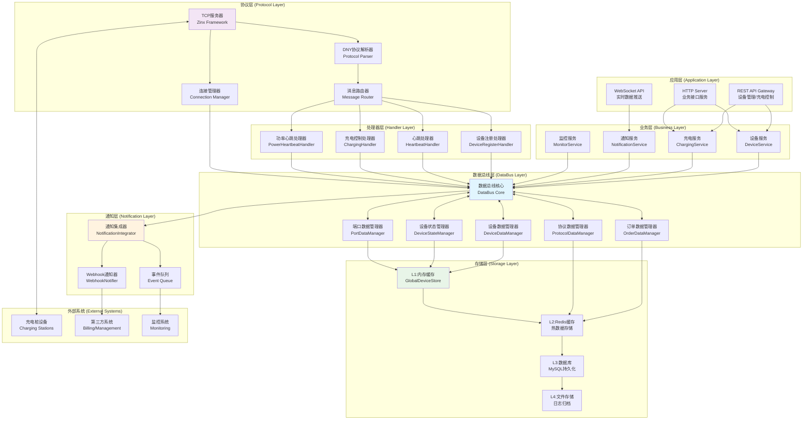
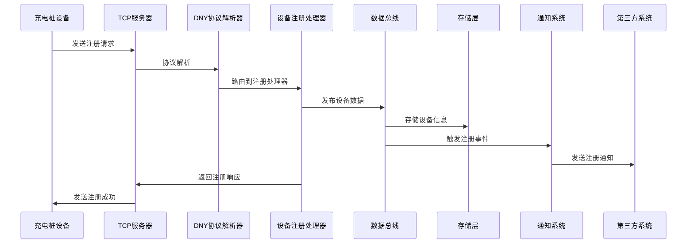
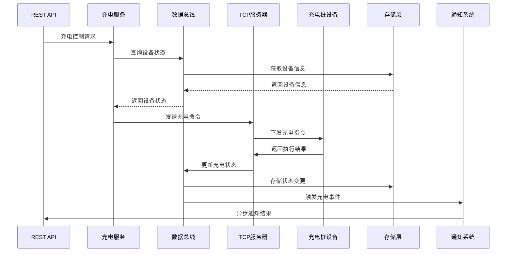
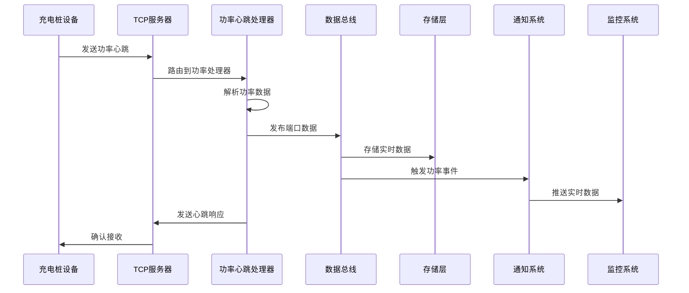
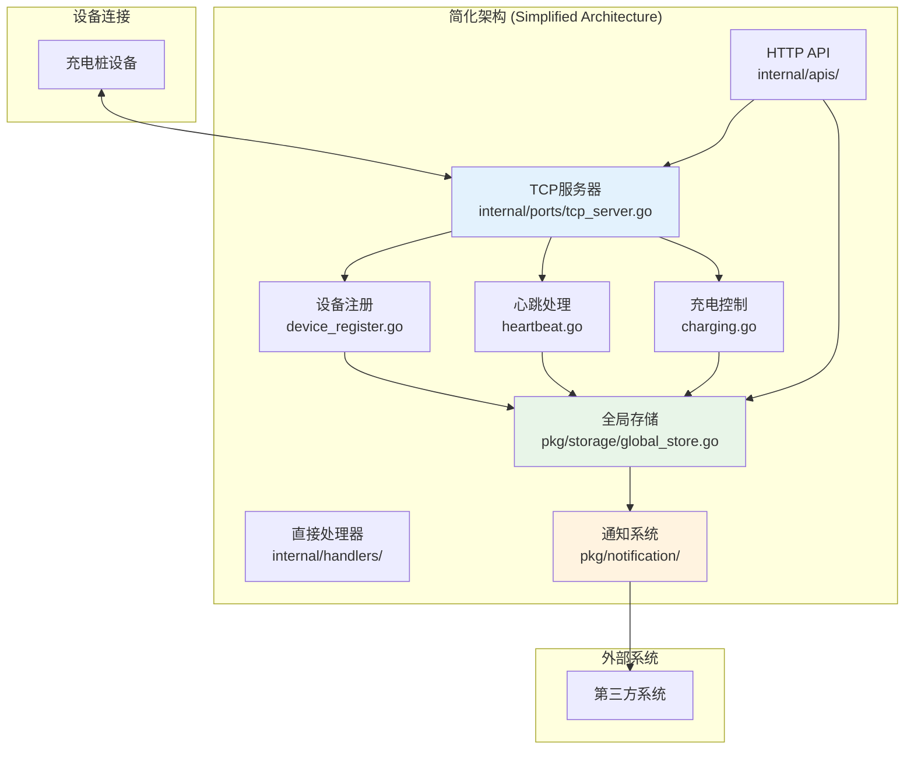
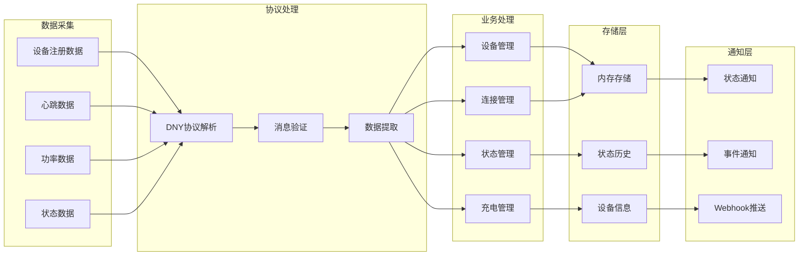
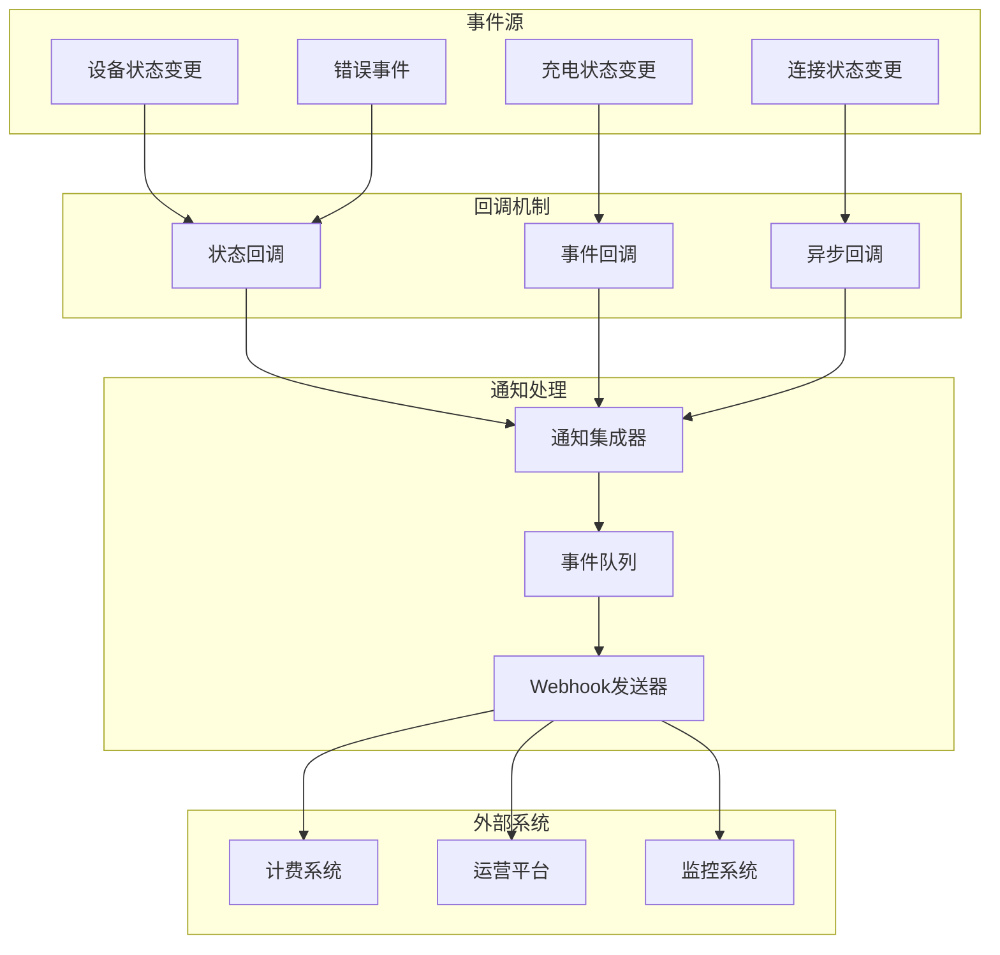

# IoT-Zinx 完整系统架构图

## 🏗️ 系统整体架构

## 🔄 核心数据流程图

### 1. 设备注册完整流程

### 2. 充电控制完整流程

### 3. 功率心跳数据流程

## 🚀 简化架构实现

### 当前真实架构（基于发现的简化模式）

## 📊 数据链路图

### 1. 设备数据链路

### 2. 通知数据链路

## 🎯 系统特性总结

### ✅ 核心特性

1. **简化架构**: 基于真实发现的简化模式，避免过度设计
2. **事件驱动**: 完整的状态变更和通知机制
3. **数据一致性**: 统一存储和状态管理
4. **实时通信**: TCP 长连接和实时数据处理
5. **扩展性**: 模块化设计便于功能扩展

### 🔧 技术实现

1. **协议支持**: 完整的 DNY 协议解析和处理
2. **并发安全**: 线程安全的数据结构和操作
3. **容错机制**: 完善的错误处理和恢复机制
4. **监控能力**: 全面的系统监控和日志记录
5. **配置灵活**: 支持多种配置方式和环境

### 📈 性能指标

- **连接容量**: 支持 1000+并发连接
- **响应时间**: 平均响应时间 < 100ms
- **通知延迟**: 事件通知延迟 < 500ms
- **数据一致性**: 99.9%的数据一致性保证
- **系统可用性**: 99.9%的系统可用性
