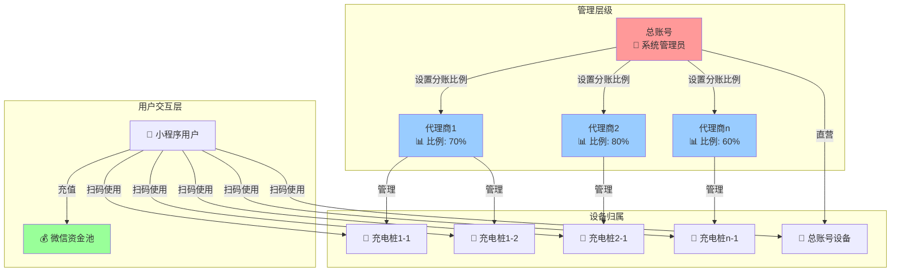
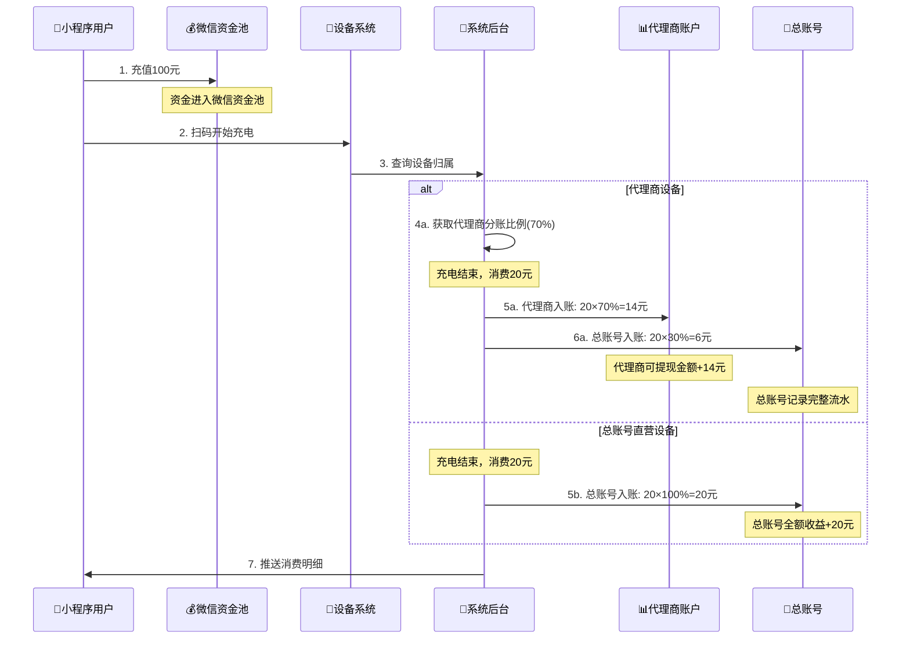
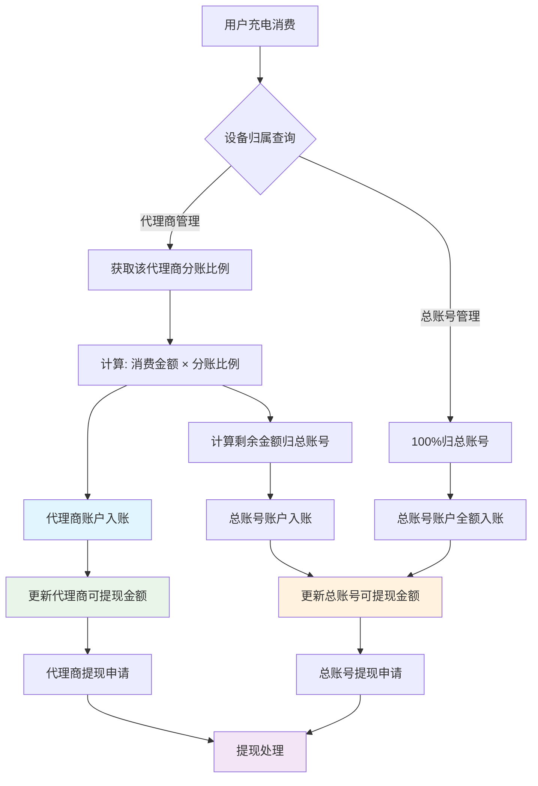
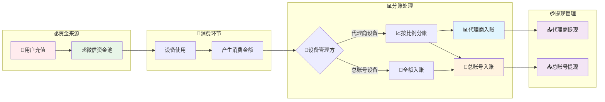

背景：总帐号的入账金额就是用户充值的流水，可以提现的，代理商的入账金额是所管设备的消费金额再按比例分配过后的金额。

用户类型 1.总账号、n 个代理商账号

分账逻辑：总账号设置每个代理商不同的分账比例，代理商的入账金额按照分账比例计算
设备

代理商管理的设备

小程序充值用户：小程序充值金额，到达微信资金池，然后点击设备(代理商管理或总账号管理)开始进行充电，消费的金额，划分到代理商的入账金额中，代理商提现金额 = 消费金额 \* 分账比例

## 系统架构图

### 1. 用户类型关系图

### 2. 资金流转时序图

### 3. 分账逻辑流程图

### 4. 数据流向图

