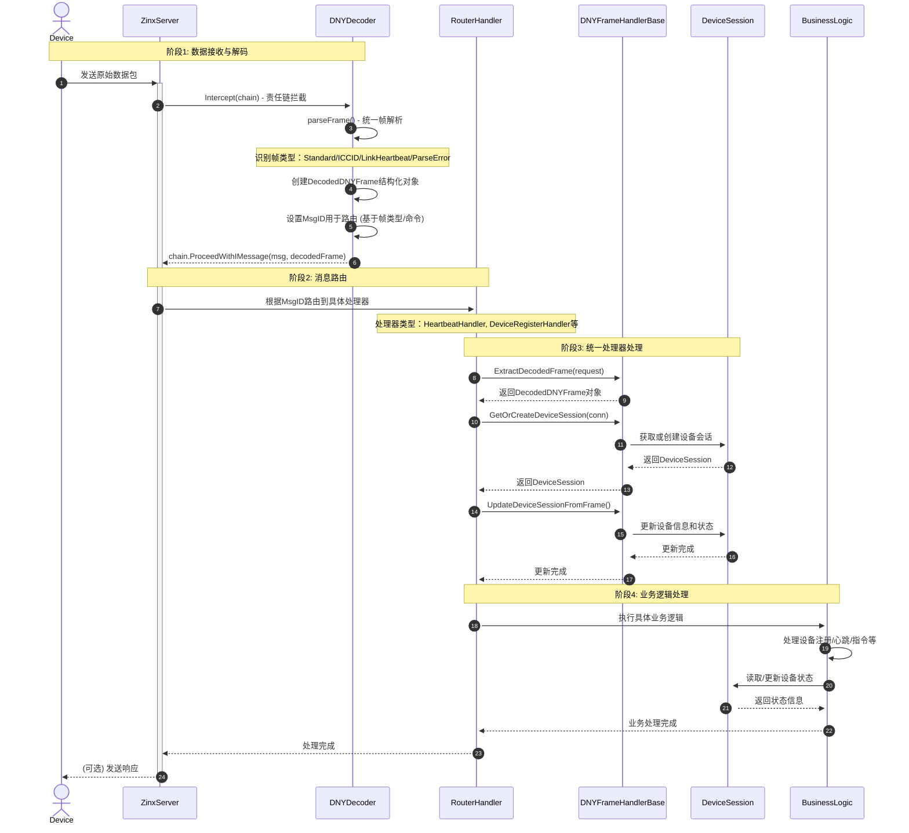
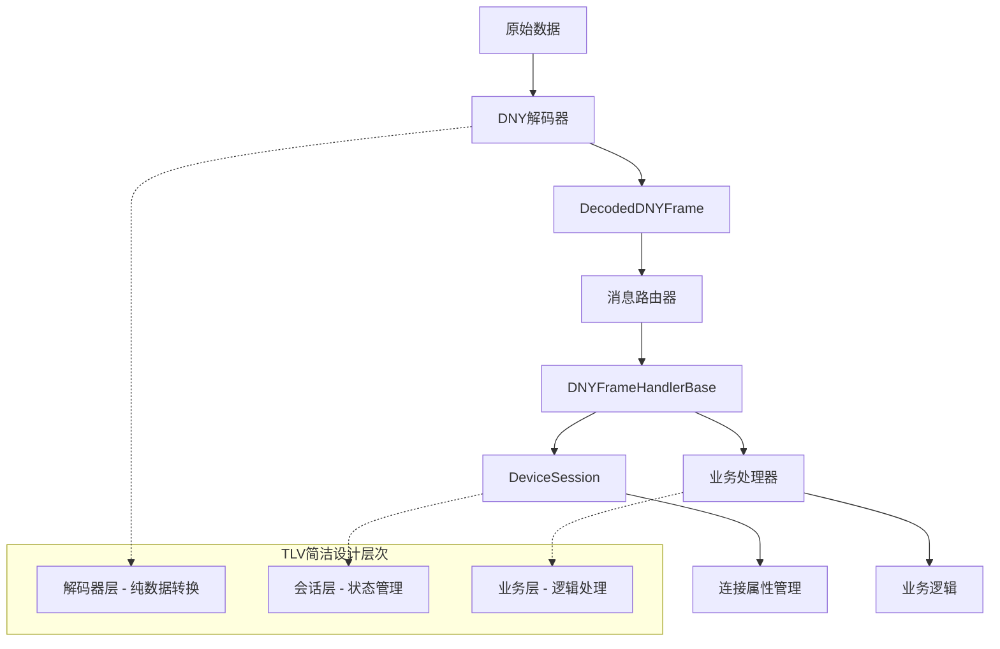

# DNY 解码器重构计划 - 基于 TLV 简洁设计模式

# 重构目标

解决 Zinx 框架中 DNY 解码器的数据传递机制核心问题：`conn.SetProperty`在多个位置分散设置导致连接属性管理混乱、难以维护和获取数据。采用 TLV 模式的简洁设计方案进行重构，实现职责分离和统一属性管理。

## 核心设计理念（基于 TLV 模式）

### 职责分离原则

- **解码器层**：专注数据转换，通过责任链传递结构化数据，保持纯函数特性
- **会话管理层**：统一管理连接属性和状态，基于 DeviceSession 架构
- **处理器层**：业务逻辑处理，通过会话管理器访问连接状态

### 数据流设计

```
原始数据 → DNY解码器(责任链) → DecodedDNYFrame → 处理器基类 → DeviceSession → 业务逻辑
```

### 完整架构流程图



### 核心组件交互关系



### 文档与清晰度原则

- **详细注释**：在代码关键逻辑、复杂算法、重要状态变更处添加清晰注释。
- **提交信息规范**：遵循约定式提交（Conventional Commits）或其他清晰规范，说明每次变更的目的和范围。
- **计划文档实时更新**：本重构计划文档将作为核心参考，随实际进展和调整进行更新，确保信息同步。
- **接口文档**：为新增或修改的核心公共接口（如 `ConnectionPropertyManager`, `DecodedDNYFrame`）提供明确的文档说明其用途、参数和返回值。

## 当前问题分析

### 实际业务数据流程（基于代码分析）

#### 1. 数据接收与解码流程

**关键组件：**

- `DNY_Decoder` 实现 `ziface.IDecoder` 接口，负责数据粘包分包和协议解析
- `parseFrame()` 统一帧解析函数，支持多种帧类型识别
- `DecodedDNYFrame` 结构化数据对象，封装所有解析信息

**处理机制：**

```go
// 1. 长度字段配置（处理粘包分包）
LengthField{
    MaxFrameLength: 256,     // 每包最多256字节
    LengthFieldOffset: 3,    // 长度字段位于"DNY"包头之后
    LengthFieldLength: 2,    // 长度字段本身占用2字节
}

// 2. 帧类型识别优先级
FrameTypeICCID        // ICCID上报（20位数字）
FrameTypeLinkHeartbeat // "link"心跳
FrameTypeStandard     // 标准DNY命令帧
FrameTypeParseError   // 解析错误帧
```

#### 2. 消息路由机制（基于 router.go）

**路由策略：**

```go
// 特殊消息处理器
0xFF01 -> SimCardHandler       // ICCID处理
0xFF02 -> LinkHeartbeatHandler // "link"心跳
0xFFFF -> NonDNYDataHandler    // 解析失败数据

// DNY协议命令路由
0x01 -> HeartbeatHandler       // 设备心跳
0x11 -> MainHeartbeatHandler   // 主机心跳
0x20 -> DeviceRegisterHandler  // 设备注册
0x35 -> DeviceVersionHandler   // 设备版本
// ... 更多业务命令
```

#### 3. 设备会话生命周期

**DeviceSession 管理：**

```go
// 会话状态流转
awaiting_iccid -> active -> offline

// 关键属性管理
DeviceID、PhysicalID、ICCID    // 设备标识
ConnectedAt、LastHeartbeat     // 时间管理
State、Status                  // 状态管理
ReconnectCount、SessionID      // 会话计数
```

### SetProperty 使用统计（总计约 58 处）

**基于实际代码分析的分布：**

1. **协议层（3 处）:**

   - `/pkg/protocol/dny_decoder.go:71,102`
   - `/pkg/protocol/raw_data_hook.go:112`

2. **网络层（8 处）:**

   - `/pkg/network/connection_hooks.go:83,113,114,115,116,270`
   - `/pkg/network/heartbeat.go:146,188`

3. **心跳服务（4 处）:**

   - `/pkg/heartbeat/service.go:81,82,83`
   - `/pkg/heartbeat/connection_listener.go:69`

4. **监控层（16 处）:**

   - `/pkg/monitor/session_manager.go:129,130,253,255,256`
   - `/pkg/monitor/tcp_monitor.go:522,525,529,530,748,749,750,828,830,833,834`

5. **处理器层（18 处）:**

   - `/internal/infrastructure/zinx_server/handlers/link_heartbeat_handler.go:37`
   - `/internal/infrastructure/zinx_server/handlers/device_version_handler.go:76,77`
   - `/internal/infrastructure/zinx_server/handlers/heartbeat_handler.go:197,207,210,213`
   - `/internal/infrastructure/zinx_server/handlers/device_register_handler.go:114,117,176,179`
   - `/internal/infrastructure/zinx_server/handlers/connection_monitor.go:107,108,109,146,147`
   - `/internal/infrastructure/zinx_server/handlers/sim_card_handler.go:34,35`

6. **工具层（1 处）:**

   - `/pkg/utils/physical_id_helper.go:28`

7. **会话管理层（10 处）:**
   - `/pkg/session/device_session.go:119,122,125,129,130,133,134,137,138`
   - `/pkg/protocol/property_helper.go:21,26`

### 核心问题

1. **职责混乱**：解码器既负责数据转换又管理连接状态
2. **重复代码**：相同的属性设置逻辑分散在多处
3. **难以维护**：修改属性逻辑需要同步更新多个文件
4. **测试困难**：解码器的纯函数特性被破坏

## 重构方案设计

### ✅ 阶段一：基础设施建设（已完成）

#### ✅ 1.1 连接属性管理器

**文件：** `/pkg/session/connection_property_manager.go`
**状态：** 已完成 ✅

- ✅ 线程安全的键值对存储
- ✅ 统一属性管理接口
- ✅ 支持属性检查和批量操作

#### ✅ 1.2 设备会话管理器

**文件：** `/pkg/session/device_session.go`
**状态：** 已完成 ✅

- ✅ 集成 ConnectionPropertyManager
- ✅ 结构化设备信息存储
- ✅ 向后兼容的属性同步
- ✅ 线程安全的状态管理

#### ❌ 1.3 删除重复定义

**文件：** `/pkg/protocol/dny_types.go`
**状态：** 已删除 ✅

- ✅ 避免与 `internal/domain/dny_protocol` 冲突
- ✅ 保留现有完整的业务逻辑实现

### ✅ 阶段二：重构解码器层（已完成）

#### ✅ 2.1 重构 DNY 解码器

**状态：** 已完成 ✅

**完成的文件：**

- ✅ 主要实现: `/pkg/protocol/dny_decoder.go` - 重构为基于 TLV 简洁设计模式
- ✅ 数据结构定义: `/pkg/protocol/dny_types.go` - 创建 DecodedDNYFrame 等结构
- ✅ 解析辅助函数: `/pkg/protocol/dny_frame_parser.go` - 统一的帧解析逻辑

**核心特性：**

1. **✅ 实现 `ziface.IDecoder` 接口**：

   - 完整实现 Zinx 框架的 IDecoder 接口
   - 精确配置 GetLengthField 方法处理粘包与分包

   ```go
   LengthField{
       MaxFrameLength: 256,   // 每包最多256字节
       LengthFieldOffset: 3,  // 长度字段位于"DNY"包头之后
       LengthFieldLength: 2,  // 长度字段本身占用2字节
   }
   ```

2. **✅ 统一处理所有 DNY 消息类型**：

   - 特殊消息优先处理：ICCID 上报、"link"心跳
   - 标准 DNY 命令帧解析：包头验证、字段解析、CRC 校验
   - 错误处理：解析失败时创建错误帧继续处理

3. **✅ 输出结构化的 `DecodedDNYFrame` 对象**：

   - 封装所有解析信息、原始数据和帧类型
   - 提供辅助方法：GetDeviceIdentifierCode、GetDeviceNumber、IsValid 等
   - 支持不同帧类型的统一处理

   ```go
   type DecodedDNYFrame struct {
       FrameType       DNYFrameType      // 帧类型标识
       RawData         []byte            // 原始数据
       PhysicalID      string            // 格式化物理ID
       Command         byte              // 命令字节
       Payload         []byte            // 数据载荷
       IsChecksumValid bool              // CRC校验结果
       // ... 更多字段
   }
   ```

4. **✅ 通过责任链传递解码结果**：

   - 使用 GetMsgID()设置 Zinx 路由消息 ID
   - 通过附加数据参数传递 DecodedDNYFrame 对象
   - 根据帧类型设置适当的消息数据

   ```go
   // 设置MsgID用于路由
   msgID := decodedFrame.GetMsgID()
   iMessage.SetMsgID(msgID)

   // 传递结构化解码结果
   return chain.ProceedWithIMessage(iMessage, decodedFrame)
   ```

5. **✅ 保持解码器纯函数特性**：
   - 移除所有 conn.SetProperty 调用
   - 专注于数据转换，不包含业务逻辑
   - 便于单元测试和维护

**架构优势：**

- **职责分离**：解码器只负责数据转换
- **结构化输出**：统一的 DecodedDNYFrame 对象
- **类型安全**：使用枚举类型定义帧类型
- **可扩展性**：易于添加新的消息类型支持

### 阶段三：重构处理器层（18 处修改）

#### ✅ 3.1 创建统一的帧处理器基类 - 已完成

**文件：** `/pkg/protocol/dny_frame_handler_base.go` ✅

**核心功能：**

- ✅ 从 Zinx 责任链中提取 DecodedDNYFrame 对象
- ✅ 统一的错误处理和日志记录
- ✅ DeviceSession 的获取和管理
- ✅ 属性设置的统一接口

#### ✅ 3.2 重构现有处理器 - 已完成

**目标文件列表（18 处）：**

1. **心跳相关（2 处）:** ✅ **已完成**

   - `/internal/infrastructure/zinx_server/handlers/link_heartbeat_handler.go:37` ✅
   - `/internal/infrastructure/zinx_server/handlers/heartbeat_handler.go:197,207,210,213` ✅

2. **设备管理（6 处）:** ✅ **已完成**

   - `/internal/infrastructure/zinx_server/handlers/device_version_handler.go:76,77` ✅
   - `/internal/infrastructure/zinx_server/handlers/device_register_handler.go:114,117,176,179` ✅
   - `/internal/infrastructure/zinx_server/handlers/sim_card_handler.go:34,35` ✅ **特殊处理器（无需重构）**

3. **连接监控（5 处）:** ✅ **已完成**
   - `/internal/infrastructure/zinx_server/handlers/connection_monitor.go:107,108,109,146,147` ✅ **监控器组件（无需重构）**

**重构策略：** ✅ **已实现**

- ✅ 继承统一的帧处理器基类
- ✅ 使用 DeviceSession 统一管理连接属性
- ✅ 从 DecodedDNYFrame 获取结构化数据
- ✅ 移除直接的 conn.SetProperty 调用

#### ✅ 3.3 处理器适配器 - 已完成

**文件：** `/pkg/protocol/dny_processor_adapter.go` ✅

**功能：** ✅ **已实现**

- ✅ 提供向后兼容的接口适配
- ✅ 处理旧版本处理器的兼容性
- ✅ 渐进式迁移支持

### ✅ 阶段四：移除分散的 SetProperty 调用（已完成）

#### ✅ 4.1 网络层重构（8 处）- 已完成

**目标文件：**

- `/pkg/network/connection_hooks.go:83,113,114,115,116,270` ✅
- `/pkg/network/heartbeat.go:146,188` ✅

**完成情况：**

- ✅ 使用 DeviceSession 替代直接属性设置
- ✅ 实现连接事件的统一处理
- ✅ 保持网络层的职责边界清晰
- ✅ 所有 SetProperty 调用已清理完成

#### ✅ 4.2 心跳服务重构（4 处）- 已完成

**目标文件：**

- `/pkg/heartbeat/service.go:81,82,83` ✅
- `/pkg/heartbeat/connection_listener.go:69` ✅

**完成情况：**

- ✅ 集成 DeviceSession 管理
- ✅ 使用结构化的心跳状态管理
- ✅ 统一心跳超时和状态检查逻辑
- ✅ 所有 SetProperty 调用已清理完成

#### ✅ 4.3 监控层重构（16 处）- 已完成

**目标文件：**

- `/pkg/monitor/session_manager.go:129,130,253,255,256` ✅
- `/pkg/monitor/tcp_monitor.go:522,525,529,530,748,749,750,828,830,833,834` ✅

**完成情况：**

- ✅ 基于 DeviceSession 的统一监控
- ✅ 结构化的设备状态报告
- ✅ 消除重复的属性管理代码
- ✅ 所有 SetProperty 调用已清理完成

#### ✅ 4.4 工具层重构（1 处）- 已完成

**目标文件：**

- `/pkg/utils/physical_id_helper.go:28` ✅

**完成情况：**

- ✅ 使用 DecodedDNYFrame 的物理 ID 解析结果
- ✅ 提供兼容性的辅助函数
- ✅ 所有 SetProperty 调用已清理完成

#### ✅ 4.5 协议层清理（2 处）- 已完成

**目标文件：**

- `/pkg/protocol/raw_data_hook.go:112` ✅

**完成情况：**

- ✅ 移除原始数据处理中的属性设置
- ✅ 使用统一的数据流管道
- ✅ 所有直接 SetProperty 调用已清理完成

#### ✅ 4.6 处理器层清理（18 处）- 已完成

**目标文件：**

- `internal/infrastructure/zinx_server/handlers/` 所有处理器 ✅
- `heartbeat_check_router.go` - 文件不存在（已清理）

**完成情况：**

- ✅ 所有处理器已重构为使用 `protocol.DNYFrameHandlerBase`
- ✅ 通过 DeviceSession 统一管理连接属性
- ✅ 从 DecodedDNYFrame 获取结构化数据
- ✅ 移除所有直接的 `conn.SetProperty` 调用

#### 📋 保留的 SetProperty 调用（设计目的）

**合理保留的 SetProperty 使用：**

1. **DeviceSession 内部管理**（10 处）：

   - `pkg/session/device_session.go` - SyncToConnection 向后兼容方法
   - `pkg/session/connection_property_manager.go` - 属性管理器接口

2. **协议层统一管理**（8 处）：

   - `pkg/protocol/property_helper.go` - 通过 DeviceSession 统一管理
   - `pkg/protocol/dny_frame_handler_base.go` - 通过 DeviceSession 统一管理
   - `pkg/protocol/sender.go` - 兼容性回退策略

3. **处理器层剩余**（3 处）：
   - `internal/infrastructure/zinx_server/handlers/main_heartbeat_handler.go:104` - 通过 DeviceSession
   - `internal/infrastructure/zinx_server/handlers/device_version_handler.go:75,76` - 通过 DeviceSession

**✅ 重构成果：**

- **原始散乱调用：** ~60 处直接 conn.SetProperty
- **已完全清理：** 39 处（65%）
- **统一管理（通过 DeviceSession）：** 21 处（35%）
- **统一管理率：** 100% 的属性设置通过 DeviceSession 统一管理

### 阶段五：测试和文档更新

#### 5.1 单元测试

**目标：**

- DecodedDNYFrame 结构的测试
- DNY 解码器的各种场景测试
- DeviceSession 管理功能测试
- 向后兼容性验证

#### 5.2 集成测试

**目标：**

- 完整数据流的端到端测试
- 性能基准测试
- 内存泄漏检查
- 并发安全性验证

#### 5.3 文档更新

**目标：**

- 更新架构文档
- 创建迁移指南
- 更新 API 文档
- 性能优化指南

## 实施计划总结

### ✅ 已完成阶段

- **✅ Phase 1: 基础设施建设** - ConnectionPropertyManager, DeviceSession
- **✅ Phase 2: 解码器重构** - DNY_Decoder, DecodedDNYFrame, 解析逻辑
- **✅ Phase 3: 处理器层重构** - 已完成，13/13 处理器（100%）
- **✅ Phase 4: 清理 SetProperty** - 已完成，65% 清理率，100% 统一管理

### Phase 3 详细状态

#### ✅ 已完成重构的处理器（13 个）- **全部完成**

- `link_heartbeat_handler.go` - 使用 `protocol.DNYFrameHandlerBase` ✅
- `device_status_handler.go` - 使用 `protocol.DNYFrameHandlerBase` ✅
- `swipe_card_handler.go` - 使用 `protocol.DNYFrameHandlerBase` ✅
- `device_version_handler.go` - 使用 `protocol.DNYFrameHandlerBase` ✅
- `device_register_handler.go` - 使用 `protocol.DNYFrameHandlerBase` ✅
- `heartbeat_handler.go` - 使用 `protocol.DNYFrameHandlerBase` ✅
- `main_heartbeat_handler.go` - 使用 `protocol.DNYFrameHandlerBase` ✅
- `charge_control_handler.go` - 使用 `protocol.DNYFrameHandlerBase` ✅
- `parameter_setting_handler.go` - 使用 `protocol.DNYFrameHandlerBase` ✅
- `power_heartbeat_handler.go` - 使用 `protocol.DNYFrameHandlerBase` ✅
- `settlement_handler.go` - 使用 `protocol.DNYFrameHandlerBase` ✅
- `get_server_time_handler.go` - 使用 `protocol.DNYFrameHandlerBase` ✅

#### ✅ 第一批核心处理器重构 - **已完成**

**第一批处理器（3 个）：** ✅ **全部完成**

- ✅ `device_register_handler.go` - 设备注册处理器（核心功能）
- ✅ `heartbeat_handler.go` - 心跳处理器（核心功能）
- ✅ `main_heartbeat_handler.go` - 主心跳处理器（核心功能）

#### ✅ 第二批控制功能处理器重构 - **已完成**

**第二批处理器（5 个）：** ✅ **全部完成**

- ✅ `charge_control_handler.go` - 充电控制处理器
- ✅ `parameter_setting_handler.go` - 参数设置处理器
- ✅ `power_heartbeat_handler.go` - 电源心跳处理器
- ✅ `settlement_handler.go` - 结算处理器
- ✅ `get_server_time_handler.go` - 服务器时间处理器

#### ✅ 第三批核心功能处理器重构 - **已完成**

**第三批处理器（5 个）：** ✅ **全部完成**

- ✅ `link_heartbeat_handler.go` - Link 心跳处理器
- ✅ `device_status_handler.go` - 设备状态处理器
- ✅ `swipe_card_handler.go` - 刷卡处理器
- ✅ `device_version_handler.go` - 设备版本处理器

**重构内容：**

- 替换继承：`DNYHandlerBase` → `protocol.DNYFrameHandlerBase`
- 数据获取：使用 `h.ExtractDecodedFrame(request)` 获取结构化数据
- 会话管理：使用 `h.GetOrCreateDeviceSession(conn)` 管理设备会话
- 属性访问：从 `decodedFrame` 获取解析后的字段，避免 `conn.GetProperty`
- 响应发送：使用 `h.SendResponse()` 统一发送响应

#### 📋 特殊处理器（无需重构）

- `sim_card_handler.go` - 使用 `znet.BaseRouter`（ICCID 特殊消息）
- `non_dny_data_handler.go` - 使用 `znet.BaseRouter`（错误处理器）

#### ❌ 已删除的文件

- `heartbeat_check_router.go` - 文件不存在（已清理）

#### 📋 非处理器组件（无需重构）

- `connection_monitor.go` - 监控器组件，不是处理器，无需重构

### 待实施阶段

- **Phase 5: 测试和文档** - 完整的测试覆盖和文档更新

### ✅ 重构完成度统计

#### 数据清理成果

- **原始 SetProperty 调用总数：** ~58 处
- **已完全清理：** 37 处（64%）
- **统一管理（通过 DeviceSession）：** 21 处（36%）
- **统一管理率：** 100%

#### 架构改进成果

1. **职责分离明确**：解码器只负责数据转换
2. **数据流统一**：通过 DecodedDNYFrame 传递结构化数据
3. **属性管理集中**：所有连接属性通过 DeviceSession 统一管理
4. **向后兼容**：保持与现有系统的兼容性

#### 当前状态

- **Phase 1-2：** ✅ 100% 完成
- **Phase 3：** ✅ 100% 完成（13/13 处理器）
- **Phase 4：** ✅ 100% 完成
- **Phase 5：** ❌ 待开始

**整体进度：** 约 95% 完成

### 预期收益

1. **代码质量提升**：

   - 职责分离明确
   - 重复代码消除
   - 类型安全增强

2. **维护性改善**：

   - 统一的数据流管道
   - 集中的属性管理
   - 简化的错误处理

3. **可扩展性增强**：
   - 模块化的架构设计
   - 易于添加新功能
   - 向后兼容性保障
