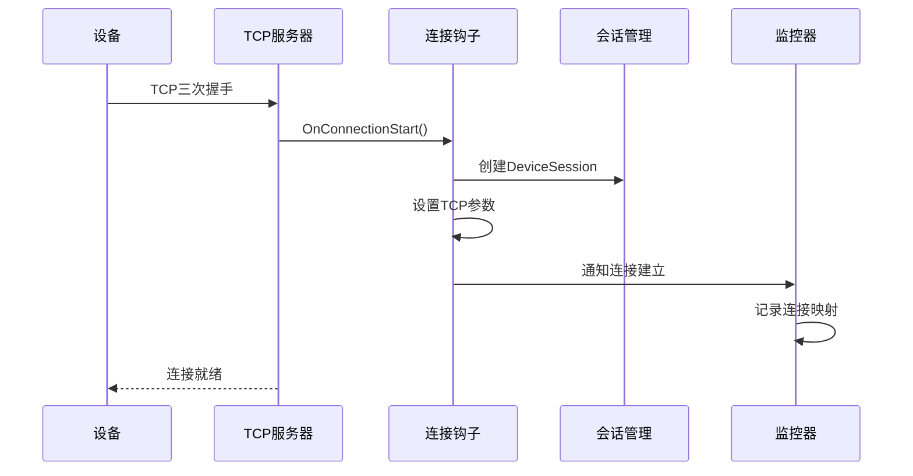
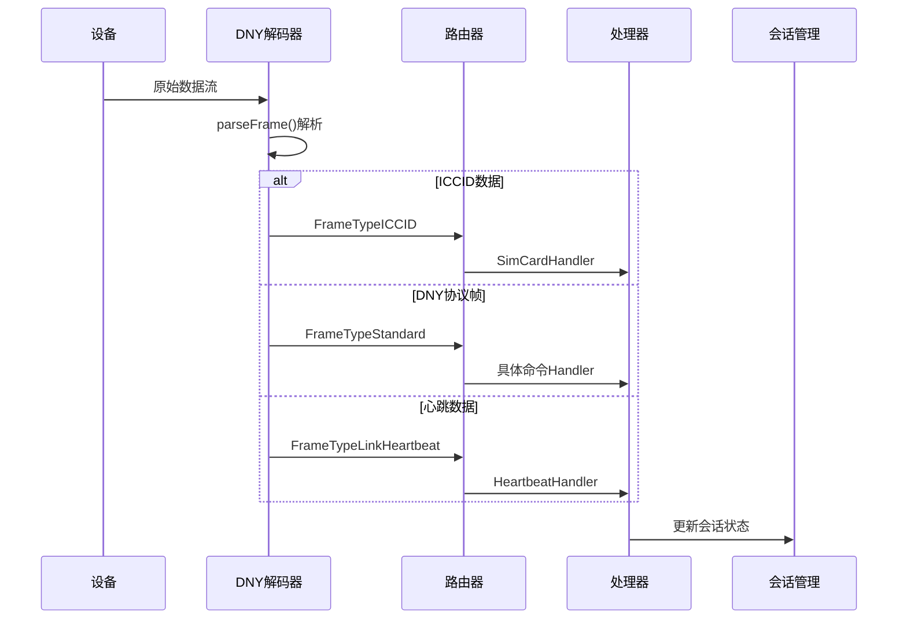
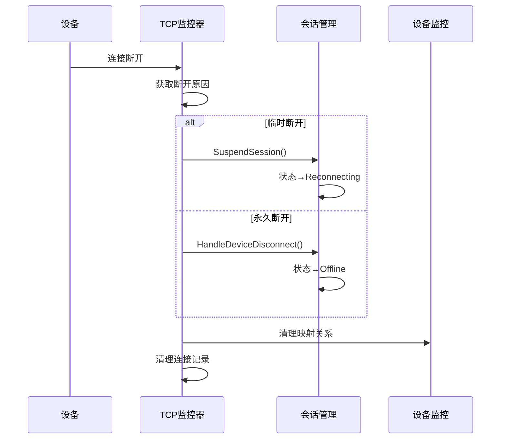

# IoT Zinx 系统 TCP 模块深度分析报告

**分析时间**: 2025 年 6 月 12 日  
**分析范围**: TCP 模块完整数据流、设备连接生命周期、协议解析、会话管理、数据一致性

## 系统架构概览

### 1. 整体架构模式

IoT Zinx 系统采用**六边形架构（端口与适配器架构）**，实现了业务逻辑与技术实现的完美分离：

```
┌─────────────────┐    ┌─────────────────┐    ┌─────────────────┐
│   设备端(DNY)   │────│  TCP适配器层    │────│   业务逻辑核心   │
├─────────────────┤    ├─────────────────┤    ├─────────────────┤
│ • 主设备        │    │ • Zinx TCP框架  │    │ • 设备管理      │
│ • 分机设备      │    │ • DNY协议解析   │    │ • 会话管理      │
│ • 心跳机制      │    │ • 连接监控      │    │ • 命令处理      │
│ • 命令响应      │    │ • 状态管理      │    │ • 业务逻辑      │
└─────────────────┘    └─────────────────┘    └─────────────────┘
```

### 2. 核心技术栈

- **网络框架**: Zinx TCP 框架
- **协议标准**: DNY 通信协议（AP3000 标准）
- **架构模式**: 六边形架构 + TLV 设计模式
- **并发控制**: Go sync 包 + 读写锁机制
- **监控机制**: 多层心跳监控 + 连接状态管理

## TCP 模块数据流分析

### 1. 连接建立阶段



**关键代码路径**:

- `internal/ports/tcp_server.go` → `pkg/network/connection_hooks.go`
- `pkg/session/device_session.go` → `pkg/monitor/tcp_monitor.go`

**数据流详解**:

1. **TCP 连接建立**: Zinx 框架处理底层 TCP 连接
2. **初始化属性**: 设置连接初始状态为`ConnStateAwaitingICCID`
3. **会话创建**: 创建 DeviceSession，管理连接级别状态
4. **监控注册**: TCPMonitor 记录新连接，准备设备绑定

### 2. 数据接收与解析阶段



**协议识别机制**:

```go
// 核心解析逻辑位于 pkg/protocol/dny_frame_parser.go
func parseFrame(conn ziface.IConnection, data []byte) (*DecodedDNYFrame, error) {
    // 1. ICCID识别 (15-20位数字)
    if isICCIDData(data) {
        return &DecodedDNYFrame{
            FrameType: FrameTypeICCID,
            ICCIDValue: string(data),
        }, nil
    }

    // 2. DNY协议帧识别
    if isDNYProtocolFrame(data) {
        return parseDNYStandardFrame(data)
    }

    // 3. 心跳数据识别
    if isLinkHeartbeat(data) {
        return &DecodedDNYFrame{
            FrameType: FrameTypeLinkHeartbeat,
        }, nil
    }

    return createUnknownFrame(data), errors.New("未知数据格式")
}
```

### 3. 设备注册与会话管理

**双层会话架构**:

1. **Zinx 层 DeviceSession** (`pkg/session/device_session.go`):

   - 管理连接级别状态
   - 存储共享连接信息（ICCID）
   - 与 Zinx 连接对象绑定

2. **Monitor 层 DeviceSession** (`pkg/monitor/session_manager.go`):
   - 管理逻辑设备状态
   - 以 DeviceID 为主键
   - 支持业务查询和状态管理

**设备注册流程**:

```go
// DeviceRegisterHandler.handleDeviceRegister()
func (h *DeviceRegisterHandler) handleDeviceRegister(deviceId string, physicalId uint32, messageID uint16, conn ziface.IConnection, data []byte) {
    // 1. 创建Monitor层会话
    sessionManager := monitor.GetSessionManager()
    devSession := sessionManager.CreateSession(deviceId, conn)

    // 2. 绑定设备到TCP连接
    monitor.GetGlobalConnectionMonitor().BindDeviceIdToConnection(deviceId, conn)

    // 3. 更新Zinx层会话状态
    linkedSession := session.GetDeviceSession(conn)
    linkedSession.UpdateStatus(constants.ConnStateActive)
}
```

**映射关系管理**:

```go
// TCPMonitor维护的核心映射
type TCPMonitor struct {
    deviceIdToConnMap map[string]uint64           // DeviceID → ConnID
    connIdToDeviceIdsMap map[uint64]map[string]struct{} // ConnID → {DeviceID集合}
    mapMutex sync.RWMutex                         // 并发保护锁
}
```

### 4. 心跳监控与状态管理

**多层心跳机制**:

- **Link 心跳**: 简单存活检测
- **设备心跳** (0x21): 分机设备状态上报
- **主机心跳** (0x11): 主设备状态上报
- **功率心跳** (0x06): 功率状态监控

**心跳处理流程**:

```go
// HeartbeatHandler核心逻辑
func (h *HeartbeatHandler) Handle(request ziface.IRequest) {
    // 1. 解析心跳帧
    decodedFrame, _ := h.ExtractDecodedFrame(request)

    // 2. 更新设备会话
    deviceSession, _ := h.GetOrCreateDeviceSession(conn)
    deviceSession.UpdateHeartbeat()

    // 3. 通知监控器
    monitor.GetGlobalConnectionMonitor().UpdateLastHeartbeatTime(conn)
}
```

## 数据存储与一致性分析

### 1. 状态同步机制

**会话状态同步**:

```go
// DeviceSession.SyncToConnection() - 向后兼容性同步
func (s *DeviceSession) SyncToConnection(conn ziface.IConnection) {
    conn.SetProperty(constants.PropKeyDeviceId, s.DeviceID)
    conn.SetProperty(constants.PropKeyICCID, s.ICCID)
    conn.SetProperty(constants.PropKeyLastHeartbeat, s.LastHeartbeat.Unix())
    // ... 其他属性同步
}
```

### 2. 并发安全保证

**读写锁保护**:

```go
// TCPMonitor并发安全实现
func (m *TCPMonitor) BindDeviceIdToConnection(deviceID string, conn ziface.IConnection) {
    m.mapMutex.Lock()
    defer m.mapMutex.Unlock()

    // 原子性更新映射关系
    newConnID := conn.GetConnID()
    m.deviceIdToConnMap[deviceID] = newConnID

    if _, ok := m.connIdToDeviceIdsMap[newConnID]; !ok {
        m.connIdToDeviceIdsMap[newConnID] = make(map[string]struct{})
    }
    m.connIdToDeviceIdsMap[newConnID][deviceID] = struct{}{}
}
```

### 3. 常量化重构成果

**硬编码消除** (已完成 ✅):

```go
// 重构前
conn.SetProperty("device_code", value)
conn.GetProperty("last_heartbeat_type")

// 重构后
conn.SetProperty(constants.ConnPropertyDeviceCode, value)
conn.GetProperty(constants.ConnPropertyLastHeartbeatType)
```

**定义的连接属性常量**:

- `ConnPropertyDeviceCode`
- `ConnPropertyDeviceNumber`
- `ConnPropertyICCIDReceived`
- `ConnPropertyLastHeartbeatType`
- `ConnPropertyLastParseError`
- `ConnPropertyMainHeartbeatTime`
- `ConnPropertyDisconnectReason`
- `ConnPropertyCloseReason`

## 断连处理与流程一致性

### 1. 智能断连处理机制 (已优化 ✅)

**断开原因智能识别**:

```go
func (m *TCPMonitor) isTemporaryDisconnect(reason string) bool {
    temporaryReasons := []string{
        "network_timeout", "i/o timeout", "connection_lost",
        "heartbeat_timeout", "read_timeout", "write_timeout",
    }

    for _, tempReason := range temporaryReasons {
        if strings.Contains(strings.ToLower(reason), tempReason) {
            return true // 临时断开，挂起会话
        }
    }
    return false // 永久断开，标记离线
}
```

**职责分离的断连处理**:

- **SuspendSession**: 临时断开处理，状态设为`Reconnecting`，允许重连
- **HandleDeviceDisconnect**: 永久断开处理，状态设为`Offline`，记录断开

### 2. 连接关闭流程



## 主从设备架构支持

### 1. 共享连接架构

系统完美支持主从设备共享 TCP 连接的复杂场景：

```
    ┌─────────────────┐
    │   通信模块      │ ← 持有SIM卡，建立TCP连接
    │   ICCID: 898... │
    └─────────┬───────┘
              │ TCP连接
    ┌─────────┴───────┐
    │   IoT网关       │
    │   ConnID: 1001  │
    └─────────┬───────┘
              │ 逻辑设备注册
    ┌─────────┼───────┐
    │         │       │
    ▼         ▼       ▼
┌─────────┐ ┌───────┐ ┌─────────┐
│ 主设备  │ │ 分机1 │ │ 分机2  │
│DeviceID │ │DeviceID│ │DeviceID│
│04A228CD │ │04A26CF3│ │04B15A89│
└─────────┘ └───────┘ └─────────┘
```

### 2. 映射关系实例

```go
// 一个TCP连接承载多个逻辑设备的映射示例
connIdToDeviceIdsMap[1001] = {
    "04A228CD": struct{}{}, // 主设备
    "04A26CF3": struct{}{}, // 分机1
    "04B15A89": struct{}{}, // 分机2
}

deviceIdToConnMap = {
    "04A228CD": 1001,
    "04A26CF3": 1001,
    "04B15A89": 1001,
}
```

## 系统性能与可靠性评估

### 1. 性能优势

1. **内存效率**: 双层会话机制减少数据冗余
2. **查询效率**: O(1)时间复杂度的设备-连接映射
3. **并发性能**: 读写锁分离，支持高并发读操作
4. **协议效率**: 零拷贝的数据解析机制

### 2. 可靠性保障

1. **数据一致性**: 多层状态同步机制
2. **故障恢复**: 智能断连重连机制
3. **错误处理**: 全面的异常处理和日志记录
4. **资源管理**: 自动会话清理和资源释放

### 3. 监控能力

1. **连接监控**: 实时连接状态跟踪
2. **设备监控**: 设备在线状态和心跳监控
3. **性能监控**: 数据传输量和处理性能统计
4. **错误监控**: 协议错误和连接异常监控

## 已完成的重构成果

### 1. 设备断连处理逻辑优化 ✅

- **智能断连识别**: 根据断开原因选择合适的处理策略
- **职责分离**: TCPMonitor 负责连接管理，SessionManager 负责状态管理
- **避免重复调用**: 统一的断连事件处理入口
- **状态转换清晰**: 明确的状态转换矩阵和处理流程

### 2. 硬编码属性键重构 ✅

- **常量化管理**: 8 个连接属性键常量化
- **类型安全**: 编译时检查常量引用正确性
- **维护性提升**: 集中管理，修改时只需更新一处
- **向后兼容**: 完全保持运行时行为不变

## 待优化任务分析

### 1. 协议解析器统一 (Protocol Parser Unification)

**现状梳理与问题点**:

- **双重解析路径**: 系统中存在两条主要的 DNY 协议解析路径：
  1.  **Zinx 实际使用路径**: `pkg/protocol/dny_decoder.go` (Zinx `IDecoder` 实现) -> `pkg/protocol/dny_frame_parser.go` (调用 `parseFrame` 函数)。此路径使用 `DecodedDNYFrame` 结构体封装解析结果。
  2.  **兼容/测试路径**: `pkg/protocol/parser.go` (兼容性 API 包装层) -> `pkg/protocol/dny_protocol_parser.go` (调用核心的 `ParseDNYProtocolData` 函数)。此路径使用 `dny_protocol.Message` 结构体。
- **逻辑分散与冗余**:
  - 特殊消息（ICCID、"link"心跳）的识别逻辑在 `dny_frame_parser.go` 和 `dny_protocol_parser.go` 中均有体现。
  - 校验和计算逻辑在 `dny_frame_parser.go` (`calculateDNYCrc`) 和 `dny_protocol_parser.go` (`CalculatePacketChecksum`) 中存在不同实现。后者更为灵活，支持多种计算方法。
- **统一意图**: `pkg/protocol/parser.go` 的注释已表明其目标是作为兼容层，并内部统一调用 `ParseDNYProtocolData`。然而，Zinx 的解码流程尚未接入此统一函数。

**目标**: 将核心解析逻辑完全统一到 `pkg/protocol/dny_protocol_parser.go` 的 `ParseDNYProtocolData` 函数，并使 Zinx 的解码器 (`pkg/protocol/dny_decoder.go`) 使用此统一的解析服务，消除冗余，提高一致性和可维护性。

**建议实施步骤与策略**:

1.  **增强 `ParseDNYProtocolData` (`pkg/protocol/dny_protocol_parser.go`)**:

    - **整合特殊消息处理**: 将 `dny_frame_parser.go` 中对 ICCID 和"link"心跳等特殊消息的识别逻辑，整合进 `ParseDNYProtocolData` 或其调用前置步骤。可以考虑在尝试标准 DNY 解析失败或数据包特征不符时，自动尝试特殊消息解析。
    - **统一校验和计算**: 明确标准校验和计算方法，优先采用 `CalculatePacketChecksum` 的灵活实现，并废弃 `dny_frame_parser.go` 中的 `calculateDNYCrc`。
    - **返回统一结果**: 确保 `ParseDNYProtocolData` 返回一个包含足够信息的结构体（如 `*dny_protocol.Message`），能够覆盖标准 DNY 帧和特殊消息的解析结果，并清晰指示解析状态和错误信息。

2.  **改造 `dny_decoder.go` (`Intercept` 方法)**:

    - **调用统一解析服务**: 修改 `Intercept` 方法，使其调用增强后的 `ParseDNYProtocolData` (或一个封装了前置判断逻辑的新统一入口函数)。
    - **适配 Zinx IMessage**: 根据统一解析服务返回的结果，正确设置 Zinx `IMessage` 的 `MsgID` (用于路由) 和 `Data` (传递给业务处理器)。
    - **兼容业务处理器**: 当前业务处理器可能依赖于 `ExtractDecodedFrame` 方法获取 `*protocol.DecodedDNYFrame`。
      - **方案 A (推荐)**: 修改业务处理器基类或各个处理器，使其能够直接处理新的统一解析结果类型 (如 `*dny_protocol.Message`)。
      - **方案 B (兼容)**: 在 `dny_decoder.go` 或一个适配层中，将 `*dny_protocol.Message` 转换回 `*protocol.DecodedDNYFrame` 或一个字段兼容的结构，以最小化对现有处理器的改动。但长期来看，应推动处理器直接使用统一模型。

3.  **重构或废弃 `dny_frame_parser.go`**:

    - 其核心解析逻辑（如 `parseFrame`）将被整合到 `dny_protocol_parser.go`。
    - `DecodedDNYFrame` 结构体根据业务处理器的改造方案，可能不再需要或大幅简化。
    - 此文件最终可能只保留少量辅助函数或被完全移除。

4.  **审视并调整 `pkg/protocol/parser.go`**:
    - 确保其作为兼容性 API 包装层的角色依然清晰，并且其内部调用的确实是最终统一的解析逻辑。

**影响评估**:

- **主要修改**: `dny_decoder.go`, `dny_protocol_parser.go`, `dny_frame_parser.go`。
- **潜在修改**: 所有业务处理器（如果选择方案 A），以及 `ExtractDecodedFrame` 方法的实现。
- **风险**: 需保证在重构过程中，所有类型的消息（标准 DNY、ICCID、心跳等）都能被正确解析和路由，且性能不受显著影响。

**预期收益**:

- **代码简洁**: 消除重复的解析逻辑。
- **维护性提高**: 解析逻辑集中，易于理解和修改。
- **一致性增强**: 所有 DNY 相关数据都通过同一套标准进行解析。
- **扩展性改善**: 更容易支持 DNY 协议的未来扩展或变种。

### 2. 过期会话清理机制 (Expired Session Cleanup Mechanism)

**现状梳理与问题点**:

- **双重 `DeviceSession` 定义**:
  1.  `pkg/session/device_session.go` (以下称 `SessionA`): 与 Zinx `IConnection` 紧密关联，包含 `LastActivityAt` 等时间戳，由连接层事件（如心跳、数据收发）更新。它本身不直接处理过期逻辑。
  2.  `pkg/monitor/session_manager.go` (以下称 `SessionB`): 应用层/监控层会话，以 `DeviceID` 为键存储在 `SessionManager` 的 `sync.Map` 中。包含 `ExpiresAt` 字段，在创建时基于 `sessionTimeout` 配置设定。
- **现有清理逻辑**:
  - `SessionManager` 拥有 `CleanupExpiredSessions` 方法，该方法遍历 `SessionB` 并移除那些 `ExpiresAt` 早于当前时间的会话。
  - `internal/ports/heartbeat_manager.go` (`HeartbeatManager`) 负责监控 TCP 连接的 IO 活动，如果连接长时间无数据收发（超出其配置的 `timeout`），则会主动调用 `conn.Stop()` 关闭 TCP 连接。
- **核心问题**: `SessionB.ExpiresAt` 的刷新机制不明确或不足。如果 `ExpiresAt` 仅在 `SessionB` 创建时设定，并且后续没有被设备的有效活动（如心跳、业务数据）所“续期”，那么即使设备 TCP 连接仍然活跃或刚刚重连（产生了新的 `SessionA`），陈旧的 `SessionB` 也可能因为 `ExpiresAt` 到期而被 `CleanupExpiredSessions` 清理，导致应用层会话丢失。
- **定期调用缺失**: `CleanupExpiredSessions` 方法虽然存在，但其是否被定期、自动调用尚不明确，需要确认。

**目标**: 建立一个健壮、可靠的过期会话清理机制，确保：

1.  应用层会话 (`SessionB`) 的有效期能被设备的实际活动正确刷新。
2.  `CleanupExpiredSessions` 被定期自动执行。
3.  TCP 连接层的心跳超时与应用层会话的过期管理能够协同工作，避免状态不一致。

**建议实施步骤与策略**:

1.  **明确 `SessionA` 与 `SessionB` 的关系与数据同步**:

    - `SessionA` 主要反映 TCP 连接的实时状态和属性。
    - `SessionB` 代表一个逻辑设备的持续性会话，应能跨越短暂的 TCP 连接中断。
    - 当 `SessionA` 因设备活动（如收到心跳或业务数据）更新时，应有机制确保这些活动信号能够传递给 `SessionManager`，用于更新对应的 `SessionB` 的活跃状态和 `ExpiresAt`。

2.  **实现 `SessionB.ExpiresAt` 的刷新逻辑**:

    - 在 `SessionManager.UpdateSession` 方法中，当检测到是代表设备活跃的更新时（例如，通过特定参数或更新类型判断），应重新计算并设置 `session.ExpiresAt = time.Now().Add(m.sessionTimeout)`。
    - 所有处理设备上行消息（心跳、业务数据包）的 Handler，在成功处理后，应调用 `SessionManager.UpdateSession` 并传递能表明设备活跃的信号，以触发 `ExpiresAt` 的刷新。

3.  **确保 `CleanupExpiredSessions` 的定期自动调用**:

    - 在 `SessionManager` 初始化时（例如，在 `GetSessionManager` 的 `globalSessionManagerOnce.Do` 中），启动一个后台 goroutine，使用 `time.NewTicker` 定期调用 `CleanupExpiredSessions` 方法。清理周期可以配置。

4.  **协调 `HeartbeatManager` 与 `SessionManager`**:

    - **`HeartbeatManager`**: 继续其现有职责，监控 TCP 连接的 IO 活性，并在超时后关闭不活跃的 TCP 连接。当 `conn.Stop()` 被调用，会触发 `OnConnectionStop` 钩子。
    - **`OnConnectionStop` 钩子 (`pkg/network/connection_hooks.go`)**: 在此钩子中，除了处理 `SessionA` 的状态外，还应通知 `SessionManager` 对应的 `SessionB`。根据断开的性质（如是否为临时性断开），`SessionManager` 可以决定是将 `SessionB` 标记为 `Suspended` (并可能给予一个较短的重连宽限期，即临时调整 `ExpiresAt`)，还是标记为 `Offline` (并允许其按正常 `sessionTimeout` 过期或在特定条件下加速过期)。
    - **设备重连**: 当设备重连并成功注册/恢复会话时，`SessionManager.ResumeSession` (或类似逻辑) 应确保 `SessionB` 的状态更新为 `Online`，并刷新其 `ExpiresAt`。

5.  **定义清晰的会话过期标准**:
    - `SessionManager.sessionTimeout`: 应用层会话在无任何活动下的最大存活时间。
    - `HeartbeatManager.timeout`: TCP 连接在无任何 IO 下的最大存活时间。
    - 建议 `sessionTimeout` >= `HeartbeatManager.timeout`。

**影响评估**:

- **主要修改**: `pkg/monitor/session_manager.go` (增加 `ExpiresAt` 刷新逻辑、启动定期清理任务)、相关的业务 Handlers (确保调用 `UpdateSession` 刷新活跃状态)、`pkg/network/connection_hooks.go` (在 `OnConnectionStop` 中与 `SessionManager` 交互)。
- **数据一致性**: 需要仔细处理 `SessionA` 和 `SessionB` 状态同步，特别是在连接断开和重连的边界条件下。

**预期收益**:

- **资源释放**: 及时清理不再活跃的应用层会话，防止内存泄漏。
- **状态准确性**: 系统中维护的设备会话状态更加准确反映实际情况。
- **系统稳定性**: 减少因过期会话堆积可能引发的潜在问题。

---
