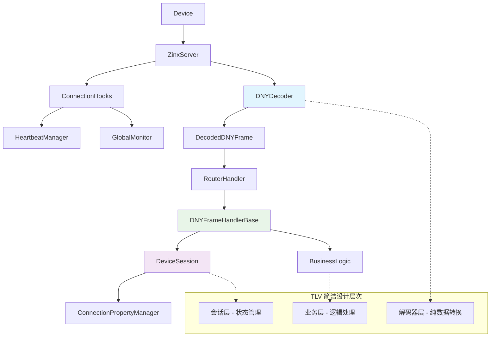

# TCP 架构 Mermaid 生成计划 (V3) - 基于 TLV 简洁设计模式

## 1. 核心参与者

- `Device` (设备端)
- `ZinxServer` (Zinx TCP 服务器核心)
- `ConnectionHooks` (连接生命周期钩子)
- `DNYDecoder` (DNY 协议解码器 - TLV 设计模式核心)
- `RouterHandler` (消息路由器/处理器，基于 DNYFrameHandlerBase)
- `DNYFrameHandlerBase` (统一的帧处理器基类)
- `DeviceSession` (设备会话管理器 - 统一属性管理)
- `HeartbeatManager` (心跳管理器)
- `GlobalMonitor` (全局连接监控器，管理所有连接)
- `BusinessLogic` (具体业务逻辑处理)

## 2. 架构组件关系图

## 2. Mermaid 图结构 (`sequenceDiagram`) - 基于 TLV 简洁设计模式

```mermaid
sequenceDiagram
    autonumber
    actor Device
    participant ZinxServer
    participant ConnectionHooks
    participant DNYDecoder
    participant RouterHandler
    participant DNYFrameHandlerBase
    participant DeviceSession
    participant HeartbeatManager
    participant GlobalMonitor
    participant BusinessLogic

    %% === 连接建立阶段 ===
    Note over Device, ZinxServer: 阶段1: TCP 连接建立
    Device->>+ZinxServer: 发起 TCP 连接请求 (SYN)
    ZinxServer-->>Device: 响应 TCP 连接请求 (SYN-ACK)
    Device->>+ZinxServer: 确认 TCP 连接 (ACK)
    ZinxServer->>+ConnectionHooks: OnConnectionStart(conn)
    ConnectionHooks->>ConnectionHooks: setConnectionInitialProperties (设置初始属性, e.g., LastHeartbeat)
    ConnectionHooks->>ConnectionHooks: setupTCPParameters (e.g., KeepAlive, NoDelay)
    ConnectionHooks->>+GlobalMonitor: OnConnectionEstablished(conn)
    GlobalMonitor-->>ConnectionHooks: (记录新连接)
    ConnectionHooks->>+HeartbeatManager: UpdateConnectionActivity(conn) (首次标记活动)
    HeartbeatManager-->>ConnectionHooks: (活动已更新)
    ConnectionHooks-->>ZinxServer: 连接初始化完成
    ZinxServer-->>-Device: (逻辑层面) 连接已就绪

    %% === 数据接收和解码阶段 ===
    Note over Device, DNYDecoder: 阶段2: 数据接收和 DNY 协议解码 (TLV 设计模式)
    Device->>+ZinxServer: 发送 DNY 协议数据包 (二进制流)
    ZinxServer->>+DNYDecoder: Decode(dataBytes) - TLV 解码
    DNYDecoder->>DNYDecoder: parseLengthField() - 解析长度字段
    DNYDecoder->>DNYDecoder: parseFrameType() - 解析帧类型
    DNYDecoder->>DNYDecoder: parseFrameData() - 解析帧数据
    DNYDecoder->>DNYDecoder: validateFrame() - 帧完整性验证
    DNYDecoder-->>ZinxServer: DecodedDNYFrame{Type, Data, Length}

    %% === 消息路由阶段 ===
    Note over ZinxServer, RouterHandler: 阶段3: 消息路由 (基于帧类型)
    ZinxServer->>+RouterHandler: RouteMsgToHandler(conn, decodedFrame)
    RouterHandler->>RouterHandler: determineHandlerByFrameType(frame.Type)
    RouterHandler->>+DNYFrameHandlerBase: HandleFrame(conn, decodedFrame)

    %% === 设备注册阶段 ===
    Note over DNYFrameHandlerBase, DeviceSession: 阶段4: 设备注册处理 (帧类型: DeviceRegister)
    alt 帧类型 == DeviceRegister
        DNYFrameHandlerBase->>DNYFrameHandlerBase: parseRegistrationData(frame.Data)
        DNYFrameHandlerBase->>DNYFrameHandlerBase: validateDeviceCredentials(deviceId, token)
        DNYFrameHandlerBase->>+DeviceSession: CreateOrUpdateSession(conn, deviceId)
        DeviceSession->>DeviceSession: setSessionProperty("deviceId", deviceId)
        DeviceSession->>DeviceSession: setSessionProperty("isAuthenticated", true)
        DeviceSession->>DeviceSession: setSessionProperty("registrationTime", now)
        DeviceSession-->>DNYFrameHandlerBase: sessionCreated
        DNYFrameHandlerBase->>+BusinessLogic: OnDeviceRegistered(deviceId, sessionInfo)
        BusinessLogic-->>DNYFrameHandlerBase: registrationResult
        DNYFrameHandlerBase-->>RouterHandler: 注册处理完毕
        RouterHandler-->>ZinxServer: (可选) 发送注册响应
        ZinxServer-->>-Device: 注册成功/失败响应
    end

    %% === 心跳维持阶段 ===
    Note over Device, HeartbeatManager: 阶段5: 心跳维持 (帧类型: Heartbeat)
    loop 定期 (e.g., every 30s)
        Device->>+ZinxServer: 发送心跳包 (DNY 协议)
        ZinxServer->>+DNYDecoder: Decode(heartbeatBytes)
        DNYDecoder-->>ZinxServer: DecodedDNYFrame{Type: Heartbeat}
        ZinxServer->>+RouterHandler: RouteMsgToHandler(conn, heartbeatFrame)
        RouterHandler->>+DNYFrameHandlerBase: HandleFrame(conn, heartbeatFrame)
        DNYFrameHandlerBase->>+DeviceSession: UpdateSessionActivity(conn)
        DeviceSession->>DeviceSession: setSessionProperty("lastHeartbeatTime", now)
        DeviceSession-->>DNYFrameHandlerBase: (活动时间已更新)
        DNYFrameHandlerBase->>+HeartbeatManager: UpdateConnectionActivity(conn)
        HeartbeatManager-->>DNYFrameHandlerBase: (更新最后活动时间)
        DNYFrameHandlerBase-->>RouterHandler: 心跳处理完毕
        RouterHandler-->>ZinxServer: (可选) 发送心跳响应
        ZinxServer-->>-Device: 心跳响应包
    end

    Note over HeartbeatManager, GlobalMonitor: 心跳检查 (服务器端定时任务)
    HeartbeatManager->>HeartbeatManager: StartCheckTimer()
    loop 定期 (e.g., every 10s)
        HeartbeatManager->>+GlobalMonitor: ForEachConnection(checkFunc)
        GlobalMonitor-->>HeartbeatManager: (遍历每个连接并执行checkFunc)
        Note over HeartbeatManager: checkFunc: if (now - session.GetProperty("lastHeartbeatTime")) > Timeout
        HeartbeatManager->>+ZinxServer: conn.Stop() (若超时)
        ZinxServer->>+ConnectionHooks: OnConnectionStop(conn) [因心跳超时]
        ConnectionHooks->>+DeviceSession: CleanupSession(conn)
        DeviceSession->>DeviceSession: removeSessionProperties()
        DeviceSession-->>ConnectionHooks: (会话已清理)
        ConnectionHooks->>+GlobalMonitor: OnConnectionClosed(conn)
        GlobalMonitor-->>ConnectionHooks: (移除连接记录)
        ConnectionHooks->>+HeartbeatManager: RemoveConnection(conn)
        HeartbeatManager-->>ConnectionHooks: (连接已移除)
        ConnectionHooks-->>ZinxServer: (清理完成)
        ZinxServer-->>-Device: (TCP FIN - 连接被服务器关闭)
        Note over HeartbeatManager: end if
        GlobalMonitor-->>HeartbeatManager: 遍历完成
    end

    %% === 业务指令交互阶段 ===
    Note over Device, BusinessLogic: 阶段6: 业务指令交互 (帧类型: Command/Data)
    Device->>+ZinxServer: 发送业务指令 (DNY 协议封装)
    ZinxServer->>+DNYDecoder: Decode(commandBytes)
    DNYDecoder-->>ZinxServer: DecodedDNYFrame{Type: Command, Data: cmdPayload}
    ZinxServer->>+RouterHandler: RouteMsgToHandler(conn, commandFrame)
    RouterHandler->>+DNYFrameHandlerBase: HandleFrame(conn, commandFrame)
    DNYFrameHandlerBase->>+DeviceSession: ValidateSession(conn)
    DeviceSession-->>DNYFrameHandlerBase: sessionValid
    DNYFrameHandlerBase->>+BusinessLogic: ProcessDeviceCommand(deviceId, cmdPayload)
    BusinessLogic->>BusinessLogic: (执行具体业务逻辑)
    BusinessLogic-->>DNYFrameHandlerBase: (返回处理结果)
    DNYFrameHandlerBase->>DNYFrameHandlerBase: encodeResponseFrame(result)
    DNYFrameHandlerBase-->>RouterHandler: (响应帧准备就绪)
    RouterHandler-->>ZinxServer: (结果准备好)
    ZinxServer-->>-Device: 业务指令响应 (DNY 协议封装)

    activate ZinxServer
    ZinxServer->>+RouterHandler: (服务器主动推送指令) PrepareDownstreamCmd(targetDeviceId, cmd)
    RouterHandler->>+GlobalMonitor: GetConnectionByDeviceId(targetDeviceId)
    GlobalMonitor-->>RouterHandler: (返回conn)
    RouterHandler->>+DNYFrameHandlerBase: PrepareDownstreamFrame(cmd)
    DNYFrameHandlerBase->>DNYFrameHandlerBase: encodeCommandFrame(cmd)
    DNYFrameHandlerBase-->>RouterHandler: encodedFrame
    RouterHandler-->>ZinxServer: conn.SendMsg(encodedFrame)
    ZinxServer-->>-Device: 服务器推送指令 (DNY 协议)

    %% === 连接断开阶段 ===
    Note over Device, ZinxServer: 阶段7: 连接断开 (设备主动)
    Device->>+ZinxServer: 发起 TCP 断开请求 (FIN)
    ZinxServer->>+ConnectionHooks: OnConnectionStop(conn) [设备主动断开]
    ConnectionHooks->>+DeviceSession: CleanupSession(conn)
    DeviceSession->>DeviceSession: removeSessionProperties()
    DeviceSession->>+BusinessLogic: OnDeviceDisconnected(deviceId)
    BusinessLogic-->>DeviceSession: (断开事件已处理)
    DeviceSession-->>ConnectionHooks: (会话已清理)
    ConnectionHooks->>+GlobalMonitor: OnConnectionClosed(conn)
    GlobalMonitor-->>ConnectionHooks: (移除连接记录)
    ConnectionHooks->>+HeartbeatManager: RemoveConnection(conn)
    HeartbeatManager-->>ConnectionHooks: (连接已移除)
    ConnectionHooks-->>ZinxServer: (清理完成)
    ZinxServer-->>-Device: (TCP ACK, FIN - 确认断开)

    Note over ZinxServer, Device: 阶段7: 连接断开 (网络异常)
    ZinxServer->>+ConnectionHooks: OnConnectionLost(conn) [网络异常]
    ConnectionHooks->>+DeviceSession: CleanupSession(conn)
    DeviceSession->>DeviceSession: removeSessionProperties()
    DeviceSession->>+BusinessLogic: OnDeviceDisconnected(deviceId)
    BusinessLogic-->>DeviceSession: (断开事件已处理)
    DeviceSession-->>ConnectionHooks: (会话已清理)
    ConnectionHooks->>+GlobalMonitor: OnConnectionClosed(conn)
    GlobalMonitor-->>ConnectionHooks: (移除连接记录)
    ConnectionHooks->>+HeartbeatManager: RemoveConnection(conn)
    HeartbeatManager-->>ConnectionHooks: (连接已移除)
    ConnectionHooks-->>ZinxServer: (清理完成)
    Note over ZinxServer: (连接已丢失，无法通知Device)
    deactivate ZinxServer
```

## 3. 详细流程说明 - 基于 TLV 简洁设计模式

### 阶段 1: TCP 连接建立

1.  **Device -> ZinxServer**: 设备向服务器的指定端口发起标准的 TCP 三次握手请求。
2.  **ZinxServer -> ConnectionHooks**: TCP 连接建立后，Zinx 框架触发 `OnConnectionStart` 钩子。
    - `setConnectionInitialProperties`: 在此钩子内部，可以为新连接设置一些初始属性，例如记录当前时间为 `LastHeartbeat` 时间戳。
    - `setupTCPParameters`: 配置 TCP 连接参数，如 `TCP_NODELAY`, `TCP_KEEPIDLE`, `TCP_KEEPINTVL`, `TCP_KEEPCNT`。这些参数在 `tcp_server.go` 的 `setConnParameters` 函数中体现。
3.  **ConnectionHooks -> GlobalMonitor**: 调用 `GlobalMonitor.OnConnectionEstablished`，将新连接告知全局监控器，后者可能会维护一个活动连接列表。
4.  **ConnectionHooks -> HeartbeatManager**: 调用 `HeartbeatManager.UpdateConnectionActivity`，首次标记该连接的活动状态，用于后续心跳检查。
5.  **ZinxServer -> Device**: TCP 连接在物理和逻辑层面均已准备就绪，可以开始数据交换。

### 阶段 2: 数据接收和 DNY 协议解码 (TLV 设计模式)

1.  **Device -> ZinxServer**: 设备发送 DNY 协议数据包 (二进制流格式)。
2.  **ZinxServer -> DNYDecoder**: Zinx 服务器调用 `DNYDecoder.Decode(dataBytes)` 进行 TLV 解码：
    - `parseLengthField()`: 解析长度字段，确定帧的完整长度
    - `parseFrameType()`: 解析帧类型字段，确定数据包的业务类型 (如注册、心跳、指令等)
    - `parseFrameData()`: 根据帧类型解析具体的帧数据内容
    - `validateFrame()`: 进行帧完整性验证，确保数据包的正确性
3.  **DNYDecoder -> ZinxServer**: 返回解码后的 `DecodedDNYFrame{Type, Data, Length}` 结构。

### 阶段 3: 消息路由 (基于帧类型)

1.  **ZinxServer -> RouterHandler**: 服务器将解码后的帧传递给路由处理器。
2.  **RouterHandler**:
    - `determineHandlerByFrameType(frame.Type)`: 根据帧类型确定具体的处理器
    - 调用对应的 `DNYFrameHandlerBase.HandleFrame(conn, decodedFrame)` 进行处理

### 阶段 4: 设备注册处理 (帧类型: DeviceRegister)

1.  **DNYFrameHandlerBase**: 处理设备注册帧：
    - `parseRegistrationData(frame.Data)`: 解析注册数据，提取设备 ID 和认证信息
    - `validateDeviceCredentials(deviceId, token)`: 验证设备凭据的有效性
2.  **DNYFrameHandlerBase -> DeviceSession**: 调用 `CreateOrUpdateSession(conn, deviceId)` 创建或更新设备会话：
    - `setSessionProperty("deviceId", deviceId)`: 设置设备 ID 属性
    - `setSessionProperty("isAuthenticated", true)`: 标记认证状态
    - `setSessionProperty("registrationTime", now)`: 记录注册时间
3.  **DNYFrameHandlerBase -> BusinessLogic**: 通知业务层设备注册事件 `OnDeviceRegistered(deviceId, sessionInfo)`
4.  **ZinxServer -> Device**: (可选) 发送注册成功/失败响应

### 阶段 5: 心跳维持 (帧类型: Heartbeat)

**设备端主动发送心跳**:

1.  **Device -> ZinxServer**: 设备按照预定的时间间隔发送心跳包 (DNY 协议格式)。
2.  **ZinxServer -> DNYDecoder**: 解码心跳数据包，返回 `DecodedDNYFrame{Type: Heartbeat}`。
3.  **ZinxServer -> RouterHandler -> DNYFrameHandlerBase**: 路由心跳帧到统一处理器。
4.  **DNYFrameHandlerBase -> DeviceSession**: 更新会话活动状态：
    - `setSessionProperty("lastHeartbeatTime", now)`: 更新最后心跳时间
5.  **DNYFrameHandlerBase -> HeartbeatManager**: 调用 `UpdateConnectionActivity(conn)` 更新连接活动记录。
6.  **ZinxServer -> Device**: (可选) 回复心跳响应包。

**服务器端心跳检查 (HeartbeatManager)**:

1.  `HeartbeatManager` 内部启动定时器，定期检查所有连接的心跳状态。
2.  **HeartbeatManager -> GlobalMonitor**: 遍历所有活动连接，检查每个连接的最后心跳时间。
3.  对于超时的连接：
    - **HeartbeatManager -> ZinxServer**: 调用 `conn.Stop()` 关闭超时连接
    - **ZinxServer -> ConnectionHooks -> DeviceSession**: 清理设备会话状态
    - **ConnectionHooks**: 从 `GlobalMonitor` 和 `HeartbeatManager` 中移除连接记录

### 阶段 6: 业务指令交互 (帧类型: Command/Data)

**设备上报数据/请求指令**:

1.  **Device -> ZinxServer**: 设备发送业务指令 (DNY 协议封装)。
2.  **ZinxServer -> DNYDecoder**: 解码业务数据包，返回 `DecodedDNYFrame{Type: Command, Data: cmdPayload}`。
3.  **ZinxServer -> RouterHandler -> DNYFrameHandlerBase**: 路由业务指令到统一处理器。
4.  **DNYFrameHandlerBase -> DeviceSession**: 验证设备会话的有效性。
5.  **DNYFrameHandlerBase -> BusinessLogic**: 调用 `ProcessDeviceCommand(deviceId, cmdPayload)` 处理具体业务逻辑。
6.  **DNYFrameHandlerBase**: 编码响应帧 `encodeResponseFrame(result)`。
7.  **ZinxServer -> Device**: 返回业务指令响应 (DNY 协议封装)。

**服务器下发指令**:

1.  **ZinxServer/BusinessLogic -> RouterHandler**: 服务器需要向特定设备下发指令。
2.  **RouterHandler -> GlobalMonitor**: 根据设备 ID 查找对应的活动连接。
3.  **RouterHandler -> DNYFrameHandlerBase**: 准备下行指令帧：
    - `encodeCommandFrame(cmd)`: 将指令编码为 DNY 协议格式
4.  **RouterHandler -> ZinxServer**: 通过连接发送编码后的指令帧。
5.  **ZinxServer -> Device**: 设备接收服务器推送的指令。

### 阶段 7: 连接断开

**设备主动断开**:

1.  **Device -> ZinxServer**: 设备主动关闭 TCP 连接。
2.  **ZinxServer -> ConnectionHooks -> DeviceSession**: 清理设备会话：
    - `removeSessionProperties()`: 移除所有会话属性
    - `OnDeviceDisconnected(deviceId)`: 通知业务层设备断开事件
3.  **ConnectionHooks**: 从 `GlobalMonitor` 和 `HeartbeatManager` 中移除连接记录。
4.  **ZinxServer -> Device**: 完成 TCP 四次挥手。

**网络异常断开**:

1.  **ZinxServer -> ConnectionHooks**: 检测到网络异常，触发 `OnConnectionLost`。
2.  清理流程与设备主动断开类似，但无法向设备发送通知。

### TLV 简洁设计模式核心特点

1.  **解码器层 (DNYDecoder)**: 纯数据转换，负责二进制流到结构化数据的转换
2.  **会话层 (DeviceSession)**: 统一的状态管理，维护设备连接的生命周期属性
3.  **业务层 (DNYFrameHandlerBase + BusinessLogic)**: 基于统一接口的业务逻辑处理

此架构通过 TLV 设计模式实现了协议解码、会话管理和业务处理的清晰分离，提高了代码的可维护性和扩展性。
